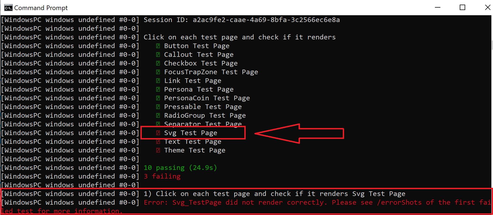
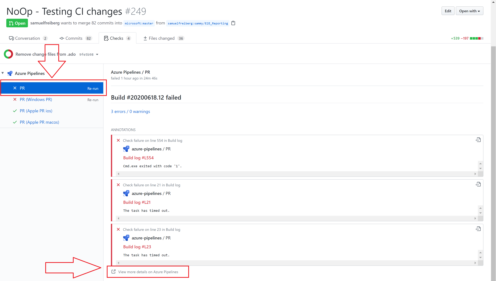
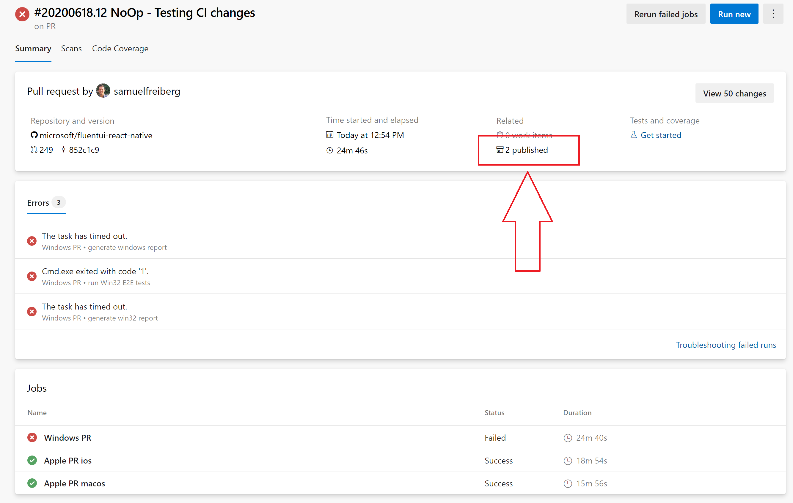
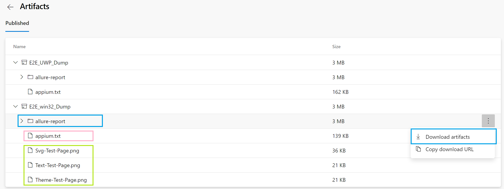

# E2E Testing Overview

**There is currently an Appium issue with NPM v8.19.2. Please use an older version of NPM**

## Win32/UWP Prerequisites

- [Node.js](https://nodejs.org/en/download/) - Version 10.19 or higher.
- [React Native Windows Development Dependencies](https://microsoft.github.io/react-native-windows/docs/rnw-dependencies)
  - **NOTE:** Please make sure you grab all of the items listed there and the appropriate versions.
- [WinAppDriver](https://github.com/microsoft/WinAppDriver) - Version 1.1
- Enable [_Developer Mode_](https://docs.microsoft.com/en-us/windows/uwp/get-started/enable-your-device-for-development) in Windows settings

### UWP Additional Prerequisites

- [UWP Prerequisites](../fluent-tester/docs/windows.md)

## macOS Prerequisites

- macOS 10.15 or later
- XCode 12 or later should be installed
- XCode Helper app should be enabled for Accessibility access. The app itself is usually found at: _/Applications/Xcode.app/Contents/Developer/Platforms/MacOSX.platform/Developer/Library/Xcode/Agents/Xcode Helper.app_.

In order to enable Accessibility access, simply open the parent folder in finder:
_open /Applications/Xcode.app/Contents/Developer/Platforms/MacOSX.platform/Developer/Library/Xcode/Agents/_
and drag & drop the **XCode Helper** app to **Security & Privacy -> Privacy -> Accessibility** list of your **System Preferences**. This action must only be done once.

## E2E Project Structure

- E2E - The root E2E testing folder containing test components and their respective platform-specific page objects and spec documents.
- reports - Each platform folder (apple, win32, windows) contains this folder that saves the test reports from Appium/WebDriverIO.
- wdio.conf.js - Each platform folder contains this file. It's the configuration file for WebDriverIO, which also configures Appium, WinAppDriver, and Jasmine parameters.

# Running E2E Tests

## Win32 Steps

1. Install node packages, build JS
   - C:\repo> `cd fluentui-react-native`
   - C:\repo\fluentui-react-native> `yarn`
   - C:\repo\fluentui-react-native> `yarn build`
2. Bundle the test app (pick specific platform you want to test, we'll use win32)
   - C:\repo\fluentui-react-native>`cd apps\win32`
   - C:\repo\fluentui-react-native\apps\win32> `yarn bundle`
3. Run E2E tests
   - C:\repo\fluentui-react-native\apps\win32> `yarn e2etest`

## UWP Steps

1. Follow step #1 from "Win32 Steps" section above.
2. Start the server
   - C:\repo\fluentui-react-native> `cd apps\windows`
   - C:\repo\fluentui-react-native\apps\E2E> `yarn start`
3. Open a new command prompt and run the E2E tests
   - C:\repo\fluentui-react-native\apps\E2E> `yarn e2etest:windows`

_Note: It could take up to a minute to load the test app with WebDriverIO, don't panic, the tests will run :)_

## macOS Steps

1. Follow step #1 from "Win32 Steps" section above.
2. POD Install
   - (from fluentui-react-native) `cd apps/fluent-tester/macos`
   - (from fluentui-react-native/apps/fluent-tester/macos) `pod install`
3. Start the server
   - (from fluentui-react-native) `cd apps/fluent-tester`
   - (from fluentui-react-native/apps/fluent-tester) `yarn start`
4. Open a new command prompt and run the E2E tests
   - (from fluentui-react-native/apps/E2E) `yarn e2etest:macos`

_Note: It could take up to a minute to load the test app with WebDriverIO, don't panic, the tests will run :)_

## iOS Steps

First check that iOS configs in wdio.conf.ios.js are updated to match your dev environment. If the config doesn't match you may get an error message "App with bundle identifier 'com.microsoft.ReactTestApp' unknown"

- 'appium:deviceName' should be updated to a simulator that you have. You can check the ones you have by going to the 'Devices and Simulators' window in Xcode.
- 'appium:platformVersion' should be updated to match the iOS version of the simulator you're using. You can check what version this should be in the same 'Devices and Simulators' window.

1. Follow step #1 from "Win32 Steps" section above.
2. POD Install
   - (from fluentui-react-native) `cd apps/fluent-tester/ios`
   - (from fluentui-react-native/apps/fluent-tester/ios) `pod install`
3. Start the server
   - (from fluentui-react-native) `cd apps/fluent-tester`
   - (from fluentui-react-native/apps/fluent-tester) `yarn start`
4. Open a new command prompt and run the E2E tests
   - (from fluentui-react-native/apps/E2E) `yarn e2etest:ios`

_Note: It could take up to a minute to load the test app with WebDriverIO, don't panic, the tests will run :)_

## Android Steps

1. Follow step #1 from "Win32 Steps" section above.
2. Start the server
   - (from fluentui-react-native) `cd apps/fluent-tester`
   - (from fluentui-react-native/apps/fluent-tester) `yarn start`
3. Install and run the app from a new command prompt
   - (from fluentui-react-native) `cd apps/fluent-tester`
   - (from fluentui-react-native/apps/fluent-tester) `yarn android`
4. Open a new command prompt and run the E2E tests
   - (from fluentui-react-native/apps/E2E) `yarn e2etest:android`

_Note: It could take up to a minute to load the test app with WebDriverIO, don't panic, the tests will run :)_

# Authoring E2E Test

You just added a new component to FURN... Awesome! Now we need to make sure we have proper regression testing to make sure we put the safest product out there (don't worry, it's not as hard as it sounds). Here's what we have to do:

## Create New E2E Testing Folder for the New Component

All our E2E testing logic exists in _/apps/E2E/src/_.

Testing is split-up on a **per-component** basis. Each component's testing story is made up of two parts - a **Page Object** and a **Spec Document**.

Example File Structure:

-> Checkbox Folder

----> CheckboxPageObject.ts

----> CheckboxSpec.ts

Please follow this structure for the new component.

## Create New Constants

The way we our automation framework interacts with our test app is by selecting UI components based on a string value. For this, we have a **consts.ts** file for each component that defines these values.
You'll want to make one for your component under **apps/fluent-tester/src/TestComponents/_your-component_/consts.ts**.

**You can simply copy/paste a _consts.ts_ file from another component, and just change the name of the component in the const names and the values.**

**This is really important!**

There are a **two specific** naming conventions we need to follow to keep in-sync with the Native side.

1. The button that navigates to each test page - **Homepage\_'componentName'\_Button**
2. The test page itself that lets us validate if the page loaded - **'componentName'\_TestPage**

Now, what are Page Objects and Spec Documents?

## Page Objects

A page object is an object-oriented class. The purpose of this class is to act as an interface for you to interact with a page of your testing app. In layman's terms, **it selects UI elements and performs some functions on them to obtain the scenario you want.**

For each component/scenario you want to test, you will have a page object class for it.

Page Object is a design pattern which has become popular in test automation for enhancing test maintenance and reducing code duplication. A [page object](https://webdriver.io/docs/pageobjects.html) is an object-oriented class that serves as an interface to a page of you testing app. The tests then use the methods of this Page Object whenever they need to interact with the UI of that page.
The benefit is that if the UI changes for the test page, the tests themselves don’t need to change, only the code within the page object needs to change.

Page Objects should be put in apps/E2E/src/_ *ComponentToBeTested* _/pages/.

In most cases, you can copy/paste ButtonPageObject.ts and simply change all instances of Button to your new component.

```ts
// CheckboxPageObject.win.ts
class CheckboxPageObject extends BasePage {
  // This function clicks on the Checkbox component you selected below
  toggleCheckbox() {
    this._testPage.click();
  }

  // This function gives the identifier of the test page's first section. This is used to test page load.
  get _pageName() {
    return CHECKBOX_TESTPAGE;
  }

  // This function gives the identifier of the button that navigates to the component's test page.
  get _pageButtonName() {
    return HOMEPAGE_CHECKBOX_BUTTON;
  }
}

export default new CheckboxPageObject();
```

### More on Page Objects (Technical Information)

Each page object should extend BasePage.ts. The BasePage class contains a baseline set of methods/variables that all page objects should have. This allows us to write the most efficient code possible.

For example, a common task we want to perform is selecting a UI element and getting its accessibilityRole attribute. Instead of doing this in all 20 page objects for each component, we write it once in the BasePage, and have the 20 page objects extend it. Enables code-reuse and allows for easy comprehension.

### **Selectors**

- In order for a Page Object to access a component from the test page, you must use [selectors](https://webdriver.io/docs/selectors.html). The WebDriver Protocol provides several selector strategies to query an element.

- The underlying Android test drivers use [accessibilityLabel](https://reactnative.dev/docs/accessibility#accessibilitylabel) to find elements. However, all other platforms use [testID](https://reactnative.dev/docs/next/view#testid). Because of this, we're adding the testProps function that takes in a unique identifier and returns the correct prop based on the platform (testID for Win32, Windows, macOS, iOS; accessibilityId for Android).
  If explict accessibilityLabel is being used for other platforms, apply testProps after it to override it for Android.

- If testProps is specified, the locator strategy should choose accessibility id.
  A unique accessiblity id/testID per Window is recommended for E2E testing when authoring the test app and test cases.

- To use this, we must add a prop to our component or UI element in question called `testProps`. In our test page, set the `testProps` for the component after accessibilityLabel prop (if present), and we can then select it in our Page Object using the imported **_By_** method above from a base class.

## Setup your Component Test Page in the Test App

In order to test the component, we need a test page in FURNs test app. Looking at existing test pages, each test page is made up of one or more sections showing off different use cases of the component. These sections are rendered using the `<Test />` component.

```tsx
const checkboxSections: TestSection[] = [
  {
    name: 'Basic Checkboxes', // This is the title of said section, rendered before the contents.
    component: BasicCheckbox, // Pass a React Component to render below the title.
    testID: CHECKBOXV1_TESTPAGE, // You can optionally add a `testID` to the title so we can find and interact with the element during automation. Attach to check if the page renders.
  },
  {
    name: 'Size Checkboxes',
    component: SizeCheckbox,
  },
];

export const CheckboxTest = () => {
  return <Test name="Checkbox Test" description={description} sections={checkboxSections} status={status} />;
};
```

When building the test page, make sure to do the following:

- Pass a `testID` to the first test section. The `testID` should equal the `_pageName` const set in the component's page object because during each test, we initially check if the page loads by checking if the element with a `testID = _pageName` is visible.
- If your component needs dedicated accessibility or functionality tests, create a dedicated `TestSection` with elements designated for use during automated E2E testing. These elements should have a `testID` assigned by passing `{...testProps(your_components_constant)}` to the props of the component so we can use our Page Object to interact with the component. Once your section is built, pass the section to the `<Test />` element via the `e2eSections` prop. The reason the E2E section is separate from the regular test sections is because these need to be rendered at the very top of the test page to reduce the time it takes for an E2E component to load into view for each test. They are also initially hidden for aesthetic purposes and get revealed during automation.

```tsx
const e2eSections: TestSection = [
  {
    name: 'E2E Testing for CheckboxV1',
    component: E2ECheckboxV1Test,
  },
];

export const CheckboxTest = () => {
  return <Test name="Checkbox Test" description={description} sections={checkboxSections} status={status} e2eSections={e2eSections} />;
};
```

## Write a Test Spec

The spec document is where the tests will be written. We use [Jasmine](https://jasmine.github.io/), an open-sourced testing framework for JavaScript.
The spec document imports a page object and uses it to manipulate the UI and uses 'expect' and other Jasmine statements to ensure proper functionality.

Spec documents should be put in apps/fluent-tester/src/E2E/\_ _ComponentToBeTested_ /specs/.

```
describe('Click on each test page and check if it renders', function() {
  it('Checkbox Test Page', () => {
    CheckboxPageObject.navigateToPageAndLoadTests(true); // pass true if you have a dedicated section for E2E tests
});
```

# Debugging E2E Failures (Locally)

If one tests fails, it will cause every subsequent test to fail as well. Due to this structure, if you get a failing E2E run, you should find the **first** failing test and focus on fixing that one.

Having a clear and concise report on testing failures is key in efficient debugging. We're utilizing two report generators:

1. **Spec Reporter** - Low overhead, easy to read, automatically runs with E2E testing. However, less information and less reliable.

2. **Allure Reporter** - Creates in-depth reports with key information about each test. Must have Java 1.8 downloaded to create reports and requires running additional script after E2E testing is complete.

## Using Spec Reporter

You can view the spec report right as E2E testing is finished. It shows the failing tests and a brief explanation of what went wrong. However, in some cases when a redbox error occurs (mostly in Win32), these messages and report will not exist. This is because the FluentTester app becomes a non-responsive window, and WebDriverIO cannot close the window, which leaves the spec reporter in a bad state. In this case, I would recommend using the Allure Reporter.

In the example below, the SVG test is the one failing the run, and at the bottom, you can see an error message.



When running E2E locally, after failing an E2E run, you will get a screenshot of the error in /errorShots/ of the platform you tested.

## Using Allure Reporter

Allure Framework is a flexible, lightweight multi-language test report tool that not only shows a very concise representation of what have been tested in a neat web report form, but allows everyone participating in the development process to extract maximum of useful information from everyday execution of tests.

After E2E testing runs, allure creates a folder of XML files with all relevant information from the tests. In order to generate the report, you need to run the following command:

- `yarn generate-report`

This will bundle all the generated information and create a report for you to read.

# Debugging E2E Failures (CI Pipeline)

When an E2E test run fails within our CI, crucial information is output to Azure-Pipelines to help you debug the failure. Follow these steps:

1. On the PR page, navigate to the "Checks" tab, ensure you've selected the "PR" tab on the left, and press "View more details on Azure Pipelines" at the bottom. 

2. Click on the "# published" section. 

3. Here, you have crucial information to help you debug the problem.
   - The bottom files (green) are screenshots of the failing tests. The first one from the top (in this case, Svg-Test-Page), is the test failing the whole run. This is the one you're focus should be on.

   - The middle file (pink) is the Appium output file. This contains more in-depth information on each test, including possible failures with WebDriverIO or the driver being used.

   - The top folder (blue) is the Allure reporter output. In order to generate the report, you must:
     1. Download the folder and unzip it

     2. Navigate to it's location within your cmd, and type:
        - C:\pathToFolder\allure-report\E2E_win32_Dump> `allure open`


