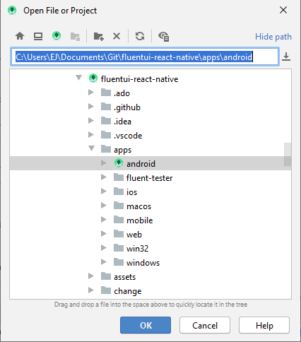

# Running the FluentUI Tester on Android

`FluentUI Tester` is the test app that we use to test our FluentUI components during development. It uses the [react-native-test app](https://github.com/microsoft/react-native-test-app) under the covers, and loads the fluent-tester bundle.

## Launch `FluentUI Tester` app on Android

Prereqs:

- FluentUI Tester is built uses react-native-test app, so install its [prereqs](https://github.com/microsoft/react-native-test-app#react-native-test-app) and follow instructions depending on whether you're developing on Windows or macOS.
- Install [Android Studio](https://developer.android.com/studio)
- Make sure you have setup an [Android Virtual Device](https://developer.android.com/studio/run/managing-avds)

1. Make sure you have followed the [Getting Started](../../README.md) instructions to install packages and build the entire FluentUI React Native repository. I.e. from the root of the repo:

```sh
yarn
yarn build
```

2. Then go into `apps/android` folder and simply run the the following

```sh
yarn android
```

## Using an Apple Silicon Mac (As of July 2021)

- The virtual devices in the AVD Manager with arm64 images still have some bugs. To get the current best emulator, download it from Github: [version 3](https://github.com/google/android-emulator-m1-preview).

- Since the emulator is an emulator, you need open it manually first. Then open Android Studio from `/apps/android/src`, choose 'emulator-5554' as the device and run the app.
- To connect to metro run the following and reload the app:

```sh
adb reverse tcp:8081 tcp:8081
yarn start
```

- APKs: The emulator is running on arm64 so any APKs that need to be installed need to be for arm64. Here is a [link](https://www.apkmirror.com/apk/google-inc/android-accessibility-suite/android-accessibility-suite-9-1-0-358315219-release/android-accessibility-suite-9-1-0-358315219-android-apk-download/) to the accessibility APK which includes TalkBack (voiceover)
  - The ADB location is not automatically detected on the emulator so you need to manually set it.
    1.  Go to expanded settings (three dots on the side) -> settings
    2.  Turn off "Use detected ADB location"
    3.  Click the folder and find the location of adb (~/Library/Android/sdk/platform-tools/adb). You will need to show hidden folders (Shift + CMD + .) to see Library
  - Once ADB location is set, drag and drop the downloaded APK into the emulator to install it onto the emulator

## Dependencies

Dependencies are managed by
[`@rnx-kit/dep-check`](https://github.com/microsoft/rnx-kit/tree/main/packages/dep-check).
If you're looking to upgrade `react-native`, look for the `rnx-kit` section in
`/apps/android/package.json`:

```json
{
  ...
  "rnx-kit": {
    "reactNativeVersion": "^0.63",
    "kitType": "app",
    "bundle": {
  ...
}
```

Bump `reactNativeVersion`, and run `yarn rnx-dep-check --write`. This command
will ensure that all relevant packages are bumped correctly.

You can read more about this tool here:
[`@rnx-kit/dep-check` design document](https://github.com/microsoft/rnx-kit/blob/main/packages/dep-check/DESIGN.md)

## Troubleshooting

- The first time you run your project, you may get errors about missing SDKs. Android Studio usually provides quick options to resolve these issues, but you can also go to Tools->SDK Manager to manually install or update SDK platforms or tools for your project.

- If you get the error "command not found: adb", add the following to .bash_profile or .zprofile

```sh
export PATH=~/Library/Android/sdk/platform-tools:$PATH
```

- If you would like to debug in Android Studio, you can do the following to open the project there:

```sh
# macOS
open -a "Android Studio" .

# Windows
# Easiest to open from within Android Studio - see picture below
```



Note: if Android Studio does not provide you with an "app" to run after you first open the project from the android folder, you may have to restart Android Studio.

Once Android Studio finishes preparing your app folder, you will be able to build and run your app by clicking on the "app" dropdown in the menu bar. If you have not yet setup an AVD, please see [this page](https://developer.android.com/studio/run/managing-avds) on how to set one up.


