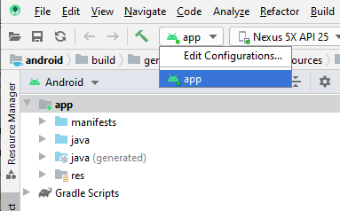

# Running the FluentUI Tester on Android

`FluentUI Tester` is the test app that we use to test our FluentUI components during development. It uses the [react-native-test app](https://github.com/microsoft/react-native-test-app) under the covers, and loads the fluent-tester bundle.

## Launch `FluentUI Tester` app on Android

Prereqs:
- FluentUI Tester is built uses react-native-test app, so install its [prereqs](https://github.com/microsoft/react-native-test-app#react-native-test-app) and follow instructions depending on whether you're developing on Windows or macOS.
- Install [Android Studio](https://developer.android.com/studio)
- Make sure you have setup an [Android Virtual Device](https://developer.android.com/studio/run/managing-avds)

1. Make sure you have followed the [Getting Started](../../README.md) instructions to install packages and build the entire FluentUI React Native repository. I.e. from the root of the repo:
```
    yarn && yarn build
```

2. Then go into `apps/android` folder and launch Android Studio from that directory. This should open Android Studio, and Android Studio will start automatically preparing the "app" folder and apk that your project will run on your Android Virtual Device.

```
    # Mac
    open -a "Android Studio" .

    # Windows
    # Easiest to open from within Android Studio - see picture below
```


Note: if Android Studio does not provide you with an "app" to run after you first open the project from the android folder, you may have to restart Android Studio.

3. Once Android Studio finishes preparing your app folder, you will be able to build and run your app by clicking on the "app" dropdown in the menu bar. If you have not yet setup an AVD, please see [this page](https://developer.android.com/studio/run/managing-avds) on how to set one up.



Troubleshooting
- The first time you run your project, you may get errors about missing SDKs. Android Studio usually provides quick options to resolve these issues, but you can also go to Tools->SDK Manager to manually install or update SDK platforms or tools for your project.
