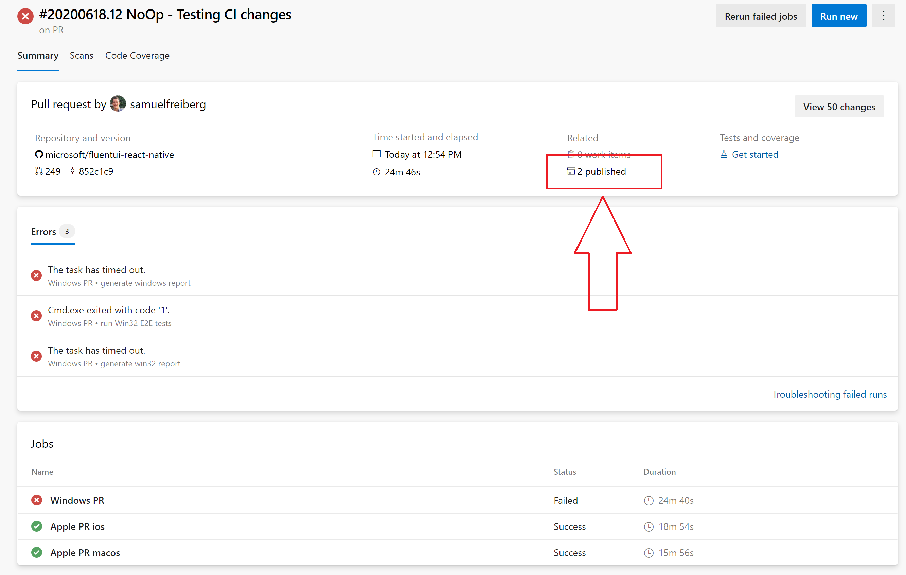
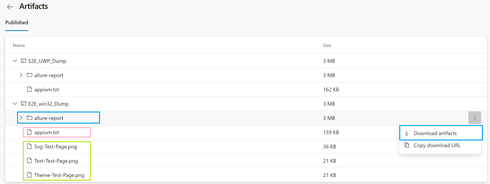

# E2E Testing Overview

## Prerequisites

- [Node.js](https://nodejs.org/en/download/) - Version 10.19 or higher.
- [React Native Windows Development Dependencies](https://microsoft.github.io/react-native-windows/docs/rnw-dependencies)
  - **NOTE:** Please make sure you grab all of the items listed there and the appropriate versions.
- [WinAppDriver](https://github.com/microsoft/WinAppDriver) - Version 1.1
- Enable [_Developer Mode_](https://docs.microsoft.com/en-us/windows/uwp/get-started/enable-your-device-for-development) in Windows settings
- [Java 1.8](https://www.oracle.com/java/technologies/javase/javase-jdk8-downloads.html) (Optional) - Used for generating in-depth after-action reports. More information in "Debugging E2E Failures" section below.
- [Allure Command-Line](https://www.npmjs.com/package/allure-commandline) (Optional) - Used for creating in-depth reporting.
  - `npm install -g allure-commandline`

### UWP Additional Prerequisites

- [UWP Prerequisites](https://github.com/microsoft/fluentui-react-native/blob/master/apps/windows/readme.md)

## E2E Project Structure

- E2E - The root E2E testing folder containing test components and their respective platform-specific page objects and spec documents.
- reports - Each platform folder (apple, win32, windows) contains this folder that saves the test reports from Appium/WebDriverIO.
- wdio.conf.js - Each platform folder contains this file. It's the configuration file for WebDriverIO, which also configures Appium, WinAppDriver, and Jasmine parameters.

# Running E2E Tests

## Win32 Steps

1. Install node packages, build JS
   - C:\repo> `cd fluentui-react-native`
   - C:\repo\fluentui-react-native> `yarn`
   - C:\repo\fluentui-react-native> `yarn build`
2. Bundle the test app (pick specific platform you want to test, we'll use win32)
   - C:\repo\fluentui-react-native>`cd apps\win32`
   - C:\repo\fluentui-react-native\apps\win32> `yarn bundle`
3. Run E2E tests
   - C:\repo\fluentui-react-native\apps\win32> `yarn e2etest`

## UWP Steps

1. Follow step #1 from "Win32 Steps" section above.
2. Start the server
   - C:\repo\fluentui-react-native> `cd apps\windows`
   - C:\repo\fluentui-react-native\apps\windows> `yarn start`
3. Open a new command prompt and run the E2E tests
   - C:\repo\fluentui-react-native\apps\windows> `yarn e2etest`

_Note: It could take up to a minute to load the test app with WebDriverIO, don't panic, the tests will run :)_

# Authoring E2E Test

## Create a new Page Object

Page Object is a design pattern which has become popular in test automation for enhancing test maintenance and reducing code duplication. A [page object](https://webdriver.io/docs/pageobjects.html) is an object-oriented class that serves as an interface to a page of you testing app. The tests then use the methods of this Page Object whenever they need to interact with the UI of that page.
The benefit is that if the UI changes for the test page, the tests themselves don’t need to change, only the code within the page object needs to change.

Page Objects should be put in apps/fluent-tester/src/E2E/_ *ComponentToBeTested* _/pages/.

```
// CheckboxTestPage.win.ts
class CheckboxTestPage extends BasePage {

  toggleCheckbox() {
    this._testPage.click();
  }

  get _testPage() {
    return By(CHECKBOX_TESTPAGE);
  }
}

export default new CheckboxTestPage();
```

### **Selectors**

- In order for a Page Object to access a component from the test page, you must use [selectors](https://webdriver.io/docs/selectors.html). The WebDriver Protocol provides several selector strategies to query an element.

- If [testID](https://reactnative.dev/docs/picker-item#testid) is specified in React Native app for Windows, the locator strategy should choose accessibility id.
  A unique accessiblity id/testID per Window is recommended for React Native Windows E2E testing when authoring the test app and test cases.

- To use this, we must add a prop to our component or UI element in question called “testID”. In our test page, set the “testID” for the component, and we can then select it in our Page Object using the imported **_By_** method above from a base class.

## Write a Test Spec

The spec document is where the tests will be written. We use [Jasmine](https://jasmine.github.io/), an open-sourced testing framework for JavaScript.
The spec document imports a page object and uses it to manipulate the UI and uses 'expect' and other Jasmine statements to ensure proper functionality.

Spec documents should be put in apps/fluent-tester/src/E2E/\_ _ComponentToBeTested_ /specs/.

```
describe('Click on each test page and check if it renders', function() {
  it('Checkbox Test Page', () => {
    BootTestPage.clickAndGoToCheckboxPage();
    expect(CheckboxTestPage.isPageLoaded()).toBeTruthy();
  });
});
```

# Debugging E2E Failures (Locally)

If one tests fails, it will cause every subsequent test to fail as well. Due to this structure, if you get a failing E2E run, you should find the **first** failing test and focus on fixing that one.

Having a clear and concise report on testing failures is key in efficient debugging. We're utilizing two report generators:

1. **Spec Reporter** - Low overhead, easy to read, automatically runs with E2E testing. However, less information and less reliable.

2. **Allure Reporter** - Creates in-depth reports with key information about each test. Must have Java 1.8 downloaded to create reports and requires running additional script after E2E testing is complete.

## Using Spec Reporter

You can view the spec report right as E2E testing is finished. It shows the failing tests and a brief explanation of what went wrong. However, in some cases when a redbox error occurs (mostly in Win32), these messages and report will not exist. This is because the FluentTester app becomes a non-responsive window, and WebDriverIO cannot close the window, which leaves the spec reporter in a bad state. In this case, I would recommend using the Allure Reporter.

In the example below, the SVG test is the one failing the run, and at the bottom, you can see an error message.


When running E2E locally, after failing an E2E run, you will get a screenshot of the error in /errorShots/ of the platform you tested.

## Using Allure Reporter

Allure Framework is a flexible, lightweight multi-language test report tool that not only shows a very concise representation of what have been tested in a neat web report form, but allows everyone participating in the development process to extract maximum of useful information from everyday execution of tests.

After E2E testing runs, allure creates a folder of XML files with all relevant information from the tests. In order to generate the report, you need to run the following command:

- `yarn generate-report`

This will bundle all the generated information and create a report for you to read.

# Debugging E2E Failures (CI Pipeline)

When an E2E test run fails within our CI, crucial information is output to Azure-Pipelines to help you debug the failure. Follow these steps:

1. On the PR page, navigate to the "Checks" tab, ensure you've selected the "PR" tab on the left, and press "View more details on Azure Pipelines" at the bottom. 

2. Click on the "# published" section. 

3. Here, you have crucial information to help you debug the problem.

   - The bottom files (green) are screenshots of the failing tests. The first one from the top (in this case, Svg-Test-Page), is the test failing the whole run. This is the one you're focus should be on.

   - The middle file (pink) is the Appium output file. This contains more in-depth information on each test, including possible failures with WebDriverIO or the driver being used.

   - The top folder (blue) is the Allure reporter output. In order to generate the report, you must:

     1. Download the folder and unzip it

     2. Navigate to it's location within your cmd, and type:
        - C:\pathToFolder\allure-report\E2E_win32_Dump> `allure open`


