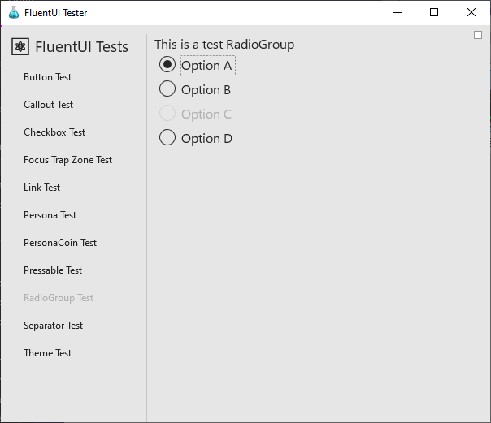
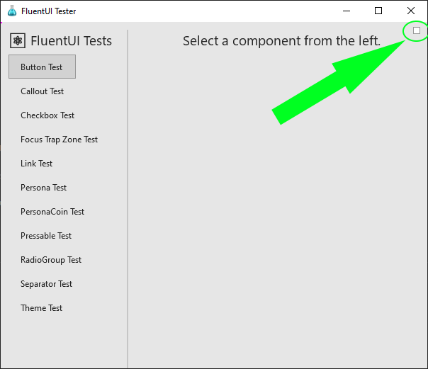

# Running the FluentUI Tester on Win32

`FluentUI Tester` is the test app that we use to test our FluentUI components during development.

## Launch `FluentUI Tester` app on Win32

1. Make sure you have followed the [Getting Started](../../README.md#setup-your-development-environment) instructions to clone and build the entire FluentUI React Native repository. I.e. from the root of the repo:

2. Then go into `apps\win32` folder:

```
cd apps\win32
```

3. Build the FluentUI Tester bundle:

```
yarn bundle
```

4. Launch the FluentUI Tester app:

```
yarn run-win32
```

5. You will see FluentUI Tester show up in a new window.



## Debug `FluentUI Tester` app with direct debugging

Note: we recommend using [Visual Studio Code](https://code.visualstudio.com/download) for direct debugging.

1. Follow the same step #1 as above.
2. Follow the same step #2 as above.

3. Build the FluentUI Tester bundle with dev option. This will ensure source map is included in the bundle.

```
yarn bundle-dev
```

4. Launch the FluentUI Tester app:

```
yarn run-win32
```

5. Inside ReactTest, open the debug option menu and select the checkbox `Use Direct Debugger`



6. In Visual Studio Code, open the debug pane and select `Debug Fabric Tester` option from the "Run And Debug" dropdown.


7. At this time, VS Code will attach to the JS runtime and you can start debugging. For more information on debugging in VS Code, please see [Visual Studio Code documentation](https://code.visualstudio.com/docs/editor/debugging).

## Debug `FluentUI Tester` app with web debugging

1. Follow the same step #1 as above.
2. Follow the same step #2 as above.
3. Start the debug server:

```
yarn start
```

4. Open Edge or Chrome and navigate to http://localhost:8081/debugger-ui

5. Open another command prompt and go into the same location `apps\win32` and run:

```
yarn run-win32-web
```

## Dependencies

Dependencies are managed by
[`@rnx-kit/dep-check`](https://github.com/microsoft/rnx-kit/tree/main/packages/dep-check).
If you're looking to upgrade `react-native`, look for the `rnx-kit` section in
`/apps/win32/package.json`:

```json
{
  ...
  "rnx-kit": {
    "reactNativeVersion": "^0.63",
    "kitType": "app",
    "bundle": {
  ...
}
```

Bump `reactNativeVersion`, and run `yarn rnx-dep-check --write`. This command
will ensure that all relevant packages are bumped correctly.

You can read more about this tool here:
[`@rnx-kit/dep-check` design document](https://github.com/microsoft/rnx-kit/blob/main/packages/dep-check/DESIGN.md)
