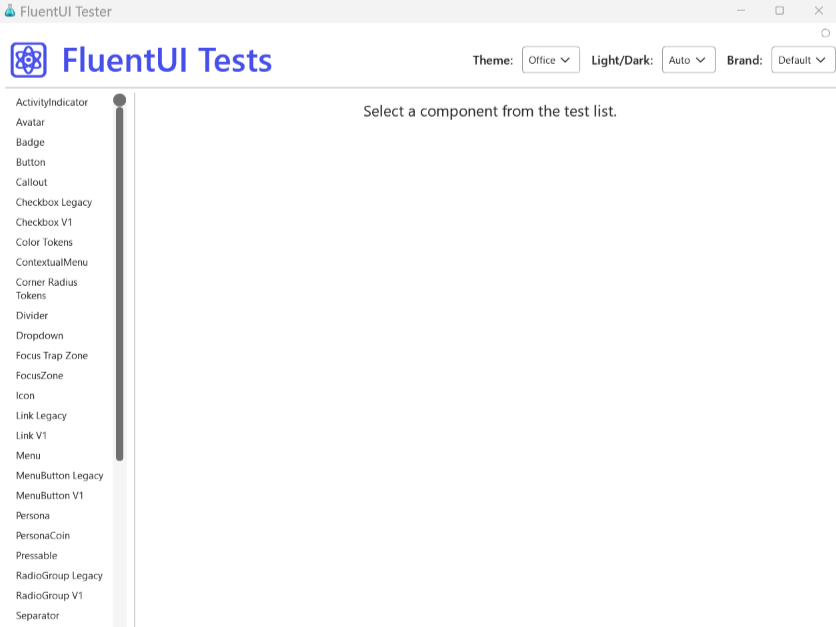
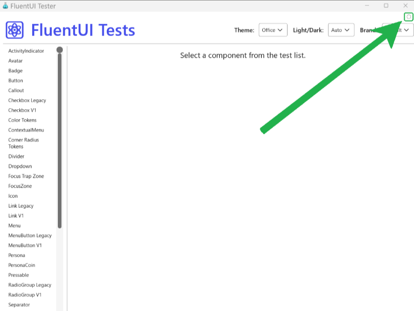
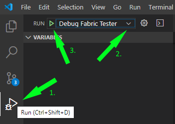

# Running the FluentUI Tester on Win32

`FluentUI Tester` is the test app that we use to test our FluentUI components during development.

## Launch `FluentUI Tester` app on Win32

1. Make sure you've installed the Standard React Native dependencies and Node.js from the [Prerequisites](https://github.com/microsoft/fluentui-react-native/tree/main?tab=readme-ov-file#prerequisites) section.

2. Next, [clone and build the repo](https://github.com/microsoft/fluentui-react-native/tree/main?tab=readme-ov-file#setup-your-development-environment). If you already have a clone of the repo, make sure you've pulled the latest from the main branch (run `git pull` from your clone's main branch). You can verify you have the latest commits by running `git log` which lists all the commits from your branch with dates. Ensure commits are from a recent date or match the latest commits [here](https://github.com/microsoft/fluentui-react-native/commits/main). To exit the `git log` view, press the letter 'q' (for "quit").

3. Then go into `apps\win32` folder:

```
cd apps\win32
```

3. Build the FluentUI Tester bundle:

```
yarn bundle
```

4. Launch the FluentUI Tester app:

```
yarn run-win32
```

5. You will see the FluentUI Tester show up in a new window.



## Debug `FluentUI Tester` app with direct debugging

Note: we recommend using Visual Studio Code for direct debugging.

1. Follow steps #1-3 above.
2. Build the FluentUI Tester bundle with dev option. This will ensure source map is included in the bundle.

```
yarn bundle-dev
```

3. Launch the FluentUI Tester app:

```
yarn run-win32
```

4. Inside ReactTest, open the debug option menu and select the checkbox `Use Direct Debugger`



5. In Visual Studio Code, open the debug pane and select `Debug Fabric Tester` option from the "Run And Debug" dropdown.



6. At this time, VS Code will attach to the JS runtime and you can start debugging

## Dependencies

Dependencies are managed by
[`@rnx-kit/align-deps`](https://github.com/microsoft/rnx-kit/tree/main/packages/align-deps).
If you're looking to upgrade `react-native`, use the interactive upgrade command:

```sh
yarn rnx-align-deps --set-version
```

This command will ensure that all relevant packages are bumped correctly.

You can read more about this tool here:
[`@rnx-kit/align-deps` design document](https://github.com/microsoft/rnx-kit/blob/main/docsite/docs/architecture/dependency-management.md)
