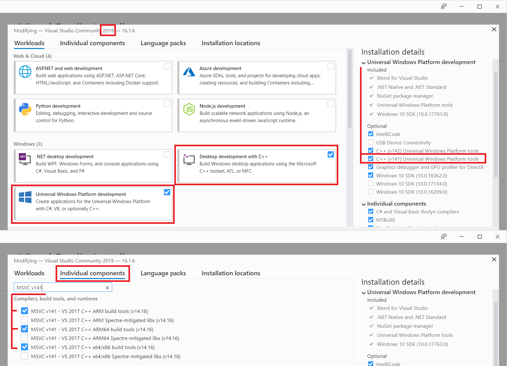
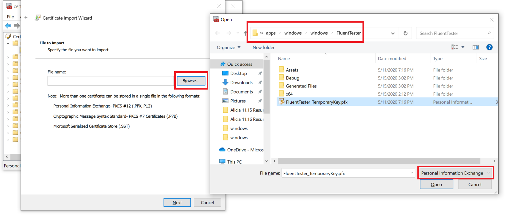

# Running the FluentUI Tester on Windows

## Prerequisites

- [Node.js](https://nodejs.org/en/download/)
- [React Native Windows Development Dependencies](https://microsoft.github.io/react-native-windows/docs/rnw-dependencies)
  - **NOTE:** Please make sure you grab all of the items listed there and the appropriate versions.
    
- [Azure Credentials Plugin for NuGet](https://github.com/microsoft/artifacts-credprovider#manual-installation-on-windows)
  - We're currently on an expermental version of react-native-windows which is being published to a private NPM feed hosted on Azure DevOps.

### Add the App Signing Certificate to your Personal Certificate Store

As with normal UWP app development, the UWP test harness that loads the JS bundle must have a developer-signed certificate present to install the APPX package.

1. Windows+R to open the Run Dialog and type in `certmgr.msc`. **NOTE:** For some reason this takes some time on my machine.
2. Expand `Personal` and right click on `Certificates`
3. Under `All tasks` click `Import`
4. For the Current User, `Browse` to find `FluentTester_TemporaryKey.pfx` in your local clone of the repo. It is currently under [fluentui-react-native/apps/windows/windows/FluentTester](windows/FluentTester).
5. On the next page, type in 'password' for the password.
   

## Running the App

1. Run `yarn` from the root of the repo
2. From this directory, simply `yarn windows`

## Dependencies

Dependencies are managed by
[`@rnx-kit/dep-check`](https://github.com/microsoft/rnx-kit/tree/main/packages/dep-check).
If you're looking to upgrade `react-native`, look for the `rnx-kit` section in
`/apps/windows/package.json`:

```json
{
  ...
  "rnx-kit": {
    "reactNativeVersion": "^0.63",
    "kitType": "app",
    "bundle": {
  ...
}
```

Bump `reactNativeVersion`, and run `yarn rnx-dep-check --write`. This command
will ensure that all relevant packages are bumped correctly.

You can read more about this tool here:
[`@rnx-kit/dep-check` design document](https://github.com/microsoft/rnx-kit/blob/main/packages/dep-check/DESIGN.md)

## Troubleshooting

### EPERM restoring NuGet packages

If you see an error like the following:

```
- Restoring NuGet packages
× Failed to restore the NuGet packages: Error: EPERM: operation not permitted, unlink C:\Users\adrum\AppData\Local\Temp\nuget.4.9.2.exe'
```

Double check that you have correctly installed the Azure Credentials Plugin for NuGet mentioned in the Prerequisites above.
