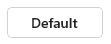
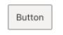
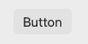
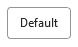

# Default FURN Themes

FURN has a default theme built in based on the [web version of the Fluent Design System](https://developer.microsoft.com/en-us/fluentui#/styles/web). This theme can be accessed by calling `createDefaultTheme()`.

We also have a default theme for each platform we support, which makes our components take on more of a native feel, while still allowing the components to fit with other Microsoft experiences.

## Platform Differences

There are slight differences of the default theme between platforms. Each platform has its own default values for typography, spacing, and other styling applied to components.

On Android and Apple platforms, you can access the default themes by calling `createAndroidTheme()`, `createAppleTheme()` respectively. These can be passed into the `ThemeProvider` for use in your app. On Windows, the default theme is provided by `createDefaultTheme()`.

On win32, we allow for better integration with an Office host.

## Integration with Office

On win32, we allow for integration with Office theming via an `OfficeThemingModule`. Office has a native module which provides information about the queried palette based on the current Office theme. FURN uses the information to populate `theme.colors`, but the palette is available as well under `theme.host.palette`.

You can create a theme using information from Office by calling `createOfficeTheme()`. By default, we use the `WhiteColors` palette. You can also ask for a specific palette's values by passing in a `paletteName` as part of the `ThemeOptions` passed into `createOfficeTheme()`:

```tsx
import { ThemeProvider } from '@fluentui-react-native/theme';
import { createOfficeTheme } from '@fluentui-react-native/win32-theme';
import { useTheme } from '@fluentui-react-native/framework';
import { Text } from 'react-native';

const AppWithOfficeTheme = () => {
  return (
    // Populate the theme with colors from PaletteName palette in Office.
    <ThemeProvider theme={createOfficeTheme({ paletteName: 'PaletteName' })}>
      <AppContent />
    </ThemeProvider>
  );
};

const AppContent = () => {
  const officeTheme = useTheme();
  return (
    <>
      // bodyText property value of theme is determined by palette
      <Text color={officeTheme.colors.bodyText}>Hello World!{'\n'}</Text>
      // Access palette entries directly if required
      <Text color={officeTheme.host.palette.Text}>Lorem ipsum!</Text>
    </>
  );
};
```

You can take a look at how the palette is used to populate theme colors [here](https://github.com/microsoft/fluentui-react-native/blob/master/packages/theming/win32-theme/src/paletteFromOfficeColors.ts) and [here](https://github.com/microsoft/fluentui-react-native/blob/master/packages/theming/win32-theme/src/createAliasesFromPalette.ts).

## Example

Here's how the button component looks by default on every platform:

### Default (Web / Windows)

```tsx
import { ThemeProvider } from '@fluentui-react-native/theme';
import { createDefaultTheme } from '@fluentui-react-native/default-theme';

<ThemeProvider theme={createDefaultTheme()}>
  <Button content={'Default Button'} />
</ThemeProvider>;
```



### Android

```tsx
import { ThemeProvider } from '@fluentui-react-native/theme';
import { createAndroidTheme } from '@fluentui-react-native/android-theme';

<ThemeProvider theme={createAndroidTheme()}>
  <Button content={'Button'} />
</ThemeProvider>;
```


### iOS

```tsx
import { ThemeProvider } from '@fluentui-react-native/theme';
import { createAppleTheme } from '@fluentui-react-native/apple-theme';

<ThemeProvider theme={createAppleTheme()}>
  <Button content={'Button'} />
</ThemeProvider>;
```



### MacOS

```tsx
import { ThemeProvider } from '@fluentui-react-native/theme';
import { createAppleTheme } from '@fluentui-react-native/apple-theme';

<ThemeProvider theme={createAppleTheme()}>
  <Button content={'Button'} />
</ThemeProvider>;
```



### Win32 (Office)

```tsx
import { ThemeProvider } from '@fluentui-react-native/theme';
import { createOfficeTheme } from '@fluentui-react-native/win32-theme';

<ThemeProvider theme={createOfficeTheme()}>
  <Button content={'Default Button'} />
</ThemeProvider>;
```


