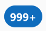
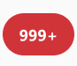

# Badge

## Background

A cross-platform Badge component using the Fluent Design System. A badge is an additional visual descriptor for UI elements.

```ts
import { Badge } from '@fluentui-react-native/badge';
```

## Sample Code

Basic examples:

```jsx
  <Badge>999+</Badge>
  <Badge appearance="filled">999+</Badge>
  <Badge shape="rounded" size="large" />
  <Badge icon={{ svgSource: { src: TestSvg, viewBox: '0 0 500 500' } }} iconPosition="after" />
  <CounterBadge count={5} appearance="ghost" />
  <CounterBadge count={0} dot showZero={true} />
  <CounterBadge count={100} overflowCount={70} />
  <PresenceBadge status="available" />
  <PresenceBadge outOfOffice={true} status="away" />
```

More examples on the [Test pages for the Badge](../../../apps/tester-core/src/TestComponents/Badge). Instructions on running the tester app can be found [here](../../../apps/fluent-tester/README.md).

## Visual Examples

Win32:



```tsx
<Badge>999+</Badge>
```


```tsx
<Badge appearance="severe" icon={{ svgProps }} iconPosition="after">WARNING</Button>
```


```tsx
<PresenceBadge status="away" />
```



```tsx
<CounterBadge appearance="danger" count={1000} overflowCount={999} />
```

## BasicBadge

## Variants

### Shape

The Basic Badge supports a square, rounded and circular shape.

### Sizes

`Badge` supports next sizes: `tiny`, `extraSmall`, `small`, `medium`, `large`, `extraLarge`.

### Appearance

The `Badge` can be `filled`, `outline`, `tint`, `ghost`.

### Color

The Badge supports preset and custom colors: `brand`, `danger`, `important`, `informative`, `severe`, `subtle`, `success`, `warning`

### Icon

The `Badge` component can include an `icon`.

### Image

An `image` can be added to the Badge as an optional content.
Example:

```jsx
<Badge>
  Badge with
  <Image source={{ uri: './path.png' }} />
  <Text style={{ backgroundColor: 'yellow' }}>optional content</Text>
</Badge>
```

### Content

Content is passed as part of `children` prop.
For long Badges it's up to consumer how they want to truncate/hide the content.

## API

### Slots

The `Badge` component has the following slots:

- `root` - The outer container representing the `Badge` wrapper.
- `icon` - If specified, renders an `icon`.
- `text` - This slot is used to render text content.

The slots can be modified using the `compose` function on the `Badge`. For more information on using the `compose` API, please see [this page](../../framework/composition/README.md).

### Props

```ts
export interface BadgeConfigurableProps {
  /**
   * A Badge can be one of preset colors
   * @defaultvalue brand
   */
  badgeColor?: BadgeColor;

  /**
   * The icon color.
   */
  iconColor?: ColorValue;

  /**
   * Badge position
   * @defaultvalue absolute
   */
  position?: FlexStyle['position'];

  /**
   * Sets shadow style with `ambient` and `key` props
   */
  shadowToken?: ShadowToken;
}
```

```ts
export interface BadgeCoreProps {
  /**
   * A Badge can be square, circular or rounded.
   * @defaultvalue circular
   */
  shape?: BadgeShape;

  /** Sets style of Badge to a preset size style
   * @defaultvalue medium
   */
  size?: BadgeSize;
}
export interface BadgeProps extends BadgeCoreProps, BadgeConfigurableProps {
  /**
   * A Badge can have its content and borders styled for greater emphasis or to be subtle.
   * It can be filled, outline, ghost, inverted
   * @defaultvalue filled
   */
  appearance?: BadgeAppearance;

  /*
   * Source URL or name of the icon to show on the Badge.
   */
  icon?: IconSourcesType;

  /**
   * Icon can be placed before or after Badge's content.
   * @default before
   */
  iconPosition?: BadgeIconPosition;
}
```

### Styling Tokens

Tokens can be used to customize the styling of the control by using the `customize` function on the `Badge`. For more information on using the `customize` API, please see [this page](../../framework/composition/README.md). The `Badge` has the following tokens:

```ts
export interface BadgeCoreTokens extends LayoutTokens, FontTokens, IBorderTokens, IShadowTokens, IColorTokens {
  /**
   * Set the bottom edge of the Badge
   */
  bottom?: FlexStyle['bottom'];

  /**
   * The height of the Badge.
   */
  height?: number;

  /**
   * The icon size.
   */
  iconSize?: number;

  /**
   * Set the left edge of the Badge
   */
  left?: FlexStyle['left'];

  /**
   * Set the right edge of the Badge
   */
  right?: FlexStyle['right'];

  /**
   * Set the top edge of the Badge
   */
  top?: FlexStyle['top'];

  /**
   * The width of the Badge.
   */
  width?: number;

  /**
   * Sizes of the Badge
   */
  tiny?: BadgeTokens;
  extraSmall?: BadgeTokens;
  small?: BadgeTokens;
  medium?: BadgeTokens;
  large?: BadgeTokens;
  extraLarge?: BadgeTokens;

  /**
   * Shapes of the Badge
   */
  rounded?: BadgeTokens;
  circular?: BadgeTokens;
  square?: BadgeTokens;
}
export interface BadgeTokens extends BadgeCoreTokens, BadgeConfigurableProps {
  /**
   * The weight of the lines used when drawing the icon.
   */
  iconWeight?: number;

  /**
   * Additional states that can be applied to a Badge
   */
  filled?: BadgeTokens;
  outline?: BadgeTokens;
  tint?: BadgeTokens;
  ghost?: BadgeTokens;

  /**
   * Colors of the Badge
   */
  brand?: BadgeTokens;
  danger?: BadgeTokens;
  important?: BadgeTokens;
  informative?: BadgeTokens;
  severe?: BadgeTokens;
  subtle?: BadgeTokens;
  success?: BadgeTokens;
  warning?: BadgeTokens;
}
```

### Accessibility

Basic Badges do not recieve focus and are not accessible.
Information about the badge should be added to the element that hosts the Badge through the element's `accessibilityLabel`.

## PresenceBadge

Presence badge represents user's availability.

### PresenceBadge Props

Presence badge on Android supports only sizes: `small, medium and large `.

```ts
export interface PresenceBadgeProps extends BadgeCoreProps {
  status?: PresenceBadgeStatus;
  outOfOffice?: boolean;
}
```

### PresenceBadge Tokens

```ts
export interface PresenceBadgeTokens extends BadgeCoreTokens {
  available?: PresenceBadgeTokens;
  away?: PresenceBadgeTokens;
  offline?: PresenceBadgeTokens;
  outOfOffice?: PresenceBadgeTokens;
  doNotDisturb?: PresenceBadgeTokens;
  busy?: PresenceBadgeTokens;
  unknown?: PresenceBadgeTokens;
  blocked?: PresenceBadgeTokens;
  status?: PresenceBadgeStatus;
}
```

## CounterBadge

Small numerical value or status descriptor for UI elements.

### CounterBadge States

The following section describes the different states which `CounterBadge` can be in as a result of interaction.

#### showBadge state

`showBadge` is set to true when `count` is bigger than 0, or when showZero is set to `true`.

#### displayCount state

`displayCount` state has content to show,e.g. if `count` is 1500 and `overflowCount` is 1000, then `displayCount` is `1000+`.

### Interaction

1. By default badge will be hidden when count is 0.
2. If count is greater than zero badge is shown.
3. Use property `showZero` to show badge even if count is at zero.

#### Overflow count

`[overflow count]+` is displayed when count is larger than the limit of displayed digits. Limit is set by prop `overflowCount`.
Examples:
By default `overflowCount` is equal to 99. If `count` is larger then `99+` will be shown.

### CounterBadge props

```ts
export interface CounterBadgeProps extends Omit<BadgeCoreProps, 'appearance' | 'color'>, Omit<BadgeProps, 'shape'> {
  /**
   * A Badge can have different appearances that emphasize certain parts of it:
   *  - filled: The default appearance if one is not specified.
   *    The badge background is filled with color with a contrasting foreground text to match.
   *  - ghost: The badge background is transparent, with the foreground text taking color to emphasize it.
   * @default filled
   */
  appearance?: 'filled' | 'ghost';

  /**
   * Semantic colors for a counter badge
   * @default brand
   */
  color?: Extract<BadgeProps['color'], 'brand' | 'danger' | 'important' | 'informative'>;

  /**
   * Value displayed by the Badge
   * @default 0
   */
  count?: number;

  /**
   * If a dot should be displayed without the count
   * @default false
   */
  dot?: boolean;

  /**
   * Max number to be displayed
   * @default 99
   */
  overflowCount?: number;

  /**
   * A Badge can be circular or rounded
   * @default circular
   */
  shape?: 'circular' | 'rounded';

  /**
   * If the badge should be shown when count is 0
   * @default false
   */
  showZero?: boolean;
}
```
