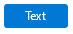

# Button

In the short term, the new `Button` control is named `ButtonV1` while it clashes with the existing older control. Once we deprecate the old control, it will be renamed to `Button`. It may be useful to rename the control to `Button` using the import syntax to simplify the rename:

```ts
import { ButtonV1 as Button } from '@fluentui-react-native/button';
```

## Background

The `Button` component enables users to trigger an action or event, such as submitting a form, opening a dialog, canceling an action, or performing a delete operation.

## Requirements

If using FURN's theming, the `Button` requires use of the `ThemeProvider` from `@fluentui-react-native/theme` to work properly with themes. Please see [this page](../../../docs/pages/Guides/UpdateThemeProvider.md) for information on updating your `ThemeProvider` if using the version from `@uifabricshared/theming-react-native`.

## Sample Code

Basic examples:

```jsx
<Button>Text</Button>
<Button icon={{ svgSource: { uri: 'https://www.example.com/test.svg', viewBox: '0 0 100 100' } }} iconOnly/>
<Button icon={{ svgSource: { uri: 'https://www.example.com/test.svg', viewBox: '0 0 100 100' } }}>Text</Button>
<Button appearance="primary">Text</Button>
<Button disabled>Text</Button>
<Button size="small">Text</Button>
<Button size="large">Text</Button>
```

More examples on the [Test pages for the Button](../../../apps/fluent-tester/src/TestComponents/Button). Instructions on running the tester app can be found [here](../../../apps/fluent-tester/README.md).

## Visual Examples

Win32:


```tsx
<Button>Text</Button>
```



```tsx
<Button appearance="primary">Text</Button>
```

## Variants

### Appearance

The `Button` component has several apparance variants depending on where it's being used:

- The default `Button` is rendered with its default styling indicating a trigger for an action. For mobile endpoints this is the same as 'accent'.
- appearance="primary"/appearance="accent": The `Button` is styled to emphasize that it represents the primary action. Accent is equivalent to primary and is based on mobile platform naming conventions.
- appearance="subtle": The `Button` is styled to blend into its background to become less emphasized.
- appearance="outline": The `Button` is styled similar to 'subtle' button but also includes a border. Implemented for mobile endpoints only. Maps to default on other platforms.

### Icon

The `Button` component can include an `icon` that appears before or after its `children`. If an `icon` is provided without any other `children` passed into `Button`, then the `Button` becomes an icon-only `Button`. This prop is required for proper styling.

### Shape

- shape="rounded": The button as rounded corners. This is the default if shape is not set.
- shape="circular": The button has completely round corners. A button of equal width and height will be a circle.
- shape="square": The button has right-angle corners.

**Shape modification is not explicitly supported on Android and is provided as an 'as-is' functionality.**

### Sizes

The `Button` component supports different sizing with at least three different sizes: `small`, `medium`, and `large`. `Small` is the default on `win32`, `medium` is the default on other platforms.

**Size modification is not explicitly supported on Android and is provided as an 'as-is' functionality.**

### Block

The `Button` component can completely fill the width of its container.

**'Block' is not explicitly supported on Android and is provided as an 'as-is' functionality.**

### Loading

The `Button` component can be loading if it's waiting for another action to occur before allowing itself to be interacted with.

**'Loading' is not explicitly supported on Android and is provided as an 'as-is' functionality.**

## API

### Slots

The `Button` component has three slots, or parts. The slots behave as follows:

- `root` - The outer container representing the `Button` itself that wraps everything passed via the `children` prop.
- `icon` - If specified, renders an `icon` either before or after the `children` as specified by the `iconPosition` prop.
- `content` - If specified, renders the first entry of `children` as text.
- `rippleContainer` - A wrapper view to support curved border in ripple for Android.

The slots can be modified using the `compose` function on the `Button`. For more information on using the `compose` API, please see [this page](../../framework/composition/README.md).

### Props

Below is the set of props the button supports:

```ts
export interface ButtonProps extends Omit<PressablePropsExtended, 'onPress'> {
  /**
   * A button can have its content and borders styled for greater emphasis or to be subtle.
   * - 'primary' or 'accent': Emphasizes the button as a primary action. 'Accent' added to support Mobile platform naming convention, maps to 'primary'.
   * - 'subtle': Minimizes emphasis to blend into the background until hovered or focused.
   * - 'outline': Similar to subtle but has a border. Implemented for mobile endpoints only. Maps to default on other platforms.
   * @default 'primary' on mobile endpoints, other platform have a separate style when no appearance is passed.
   */
  appearance?: 'primary' | 'subtle' | 'accent' | 'outline';

  /**
   * A button can fill the width of its container.
   * Not supported from Fluent Android, renders as-is.
   * @default false
   */
  block?: boolean;

  /**
   * A RefObject to access the IButton interface. Use this to access the public methods and properties of the component.
   */
  componentRef?: React.RefObject<IFocusable>;

  /**
   * Whether to use native focus visuals for the component
   * @default true
   */
  enableFocusRing?: boolean;

  /**
   * Icon slot that, if specified, renders an icon either before or after the `children` as specified by the
   * `iconPosition` prop.
   */
  icon?: IconSourcesType;

  /**
   * Button contains only icon, there's no text content
   * Must be set for button to style correctly when button has no content.
   */
  iconOnly?: boolean;

  /**
   * A button can format its icon to appear before or after its content.
   * 'after' is not supported from Fluent Android, renders as-is.
   * @default 'before'
   */
  iconPosition?: 'before' | 'after';

  /**
   * A button can show a loading indicator if it is waiting for another action to happen before allowing itself to
   * be interacted with.
   * Not supported from Fluent Android, renders as-is.
   * @default false
   */
  loading?: boolean;

  /**
   * A callback to call on button click event
   */
  onClick?: (e: InteractionEvent) => void;

  /**
   * A button can be rounded, circular, or square.
   * Not supported from Fluent Android, renders as-is.
   * @default 'rounded'
   */
  shape?: 'rounded' | 'circular' | 'square';

  /**
   * A button supports different sizes.
   * @default 'medium'
   */
  size?: 'small' | 'medium' | 'large';

  /**
   * Text that should show in a tooltip when the user hovers over a button.
   */
  tooltip?: string;
}
```

### Styling Tokens

Tokens can be used to customize the styling of the control by using the `customize` function on the `Button`. For more information on using the `customize` API, please see [this page](../../framework/composition/README.md). The `Button` has the following tokens:

```ts
export interface ButtonTokens extends LayoutTokens, FontTokens, IBorderTokens, IShadowTokens, IColorTokens {
  /**
   * Focused State on Android has inner and outer borders.
   * Outer Border is equivalent to the border tokens from IBorders.
   */
  borderInnerColor?: ColorValue;
  borderInnerRadius?: number;
  borderInnerStyle?: ViewStyle['borderStyle'];
  borderInnerWidth?: number;

  /**
   * The icon color.
   */
  iconColor?: ColorValue;

  /**
   * The size of the icon.
   */
  iconSize?: number;

  /**
   * The weight of the lines used when drawing the icon.
   */
  iconWeight?: number;

  /**
   * An object describing the shadow of the button.
   */
  shadowToken?: ShadowToken;

  /**
   * The amount of spacing between an icon and the content when iconPosition is set to 'before', in pixels.
   */
  spacingIconContentBefore?: number;

  /**
   * The amount of spacing between an icon and the content when iconPosition is set to 'after', in pixels.
   */
  spacingIconContentAfter?: number;

  /**
   * The width of the button.
   */
  width?: ViewStyle['width'];

  /**
   * States that can be applied to a button.
   * These can be used to modify styles of the button when under the specified state.
   */
  hovered?: ButtonTokens;
  focused?: ButtonTokens;
  pressed?: ButtonTokens;
  disabled?: ButtonTokens;
  hasContent?: ButtonTokens;
  hasIconAfter?: ButtonTokens;
  hasIconBefore?: ButtonTokens;
  primary?: ButtonTokens;
  subtle?: ButtonTokens;
  block?: ButtonTokens;
  small?: ButtonTokens;
  medium?: ButtonTokens;
  large?: ButtonTokens;
  rounded?: ButtonTokens;
  circular?: ButtonTokens;
  square?: ButtonTokens;
}
```

## Behaviors

### States

The following section describes the different states which `Button` can be in as a result of interaction.

#### Enabled and Disabled states

An enabled `Button` communicates interaction by having styling that invites the user to click/tap on it to trigger an action.

A disabled `Button` is non-interactive, disallowing the user to click/tap on it to trigger an action.

#### Hovered state

A hovered `Button` changes styling to communicate that the user has placed a cursor above it.

#### Focused state

A focused `Button` changes styling to communicate that the user has placed keyboard focus on it. This styling is usually the same to the one in the hovered state plus extra styling on the outline to indicate keyboard focus has been placed on the component.

#### Pressed state

A pressed `Button` changes styling to communicate that the user is currently pressing it.

#### Loading state

A loading `Button` renders a `loader` before all the other content to indicate that it is waiting for another action before allowing itself to be interacted with.

### Interaction

#### Keyboard interaction

The following is a set of keys that interact with the `Button` component:

| Key     | Description                                           |
| ------- | ----------------------------------------------------- |
| `Enter` | Executes the function passed into the `onClick` prop. |
| `Space` | Executes the function passed into the `onClick` prop. |

It is possible to override key behaviors by specifying `onKeyUp` or `onKeyDown`, depending on what `preferKeyDownForKeyEvents` from the `@fluentui-react-native/interactive-hooks` package indicates. Providing the callback this way will prevent the default behaviors noted above -- you will need to handle `Enter` and `Space` in the provided callback if the default behavior is desired.

#### Cursor interaction

- Cursor moves onto botton: Should immediately change the styling of the `Button` so that it appears to be hovered.
- Cursor moves out of botton: Should immediately remove the hovered styling of the `Button`.
- Mouse click: Should execute the `Button` and move focus to its target.

#### Touch interaction

The same behavior as above translated for touch events. This means that there is no equivalent for `onHoverIn` and `onHoverOut`, which makes it so that the hovered state cannot be accessed.

## Accessibility

### Expected behavior

- Should default to adding `role="button"` to the root slot.
- Should mix in the accessibility props expected for a `button` component.
- Should be keyboard tabbable and focusable.

See [`useButton` hook](./src/useButton.ts) for details on accessibility props
