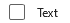
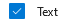
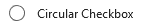
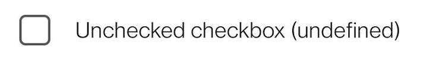
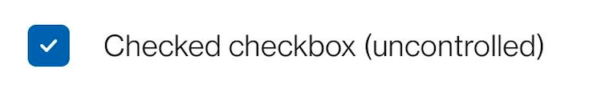
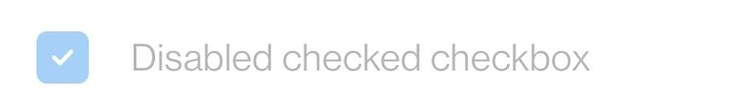
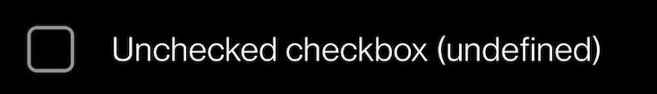
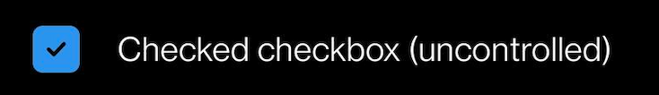

# Checkbox

**Not available on MacOS** - Please use `import { Checkbox } from @'fluentui-react-native/checkbox'` and ignore the deprecation message until further notice.

In the short term, the new `Checkbox` control is named `CheckboxV1` while it clashes with the existing older control. Once we deprecate the old control, it will be renamed to `Checkbox`. It may be useful to rename the control to `Checkbox` using the import syntax to simplify the rename:

```ts
import { CheckboxV1 as Checkbox } from '@fluentui-react-native/checkbox';
```

## Background

The `Checkbox` component enables users to select one or more items from a group, or switch between two mutually exclusive options (checked or unchecked).

## Requirements

If using FURN's theming, the `Checkbox` requires use of the `ThemeProvider` from `@fluentui-react-native/theme` to work properly with themes. Please see [this page](../../../docs/pages/Guides/UpdateThemeProvider.md) for information on updating your `ThemeProvider` if using the version from `@uifabricshared/theming-react-native`.

## Sample Code

Basic examples:

```jsx
<Checkbox label="Example Checkbox" />
<Checkbox label="Large Circular Checkbox" shape="circular" size="large" />
<Checkbox label="Controlled Checkbox" onChange={onChangeFunction} checked={checked} />
```

More examples on the [Test pages for the Checkbox](../../../apps/fluent-tester/src/TestComponents/CheckboxExperimental). Instructions on running the tester app can be found [here](../../../apps/fluent-tester/README.md).

## Visual Examples

Win32:



```jsx
<Checkbox label="Text" />
```



```jsx
<Checkbox label="Text" checked />
```



```jsx
<Checkbox label="Circular Checkbox" shape="circular" />
```

Android:

##### Light Mode

---

<br/>



```jsx
<Checkbox label="Unchecked checkbox (undefined)" />
```



```jsx
<Checkbox label="checked checkbox (uncontrolled)" defaultChecked />
```



```jsx
<Checkbox label="Disabled checked checkbox" defaultChecked disabled />
```


```jsx
<Checkbox label="Disabled checkbox" disabled />
```

##### Dark Mode

---

<br/>



```jsx
<Checkbox label="Unchecked checkbox (undefined)" />
```



```jsx
<Checkbox label="checked checkbox (uncontrolled)" defaultChecked />
```


```jsx
<Checkbox label="Disabled checked checkbox" defaultChecked disabled />
```


```jsx
<Checkbox label="Disabled checkbox" disabled />
```

## Variants

### Checked

The `Checkbox` control supports the `unchecked` and `checked` appearances. It does _not_ support a `intermediate` or `mixed` appearance.

### Shapes

The `Checkbox` control supports a rounded `square` (default) and `circular` shape variants.

Note: Not Supported on Android

### Sizes

The `Checkbox` control supports two different sizes: `medium` (default), and `large`.

Note: Not Supported on Android

## API

### Slots

The `Checkbox` control has three slots, or parts. The slots behave as follows:

- `root` - The outer container representing the `Checkbox` itself that wraps everything passed via the `children` prop.
- `label` - If specified, renders text describing the checkbox either before or after the `checkbox` as specified by the `labelPosition` prop.
- `required` - If specified, renders text that denotes a checkbox as required after `label`.
- `checkbox` - The box which visually represents the checkbox.
- `checkmark` - A checkmark icon which shows whether the checkbox is in a checked state.

The slots can be modified using the `compose` function on the `Checkbox`. For more information on using the `compose` API, please see [this page](../../framework/composition/README.md).

### Props

Below is the set of props the Checkbox supports:

```ts
export interface CheckboxProps extends Omit<IViewProps, 'onPress'> {
  /**
   * Checked state. Mutually exclusive to “defaultChecked”. Use this if you control the checked state at a higher level
   * and plan to pass in the correct value based on handling onChange events and re-rendering.
   */
  checked?: boolean;

  /**
   * A RefObject to access the IFocusable interface. Use this to access the public methods and properties of the component.
   */
  componentRef?: React.RefObject<IFocusable>;

  /**
   * Default checked state. Mutually exclusive to ‘checked’. Use this if you want an uncontrolled component, and
   * want the Checkbox instance to maintain its own state.
   */
  defaultChecked?: boolean;

  /**
   * Disabled state of the checkbox.
   */
  disabled?: boolean;

  /**
   * Whether to use native focus visuals for the component
   * @default true
   */
  enableFocusRing?: boolean;

  /**
   * Label to display next to the checkbox.
   */
  label?: string;

  /**
   * Allows you to set the checkbox to be at the before (start) or after (end) the label
   *
   * @default after
   * @platform win32
   */
  labelPosition?: 'before' | 'after';

  /**
   * Callback that is called when the checked value has changed.
   */
  onChange?: (e: InteractionEvent, isChecked: boolean) => void;

  /**
   * If true, adds an asterisk which denotes that this checkbox is required. Can also be set a custom string.
   * Also sets accessibility state to have screen reader announce required state.
   */
  required?: boolean | string;

  /**
   * The shape of the checkbox. Can be either (rounded) square or circular.
   *
   * @default square
   * @platform iOS, windows, win32
   */
  shape?: CheckboxShape;

  /**
   * Sets style of checkbox to a preset size style.
   * @default 'medium'
   * @platform win32
   */
  size?: CheckboxSize;

  /**
   * Provides a tooltip while hovering over Checkbox component
   * @platform win32
   */
  tooltip?: string;
}
```

### Styling Tokens

Tokens can be used to customize the styling of the control by using the `customize` function on the `Checkbox`. For more information on using the `customize` API, please see [this page](../../framework/composition/README.md). The `Checkbox` has the following tokens:

```ts
export interface CheckboxTokens extends FontTokens, IForegroundColorTokens, IBackgroundColorTokens, IBorderTokens, LayoutTokens {
  /**
   * Color of the background of the box containing the checkmark.
   */
  checkboxBackgroundColor?: ColorValue;

  /**
   * Color of the border of the box containing the checkmark.
   */
  checkboxBorderColor?: ColorValue;

  /**
   * Border radius of the box containing the checkmark.
   */
  checkboxBorderRadius?: number;

  /**
   * Width of the border around the box containing the checkmark.
   */
  checkboxBorderWidth?: number;

  /**
   * Height and width of the checkbox containing the checkmark.
   */
  checkboxSize?: number;

  /**
   * Color of the checkmark icon.
   * Note: Due to upstream limitations this currently does not support PlatformColors.
   */
  checkmarkColor?: ColorValue;

  /**
   * The opacity of checkmark as a number between 0 and 1.
   */
  checkmarkOpacity?: number;

  /**
   * Height and width of the checkmark icon.
   */
  checkmarkSize?: number;

  /**
   * Color of the text that denotes that the checkbox is required
   */
  requiredColor?: ColorValue;

  /**
   * Amount of padding between the end of the label and the start of the required text
   */
  requiredPadding?: ViewStyle['padding'];

  /**
   * The amount of spacing between an icon and the content when iconPosition is set to 'before', in pixels
   */
  spacingLabelAfter?: number;

  /**
   * The amount of spacing between an icon and the content when iconPosition is set to 'after', in pixels
   */
  spacingLabelBefore?: number;

  /**
   * States that can be applied to a Checkbox.
   * These can be used to modify styles of the Checkbox when under the specified state.
   */
  disabled?: CheckboxTokens;
  label?: CheckboxTokens;
  labelIsBefore?: CheckboxTokens;
  hovered?: CheckboxTokens;
  focused?: CheckboxTokens;
  pressed?: CheckboxTokens;
  checked?: CheckboxTokens;
  circular?: CheckboxTokens;
  medium?: CheckboxTokens;
  large?: CheckboxTokens;
}
```

## Behaviors

### States

The following section describes the different states which `Checkbox` can be in as a result of interaction.

#### Enabled and Disabled states

An enabled `Checkbox` communicates interaction by having styling that invites the user to click/tap on it to trigger an action.

A disabled `Checkbox` is non-interactive, disallowing the user to click/tap on it to trigger an action.

#### Hovered state

A hovered `Checkbox` changes styling to communicate that the user has placed a cursor above it. On win32, this will show a checkmark in a checkbox.

Note: Not Supported on Android

#### Focused state

A focused `Checkbox` changes styling to communicate that the user has placed keyboard focus on it. This styling is usually the same to the one in the hovered state plus extra styling on the outline to indicate keyboard focus has been placed on the component.

Note: Not Supported on Android

#### Pressed state

A pressed `Checkbox` changes styling to communicate that the user is currently pressing it.

Note: Not Supported on Android

#### Checked state

A checked `Checkbox` changes styling to communicate that it is currently in a selected state. The checkbox will show a checkmark in it to show the checked state.

### Interaction

#### Keyboard interaction

The following is a set of keys that interact with the `Checkbox` component:

| Key     | Description                                            |
| ------- | ------------------------------------------------------ |
| `Space` | Executes the function passed into the `onChange` prop. |

#### Cursor interaction

- Cursor moves onto checkbox hit target: Should immediately change the styling of the `Checkbox` so that it appears to be hovered.
- Cursor moves out of checkbox hit target: Should immediately remove the hovered styling of the `Checkbox`.
- Mouse click: Should toggle the `Checkbox` and move focus to its target.

#### Touch interaction

The same behavior as above translated for touch events. This means that there is no equivalent for `onHoverIn` and `onHoverOut`, which makes it so that the hovered state cannot be accessed.

## Accessibility

### Expected behavior

- Should default to adding `role="checkbox"` to the root slot.
- Should default to adding the Toggle pattern.
- Should mix in the accessibility props expected for a `Checkbox` component.
- Should be keyboard tabbable and focusable.

See [`useCheckbox` hook](./src/useCheckbox.ts) for details on accessibility props
