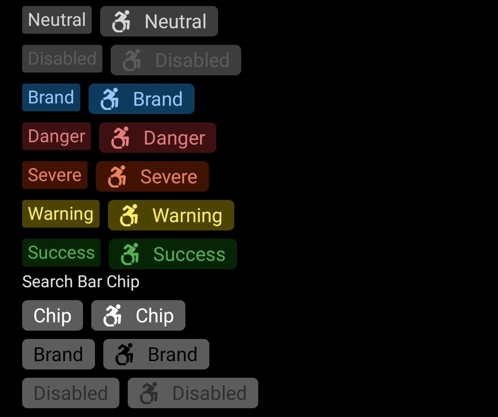
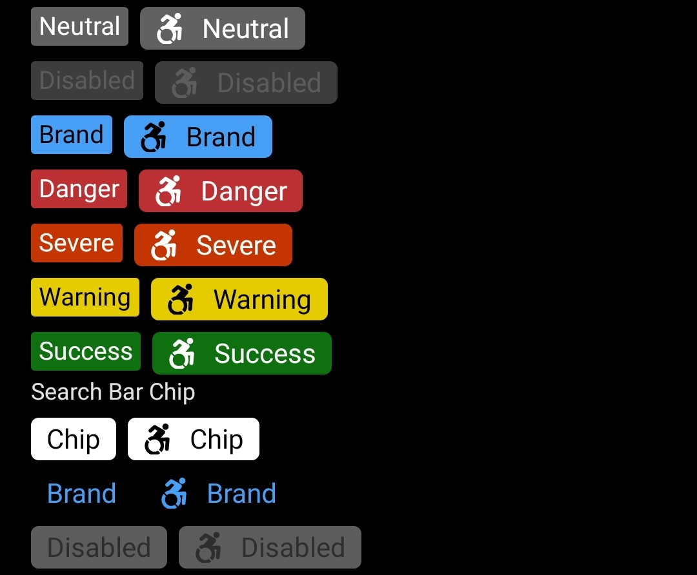
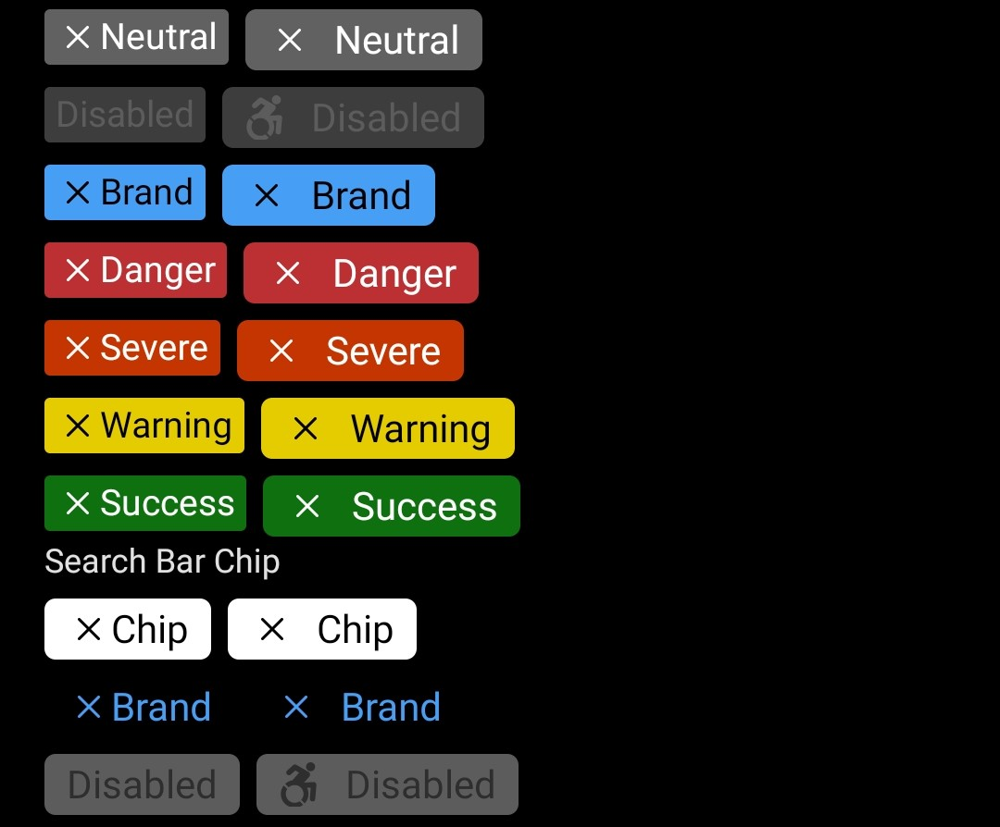
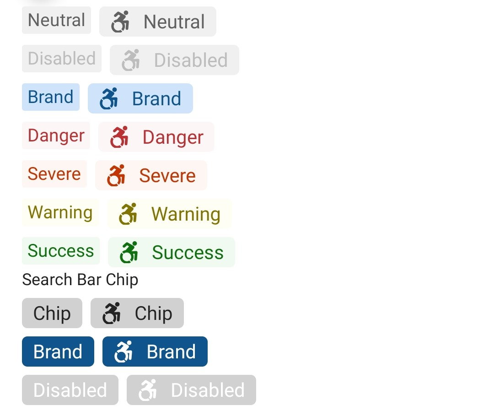
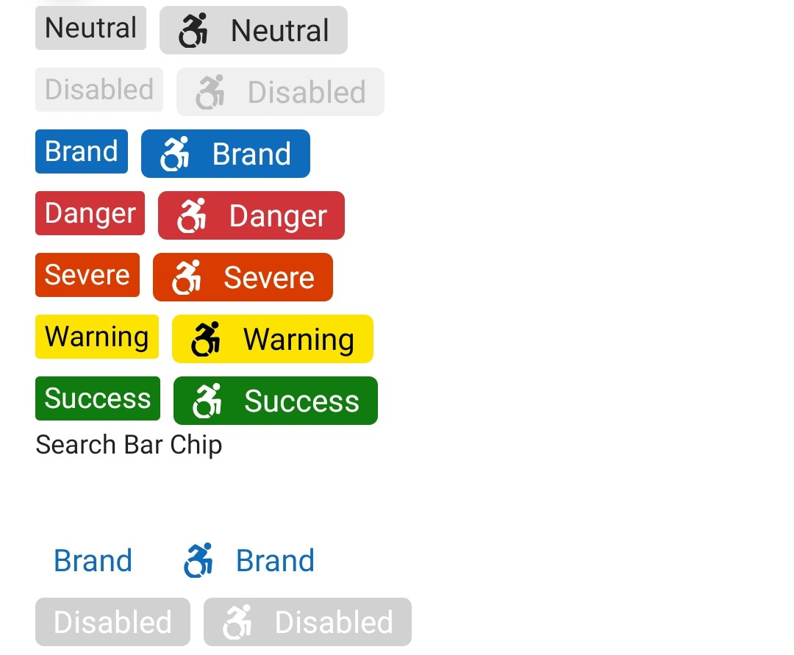
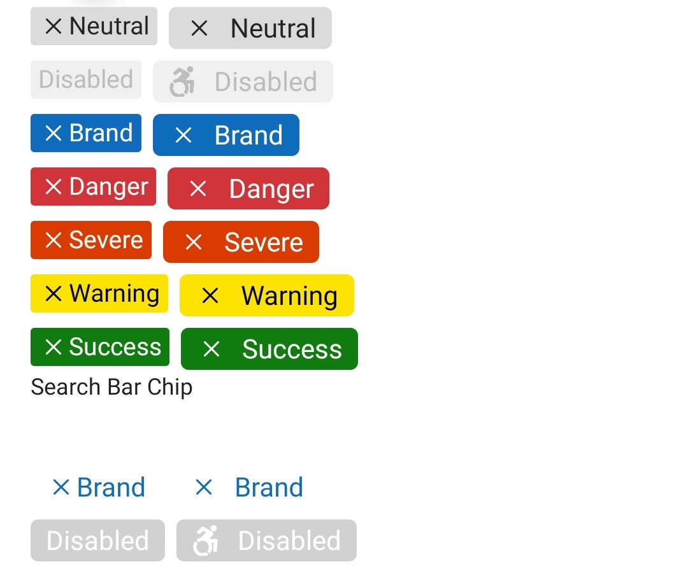

# Chip

## Background

Chips are compact representations of entities (most commonly, people) that can be typed in, deleted or dragged easily.

```ts
import { Chip } from '@fluentui-react-native/chip';
```

## Sample Code

Basic examples:

```jsx
  <Chip showCloseIcon>Chip</Chip>
  <Chip size="small" />
  <Chip icon={{ svgSource: { src: TestSvg, viewBox: '0 0 500 500' } }} disabled />
```

More examples on the [Test pages for the Chip](../../../apps/tester-core/src/TestComponents/Chip). Instructions on running the tester app can be found [here](../../../apps/fluent-tester/README.md).

## Visual Examples

##### Dark Mode


Clicking on the chip toggles the selected state.

Chip can show a close icon in selected state.


##### Light Mode


Clicking on the chip toggles the selected state.

Chip can show a close icon in selected state.


## Chip

## Variants

### Sizes

`Chip` supports sizes: `small`, `medium`.

### Color

The Chip supports preset and custom colors: `neutral`, `brand`, `danger`, `severe`, `success`, `warning`, with `neutral` being the default.

### Icon

The `Chip` component can include an `icon`.
Out of `small` and `medium` sizes, the `icon` is shown only for `medium` size. Chip also supports a default close icon in `selected` state. This is controlled by `showCloseIcon` prop.
Note - Close icon is shown even for `small` size.

### Image

An `image` can be added to the Chip as an optional content.
Example:

```jsx
<Chip>
  Chip with
  <Image source={{ uri: './path.png' }} />
  <Text style={{ backgroundColor: 'yellow' }}>optional content</Text>
</Chip>
```

### Content

Content is passed as part of `children` prop.
For long Chips it's up to consumer how they want to truncate/hide the content.

### Search Bar Chip

Special styling is applied when the `Chip` is used in a `SearchBar` component.
To enable this pass the `searchBar` prop to the `Chip`.

### States

The following section describes the additional states a `Chip` can have.

#### Selected state

A selected `Chip` changes styling to communicate that the chip is currently selected or toggled.

## API

### Slots

The `Chip` component has the following slots:

- `root` - The outer container representing the `Chip` wrapper.
- `icon` - If specified, renders an `icon`.
- `text` - This slot is used to render text content.
- `iconPressable` - This provides the press target for the `icon`.

The slots can be modified using the `compose` function on the `Chip`. For more information on using the `compose` API, please see [this page](../../framework/composition/README.md).

### Props

```ts
export interface ChipConfigurableProps {
  /*
   * Source URL or name of the icon to show on the Chip.
   */
  icon?: IconSourcesType;

  /**
   * The icon color.
   */
  iconColor?: ColorValue;
}
```

```ts
export interface ChipProps extends IViewProps, ChipConfigurableProps {
  /**
   * A Chip can be one of preset colors.
   * @defaultvalue neutral
   */
  chipColor?: ChipColor;

  /** Sets style of Chip to a preset size style
   * @defaultvalue medium
   */
  size?: ChipSize;

  /**
   * Whether the Chip is disabled or not.
   * @defaultvalue false
   */
  disabled?: boolean;

  /**
   * Selected state. Mutually exclusive to 'defaultSelected'. Use this if you control the selected state at a higher level
   * and plan to pass in the correct value based on handling onChange events and re-rendering.
   * @defaultvalue false
   */
  selected?: boolean;

  /**
   * Default selected state. Mutually exclusive to 'selected'. Use this if you want an uncontrolled component, and
   * want the Chip instance to maintain its own state.
   */
  defaultSelected?: boolean;

  /**
   * Callback that is called when the selected value has changed.
   */
  onSelectionChange?: (e: InteractionEvent, isSelected: boolean) => void;

  /**
   * Apply when chip is intended to be used in a search bar.
   * Special styling is applied to the chip.
   */
  searchBar?: boolean;

  /**
   * Show close icon when in 'selected' state.
   * @defaultvalue false
   */
  showCloseIcon?: boolean;

  /**
   * Close icon's accessibility label.
   */
  closeIconAccessibilityLabel?: string;

  /**
   * A callback to call on close icon click event.
   */
  closeIconOnPress?: (e: InteractionEvent) => void;
}
```

### Styling Tokens

Tokens can be used to customize the styling of the control by using the `customize` function on the `Chip`. For more information on using the `customize` API, please see [this page](../../framework/composition/README.md). The `Chip` has the following tokens:

```ts
export interface ChipTokens extends LayoutTokens, FontTokens, IBorderTokens, Omit<IColorTokens, 'color'>, ChipConfigurableProps {
  /**
   * Set the text color
   */
  color?: ColorValue;

  /**
   * Set the bottom edge of the Chip
   */
  bottom?: FlexStyle['bottom'];

  /**
   * The icon size.
   */
  iconSize?: number;

  /**
   * Set the left edge of the Chip
   */
  left?: FlexStyle['left'];

  /**
   * Set the right edge of the Chip
   */
  right?: FlexStyle['right'];

  /**
   * Set padding for text container when Chip contains
   * icons or images
   */
  textMargin?: number;

  /**
   * Sizes of the Chip
   */
  small?: ChipTokens;
  medium?: ChipTokens;

  /**
   * When isRTL - applies Chip from the left side
   */
  rtl?: ChipTokens;

  /**
   * Colors of the Chip
   */
  neutral?: ChipTokens;
  brand?: ChipTokens;
  danger?: ChipTokens;
  severe?: ChipTokens;
  success?: ChipTokens;
  warning?: ChipTokens;
  disabled?: ChipTokens;
  searchBar?: ChipTokens;
  /**
   * Selected state tokens for Chip
   */
  selected?: ChipTokens;
}
```

### Accessibility

Chips recieve focus and are accessible. They can be toggled.
Information about the chip should be added to the element that hosts the Chip through the element's `accessibilityLabel`.
