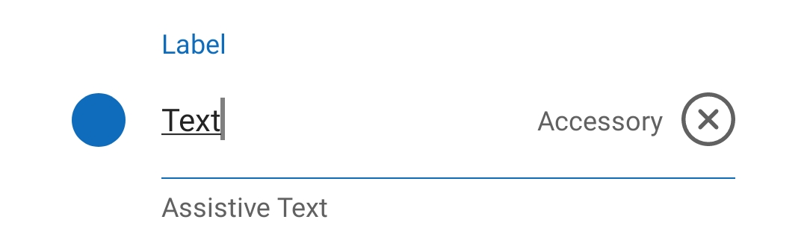
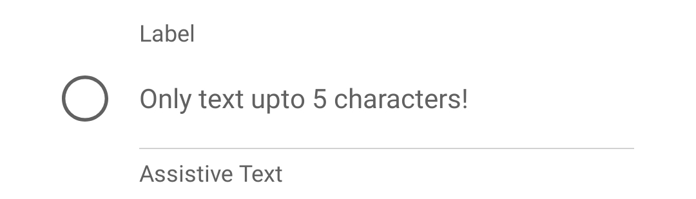
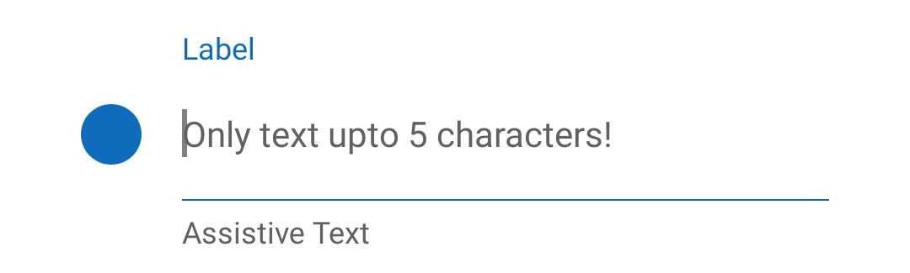
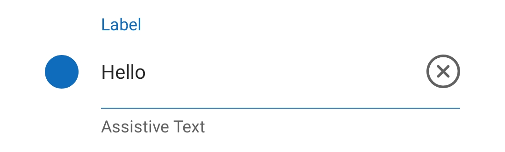
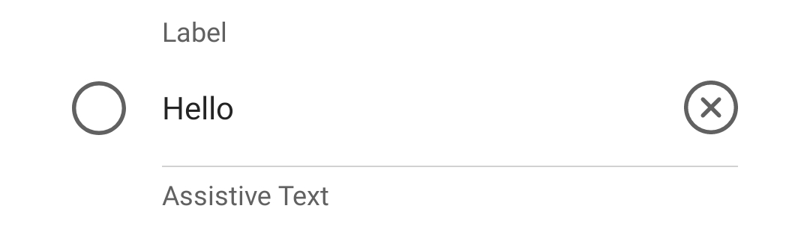
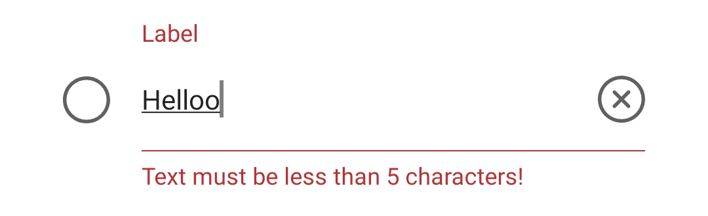

# Input

## Background

The `Input` component enables users to enter and edit text.

## Requirements

If using FURN's theming, the `Input` requires use of the `ThemeProvider` from `@fluentui-react-native/theme` to work properly with themes. Please see [this page](../../../docs/pages/Guides/UpdateThemeProvider.md) for information on updating your `ThemeProvider` if using the version from `@uifabricshared/theming-react-native`.

## Sample Code

Basic examples:

```jsx
<Input />
<Input placeholder="Custom dismiss icon" accessoryIcon={outlineIconProps} secondaryText="Secondary" type="decimal-pad" />
<Input
  placeholder="Enter text here!"
  accessoryIcon={dismissIconProps}
  label="Label"
  assistiveText="Assistive Text"
  secondaryText="Secondary"
/>
```

More examples on the [Test pages for the Input](../../../apps/tester-core/src/TestComponents/Input). Instructions on running the tester app can be found [here](../../../apps/fluent-tester/README.md).

## Visual Examples

Android:



```tsx
const [error, setError] = React.useState<string>('');
export const dismissIconProps: IconProps = { svgSource: { src: DismissSvg, viewBox: '0 0 20 20' } };
<Input
  error={error}
  icon={outlineIconProps}
  focusedStateIcon={filledIconProps}
  textInputProps={{ autoFocus: true }}
  placeholder="Only text upto 5 characters!"
  assistiveText="Assistive Text"
  label="Label"
  onChange={(text: string) => {
    if (text.length > 5) setError('Text must be less than 5 characters!');
    else setError('');
  }}
/>;
```

At rest with no input text, the input shows the placeholder text.



Once the user selects the text input, the label and icon are re-coloured. It is recommended to pass filled version of the icon to be used in focus state.



Once the user starts typing, the accessory text and icon are shown. The default accessory icon is shown here and behaves like a clear text button. Both the icon and its functionality are overridable.



Once the user is done and taps away, the input switches back to the unfocused state with neutral colors, but continues to show the accessory views as long as the input text isn't empty.



The input also takes an error string, if set, it replaces the assistive text with the error's localized description and recolors the title, separator, and assistive text to indicate an invalid input.



## Variants

### Icon

The `Input` component can include an `icon` that appears before the text field. Passing just one icon is enough, but it is recommended to also pass the `focusedStateIcon`. The outline version is to be passed in the `icon` while it's filled version is to be passed to the `focusedStateIcon`. This icon is used when the input is in focus.

### Accessory Icon/Text

The `Input` component can include an `accessoryIcon` and `accessoryText` that appears on the right of the text field. These are shown only when the input has some text in it. By default the `accessoryIcon` fuctions as a clear text button. This can be disabled by setting the prop to null. Funcationality of the `accessoryIcon` can be modified using `accessoryButtonOnPress`.

## API

### Slots

The `Input` component has ten slots, or parts. The slots behave as follows:

- `root` - The outer container representing the `Input` itself.
- `icon` - If specified, renders an `icon` before the text input.
- `accessoryIcon` - Renders an `accessoryIcon` after the text input.
- `accessoryIconPressable` - Pressable layer that handles onPress on `accessoryIcon`.
- `accessoryText` - If specified, renders `accessoryText` after the text input.
- `textInput` - Text Input from react native that provides the functional behaviors.
- `input` - Wrapper view that contains the `textInput`, `accessoryIconPressable` and `accessoryText`. Provides bottom margin of the input.
- `inputWrapper` - Wrapper view that contains `input` and `icon`, this is used to align icon properly with the input regardless of presence/absence of `label` and `assistiveText`.
- `label` - Text displayed over the text input.
- `assistiveText` - Additional text displayed on the bottom of the text input.

The slots can be modified using the `compose` function on the `Input`. For more information on using the `compose` API, please see [this page](../../framework/composition/README.md).

### Props

Below is the set of props the input supports:

```ts
export interface InputProps {
  /*
   ** An accessibility label for screen readers. Set on the text input.
   */
  accessibilityLabel?: string;

  /*
   * An accessibility label for screen readers. Set on the accessory icon pressable.
   */
  accessoryIconAccessibilityLabel?: string;

  /*
   * Source URL or name of the icon to show on the input.
   *
   * Based on fluent guidelines this icon should be an "outline" icon.
   * FocusedStateIcon is applied onFocus and should be a "filled" icon.
   */
  icon?: IconSourcesType;

  /*
   * Source URL or name of the icon to show when the input is focused.
   * Can be used only when the default icon is also passed.
   *
   * Based on fluent guidelines this icon should be a "filled" icon.
   * While the default icon should be an "outline" icon.
   */
  focusedStateIcon?: IconSourcesType;

  /**
   * The width of the input.
   */
  width?: ViewStyle['width'];

  /*
   * Source URL or name of the accessory icon to show on the input.
   * Shown while input has text in it. Not shown while input is used as a control component.
   *
   * @default - dismiss icon is shown.
   * Set as null to disabled this icon.
   */
  accessoryIcon?: IconSourcesType | null;

  /**
   * A callback to call on accessoryIcon click event.
   */
  accessoryButtonOnPress?: (e: InteractionEvent) => void;

  /**
   * Label to display on top of the input.
   */
  label?: string;

  /**
   * Assistive text to display on the bottom of the input.
   */
  assistiveText?: string;

  /**
   * Accessory text to display on the right of the input.
   */
  accessoryText?: string;

  /**
   * Placeholder to display in the input.
   */
  placeholder?: string;

  /**
   * These props facilitate behaviour changes of the text field.
   */
  textInputProps?: Omit<TextInputProps, 'defaultValue' | 'value' | 'keyboardType' | 'onChangeText' | 'onBlur' | 'onFocus' | 'placeholder'>;

  /**
   * Optional string that triggers error state when non-empty.
   * Error message replaces the assistive text and is displayed on the bottom of the input.
   */
  error?: string;

  /**
   * The value to show for the text input.
   * Turns it into a controlled component.
   * To prevent editting, use textInputProps and set editable as false.
   */
  value?: string;

  /**
   * Provides an initial value that will change when the user starts typing.
   */
  defaultValue?: string;

  /**
   * Determines which keyboard to open.
   * enum("default", 'numeric', 'email-address', "ascii-capable", 'numbers-and-punctuation', 'url', 'number-pad', 'phone-pad', 'name-phone-pad',
   * 'decimal-pad', 'twitter', 'web-search', 'visible-password')
   * Determines which keyboard to open, e.g.numeric.
   * The following values work across platforms: - default - numeric - email-address - phone-pad
   * The following values work on iOS: - ascii-capable - numbers-and-punctuation - url - number-pad - name-phone-pad - decimal-pad - twitter - web-search
   * The following values work on Android: - visible-password
   */
  type?: KeyboardTypeOptions | undefined; // Uses KeyboardType under the hood

  /**
   * Callback that is called when the text input's text changes.
   */
  onChange?: (text: string) => void;

  /**
   * Determines when the keyboard should stay visible after a tap.
   * - 'never', tapping outside of the focused text input when the keyboard is up dismisses the keyboard. When this happens, children won't receive the tap.
   * - 'always', the keyboard will not dismiss automatically, and the scroll view will not catch taps, but children of the scroll view can catch taps.
   * - 'handled', the keyboard will not dismiss automatically when the tap was handled by a children, (or captured by an ancestor).
   * - false, deprecated, use 'never' instead
   * - true, deprecated, use 'always' instead
   * @default always
   */
  keyboardShouldPersistTaps?: boolean | 'always' | 'never' | 'handled' | undefined;

  /**
   * A RefObject to access the text input interface. Use this to access the public methods and properties of the component.
   */
  componentRef?: React.RefObject<TextInput>;

  /**
   * Called after the element loses focus.
   */
  onBlur?: (event: BlurEvent) => any;

  /**
   * Called after the element is focused.
   */
  onFocus?: (event: FocusEvent) => any;
}
```

### Styling Tokens

Tokens can be used to customize the styling of the control by using the `customize` function on the `Input`. For more information on using the `customize` API, please see [this page](../../framework/composition/README.md). The `Input` has the following tokens:

```ts
export interface InputTokens extends LayoutTokens, IBorderTokens, IColorTokens, FontTokens {
  /**
   * The icon color.
   */
  iconColor?: ColorValue;

  /**
   * The size of the icon.
   */
  iconSize?: number;

  /**
   * The dismiss icon color.
   */
  accessoryIconColor?: ColorValue;

  /**
   * The size of the dismiss icon.
   */
  accessoryIconSize?: number;

  /**
   * The color of the assistive text.
   */
  assistiveTextColor?: ColorValue;

  /**
   * The font style of the assistive text.
   */
  assistiveTextFont?: FontTokens;

  /**
   * The font style of the input box.
   */
  inputTextFont?: FontTokens;

  /**
   * The color of the input text.
   */
  inputTextColor?: ColorValue;

  /**
   * The font style of the accessory text.
   */
  accessoryTextFont?: FontTokens;

  /**
   * The color of the accessory text.
   */
  accessoryTextColor?: ColorValue;

  /**
   * The width of the divider.
   */
  strokeWidth?: number;

  /**
   * The color of the divider.
   */
  strokeColor?: ColorValue;

  /**
   * The color of the cursor.
   */
  cursorColor?: ColorValue;

  /**
   * The space between the icon and the rest of the content.
   */
  spacingIconContent?: number;

  /**
   * The space between the input and the accessory text.
   */
  spacingInputAccessory?: number;

  /**
   * The space between the dismiss icon and the left content.
   */
  spacingAccessoryIconStart?: number;

  /**
   * The input's vertical margin.
   */
  spacingInputVertical?: number;

  /**
   * The assistive text's vertical margin.
   */
  spacingAssistiveTextVertical?: number;

  /**
   * The assistive text's start margin. Used to align it with input box.
   */
  spacingAssistiveTextStart?: number;

  /**
   * The label's start margin. Used to align it with input box.
   */
  spacingLabelStart?: number;

  /**
   * The label's top margin.
   */
  spacingLabelTop?: number;

  /**
   * States that can be applied to an input.
   */
  hasIcon?: InputTokens;
  error?: InputTokens;
  focused?: InputTokens;
  typing?: InputTokens;
  filled?: InputTokens;
}
```

## Behaviors

### States

The following section describes the different states which `Input` can be in as a result of interaction.

#### Placeholder state

Default state of `Input`. The placeholder is displayed, there is no text typed into the input.

#### Focused state

Once the user selects the text input, the label and icon are re-coloured. It is recommended to pass filled version of the icon to be used in focus state.

#### Typing state

Once the user starts typing, the accessory text and icon are shown. The default accessory icon is shown here and behaves like a clear text button. Both the icon and its functionality are overridable.

#### Filled state

Once the user is done and taps away, the input switches back to the unfocused state with neutral colors, but continues to show the accessory views as long as the input text isn't empty.

#### Error state

The input also takes an error string, if set, it replaces the assistive text with the error's localized description and recolors the title, separator, and assistive text to indicate an invalid input.

## Accessibility

### Expected behavior

- Should read out placeholder text when focused, allow the user to interact with the text input and read out any pre-filled text when focused.
- Should allow user to type into the text input.
- Should allow user to read the label, assistive text and accessory text.
- Should allow the user to set custom accessibility label and interact with the accessory button.
- Should be keyboard tabbable and focusable.

See [`useInput` hook](./src/useInput.ts) for details on accessibility props
