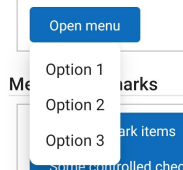
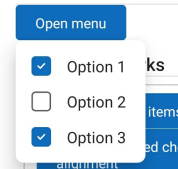

# Menu

## Background

A `Menu` is an component that displays a list of options on a temporary surface. They are invoked when users interact with a button, action, or other control.

## Requirements

If using FURN's theming, the `Menu` and its sub-components require use of the `ThemeProvider` from `@fluentui-react-native/theme` to work properly with themes. Please see [this page](../../../docs/pages/Guides/UpdateThemeProvider.md) for information on updating your `ThemeProvider` if using the version from `@uifabricshared/theming-react-native`.

## Sample code

The below samples do not represent the definitive props of the final implemented component, but represent the ideal final implementations. Can be subject to change during the implementation phase.

### Basic Menu

##### On Win32


##### On Android



```tsx
const menu = (
  <Menu>
    <MenuTrigger>
      <Button>Open menu</Button>
    </MenuTrigger>
    <MenuPopover>
      <MenuList>
        <MenuItem>Option 1</MenuItem>
        <MenuItem>Option 2</MenuItem>
        <MenuItem>Option 3</MenuItem>
      </MenuList>
    </MenuPopover>
  </Menu>
);
```

### Submenus

Note: Submenus are not supported on Mobile Platforms


```tsx
const menu = (
  <Menu>
    <MenuTrigger>
      <Button>Open menu</Button>
    </MenuTrigger>
    <MenuPopover>
      <MenuList>
        <MenuItem>Option 1</MenuItem>
        <Menu>
          <MenuTrigger>
            <MenuItem>Open submenu</MenuItem>
          </MenuTrigger>
          <MenuPopover>
            <MenuList>
              <MenuItem>Option 1</MenuItem>
              <MenuItem>Option 2</MenuItem>
              <MenuItem>Option 3</MenuItem>
            </MenuList>
          </MenuPopover>
        </Menu>
      </MenuList>
    </MenuPopover>
  </Menu>
);
```

### Selection

##### On Win32


##### On Android



```tsx
const [selectedItems, setSelectedItems] = React.useState([]);
const onCheckedChange = React.useCallback(
  (e, checked) => {
    setSelectedItems(checked);
  },
  [setSelectedItems],
);

const menuCheckbox = (
  <Menu checked={selectedItems} onCheckedChange={onCheckedChange}>
    <MenuTrigger>
      <Button>Open menu</Button>
    </MenuTrigger>
    <MenuPopover>
      <MenuList>
        <MenuItemCheckbox name="checkbox1">Option 1</MenuItemCheckbox>
        <MenuItemCheckbox name="checkbox2">Option 2</MenuItemCheckbox>
        <MenuItemCheckbox name="checkbox3">Option 3</MenuItemCheckbox>
      </MenuList>
    </MenuPopover>
  </Menu>
);
```

## Variants

### Nested menus

A `Menu` should be able to trigger a submenu, or an additional instance of `Menu`, as a part of one or more of its options. The nested `Menu` component should have the same functional capabilities as the root `Menu` component, however it will have some default behavioral differences.

Nested menus are by default triggered by hovering over a trigger, but can also be opened by invoking the trigger component for the nested `Menu`.

Note: Nested menus are not supported on mobile platforms.

### Selection state

A `Menu` should be able to track and represent the selection, or checked, state of its options.

When an option has a configurable selection state, it does not dismiss the `Menu` when toggled, as opposed to other options which close the `Menu` on being invoked by default.

### Sections

A `Menu` can be divided into sections using dividers. The `Menu` does not support `MenuGroups` yet, but can visually represent sections using `MenuDividers`.

### Disabled option(s)

All options in a `Menu` component can be disabled and should provide a visible indication for this purpose. Although disabled actions cannot be invoked, they are keyboard focusable for the purposes of accessibility.

### Scrollable menu

A `Menu` can be made scrollable to show a long list of menu items by setting the `maxHeight` prop on `MenuPopover`. If the user never sets `maxHeight` and content does overflow, overflowing menu items would simply be cut off. Omitting the `maxHeight` prop will be render a non-scrollable menu.

When menu items end up being wider than the default width, scrollable menu will wrap content between words. For longer text without space, it will do an ellipsis with a tail.

If your menuItems’ content require a larger minWidth, you’d have to set a larger minWidth on the `<MenuPopover>`. **Menu's width does not expand dynamically and you will have to specify a larger minwidth. (NOT SUPPORTED YET)**

```ts
<Menu>
  <MenuTrigger>
    <Button>Click to open Scrollable menu</Button>
  </MenuTrigger>
  <MenuPopover maxHeight={100}>
    <MenuList>
      <MenuItem>MenuItem 1</MenuItem>
      <MenuItem>MenuItem 2</MenuItem>
      <MenuItem>MenuItem 3</MenuItem>
      <MenuItem>MenuItem 4</MenuItem>
      <MenuItem>MenuItem 5</MenuItem>
      <MenuItem>MenuItem 6</MenuItem>
      <MenuItem>MenuItem 7</MenuItem>
      <MenuItem>MenuItem 8</MenuItem>
      <MenuItem>MenuItem 9</MenuItem>
    </MenuList>
  </MenuPopover>
</Menu>
```

### Automatic tooltip generation for MenuItems

You can set the `hasTooltips` prop on the `Menu` to have it automatically generate tooltips for each MenuItem automatically based on its child text. This can be used to ensure that text is fully accessible for programmatically generated items.

## API

### Menu

The root level component serves as a simplified interface for configuring the triggering of a Menu.

```ts
export interface MenuProps extends MenuListProps {
  /**
   * Whether the popup is open on mount
   */
  defaultOpen?: boolean;

  /**
   * How much delay to have between hover in and showing the menu, in ms.
   * @platform win32, macOS
   */
  hoverDelay?: number;

  /**
   * Whether the popup is open
   */
  open?: boolean;

  /**
   * Call back when the component requests to change value
   */
  onOpenChange?: (e: InteractionEvent, isOpen: boolean) => void;

  /*
   * Opens the menu on hovering over the trigger
   * @platform win32, macOS
   */
  openOnHover?: boolean;

  /**
   * Do not dismiss the menu when a menu item is clicked
   */
  persistOnItemClick?: boolean;
}
```

### MenuTrigger

A non-visual component that wraps its child and configures them to be the trigger that will open a menu. This component should only accept one child. Accepts no other props.

### MenuPopover

This component provides the temporary surface that will host the `Menu`'s options.

```ts
export type MenuPopoverProps = ICalloutProps;
```

### MenuCallout

This component provides the temporary surface that will host the `Menu`'s popover.
It act as a wrapper for Callout on win32 and macos whereas RN Modal for Android plaform.

```ts
export type MenuCalloutProps = ICalloutProps & { tokens: MenuCalloutTokens };
```

### MenuList

This component is used internally by `Menu` and manages the context and layout of its items.

#### MenuList Props

```ts
export interface MenuListProps extends Omit<IViewProps, 'onPress'> {
  /**
   * Array of all checked items
   */
  checked?: string[];

  /**
   * Default items to be checked on mount
   */
  defaultChecked?: string[];

  /**
   * States that menu items can contain selectable items and reserves space for item alignment
   */
  hasCheckmarks?: boolean;

  /**
   * States that menu items can contain icons and reserves space for item alignment
   */
  hasIcons?: boolean;

  /**
   * States that menu items all have tooltips with its text by default.
   *
   * This option is useful for programmatically generated items to provide
   * text for options that end up having tuncated text.
   * @platform win32, macOS
   */
  hasTooltips?: boolean;

  /**
   * Callback when checked items change
   *
   * @param checked Array of all currently checked values
   */
  onCheckedChange?: (e: InteractionEvent, checked: string[]) => void;
  /**
   * Defines a minumum width for the Menu.
   */
  minWidth?: number | string;
}
```

#### MenuList Tokens

```ts
export interface MenuListTokens extends LayoutTokens, IBackgroundColorTokens {
  /**
   * Space between items in pixels
   */
  gap?: number;

  /**
   * States of the list control
   */
  hasMaxHeight?: MenuListTokens;

  /**
   * Corner radius of the menu list
   * @platform android macos
   */
  borderRadius?: number;
}
```

#### MenuList Slots

- `root` - The container of the `Menu`'s options that wraps all `children`.

### MenuDivider

Creates a divider element in the `MenuList`. This divider is purely visual and does not handle any grouping logic of the options in the `MenuList`.

### MenuItem

#### MenuItem Props

```ts
export interface MenuItemProps extends Omit<PressablePropsExtended, 'onPress'> {
  /**
   * A RefObject to access the IButton interface. Use this to access the public methods and properties of the component.
   */
  componentRef?: React.RefObject<IFocusable>;

  /*
   * Source URL or name of the icon to show on the Button.
   */
  icon?: IconProps | ImageProps;

  /**
   * A callback to call on button click event
   */
  onClick?: (e: InteractionEvent) => void;

  /**
   * Do not dismiss the menu when a menu item is clicked
   */
  persistOnClick?: boolean;
}
```

#### MenuItem Tokens

```ts
export interface MenuItemTokens extends LayoutTokens, FontTokens, IBorderTokens, IColorTokens {
  /**
   * Height and width in pixels of the space that is reserved to align the item's text with other items which have checkmarks
   */
  checkmarkSize?: number;

  /**
   * Space between parts of the item control in pixels
   */
  gap?: number;

  /**
   * Color of the icon
   */
  iconColor?: ColorValue;

  /**
   * Size of the icon. Pixels for SVG and points for font icon.
   */
  iconSize?: number;

  /**
   * Amount of space in pixels at the end of the item control that is reserved to align the item's text with other items which have checkmarks
   * @platform android
   */
  marginEndForCheckedAndroid?: number;

  /**
   * Color of the indicator that shows that an item has a submenu
   */
  submenuIndicatorColor?: ColorValue;

  /**
   * Amount of space in pixels around the indicator that shows that an item has a submenu
   */
  submenuIndicatorPadding?: number;

  /**
   * Height and width in pixels of the indicator that shows that an item has a submenu
   */
  submenuIndicatorSize?: number;

  /**
   * States of the item control
   */
  disabled?: MenuItemTokens;
  focused?: MenuItemTokens;
  hovered?: MenuItemTokens;
  pressed?: MenuItemTokens;
}
```

#### MenuItem Slots

- `root` - The outer container representing the `MenuItem` itself that wraps everything passed via the `children` prop.
- `content` - If specified, renders the `content` prop as text.
- `checkmark` - If specified, renders space such that the `content` aligns with other items which have checkmarks. Only used when the `Menu` has `hasCheckmarks`.
- `iconPlaceholder` - If specified, renders space for an icon before the content. Could be blank or contain an icon. Used when the `Menu` has `hasIcons`.
- `imgIcon` - If specified, renders an `Image` as an icon.
- `fontOrSvgIcon` - If specified, renders an `Icon` which supports font or SVG icons.
- `submenuIndicator` - If specified, renders an SVG which indicates that the `MenuItem` is a trigger for a nested `Menu`.

### MenuItemCheckbox

Variants of `MenuItem` that allows multiple selection state based on the value that it represents. These `MenuItems` do not support submenus.

#### MenuItemCheckbox Props

```ts
export interface MenuItemCheckboxProps extends MenuItemProps {
  /**
   * Identifier for the control
   */
  name: string;
}
```

#### MenuItemCheckbox Tokens

```ts
export interface MenuItemCheckboxTokens extends Omit<
  MenuItemTokens,
  'submenuIndicatorPadding' | 'submenuIndicatorSize' | 'disabled' | 'focused' | 'hovered' | 'pressed'
> {
  /**
   * Color of the checkmark icon
   */
  checkmarkColor?: ColorValue;

  /**
   * Amount of space in pixels around the checkmark icon
   */
  checkmarkPadding?: number;

  /**
   * Visibility of the checkmark icon from 0 to 1
   */
  checkmarkVisibility?: number;

  /**
   * Color of the icon
   */
  iconColor?: ColorValue;

  /**
   * Size of the icon. Pixels for SVG and points for font icon.
   */
  iconSize?: number;

  /**
   * Color of the background of the box containing the checkmark.
   * @platform android
   */
  checkboxBackgroundColor?: ColorValue;

  /**
   * Color of the border of the box containing the checkmark.
   * @platform android
   */
  checkboxBorderColor?: ColorValue;

  /**
   * Border radius of the box containing the checkmark.
   * @platform android
   */
  checkboxBorderRadius?: number;

  /**
   * Width of the border around the box containing the checkmark.
   * @platform android
   */
  checkboxBorderWidth?: number;

  /**
   * Height and width of the box containing the checkmark.
   * @platform android
   */
  checkboxSize?: number;

  /**
   * Ripple color for Android.
   *
   * A ripple animation is shown on click for Android. This sets the color of the ripple.
   * @platform android
   */
  rippleColor?: ColorValue;

  /**
   * Ripple radius for circular radio on Android.
   *
   * A ripple animation is shown on click for Android. This sets the radius of the circular ripple shown on the radio button.
   * @platform android
   */
  rippleRadius?: number;

  /**
   * States of the item control
   */
  checked?: MenuItemCheckboxTokens;
  disabled?: MenuItemCheckboxTokens;
  focused?: MenuItemCheckboxTokens;
  hovered?: MenuItemCheckboxTokens;
  pressed?: MenuItemCheckboxTokens;
}
```

#### MenuItemCheckbox Slots

- `root` - The outer container representing the `MenuItem` itself that wraps everything passed via the `children` prop.
- `checkbox` - If specified render box with checkmark svg which indicates that the `MenuItem` is selected.
- `content` - If specified, renders the `content` prop as text.
- `checkmark` - If specified, renders an SVG which indicates that the `MenuItem` is selected.
- `iconPlaceholder` - If specified, renders space for an icon before the content. Could be blank or contain an icon. Used when the `Menu` has `hasIcons`.
- `imgIcon` - If specified, renders an `Image` as an icon.
- `fontOrSvgIcon` - If specified, renders an `Icon` which supports font or SVG icons.

### MenuItemRadio

Variants of `MenuItem` that allows single selection state based on the value that it represents. These `MenuItems` do not support submenus.

#### MenuItemRadio Props

```ts
export interface MenuItemRadioProps extends MenuItemProps {
  /**
   * Identifier for the control
   */
  name: string;
}
```

#### MenuItemRadio Tokens

```ts
export interface MenuItemRadioTokens extends Omit<
  MenuItemTokens,
  'submenuIndicatorPadding' | 'submenuIndicatorSize' | 'disabled' | 'focused' | 'hovered' | 'pressed'
> {
  /**
   * Color of the checkmark icon
   */
  checkmarkColor?: ColorValue;

  /**
   * Amount of space in pixels around the checkmark icon
   */
  checkmarkPadding?: number;

  /**
   * Visibility of the checkmark icon from 0 to 1
   */
  checkmarkVisibility?: number;

  /**
   * Color of the icon
   */
  iconColor?: ColorValue;

  /**
   * Size of the icon. Pixels for SVG and points for font icon.
   */
  iconSize?: number;

  /**
   * Ripple color for Android.
   *
   * A ripple animation is shown on click for Android. This sets the color of the ripple.
   * @platform android
   */
  rippleColor?: ColorValue;

  /**
   * Color of the background of the box containing the radio.
   * @platform android
   */
  radioBackgroundColor?: ColorValue;

  /**
   * Color of the border of the box containing the radio.
   * @platform android
   */
  radioBorderColor?: ColorValue;

  /**
   * Border radius of the box containing the radio.
   * @platform android
   */
  radioBorderRadius?: number;

  /**
   * Height and width of the box containing the radio.
   * @platform android
   */
  radioSize?: number;

  /**
   * Indicator  radio border color
   * @platform android
   */
  radioBorder?: ColorValue;

  /**
   * Indicator radio border style
   * @platform android
   */
  radioBorderStyle?: ViewStyle['borderStyle'];

  /**
   * Inner circle color when selected
   * @platform android
   */
  radioFill?: ColorValue;

  /**
   * Visibility of the radio inner circle from 0 to 1
   * @platform android
   */
  radioVisibility?: number;

  /**
   * Diameter size of the outer indicator
   * @platform android
   */
  radioOuterCircleSize?: number;

  /**
   * Diameter size of the inner circle indicator
   * @platform android
   */
  radioInnerCircleSize?: number;

  /**
   * Border width of Radio
   * @platform android
   */
  radioBorderWidth?: number;

  /**
   * Ripple radius for circular radio on Android.
   *
   * A ripple animation is shown on click for Android. This sets the radius of the circular ripple shown on the radio button.
   * @platform android
   */
  rippleRadius?: number;

  /**
   * States of the item control
   */
  checked?: MenuItemRadioTokens;
  disabled?: MenuItemRadioTokens;
  focused?: MenuItemRadioTokens;
  hovered?: MenuItemRadioTokens;
  pressed?: MenuItemRadioTokens;
}
```

#### MenuItemRadio Slots

- `root` - The outer container representing the `MenuItem` itself that wraps everything passed via the `children` prop.
- `content` - If specified, renders the `content` prop as text.
- `checkmark` - If specified, renders an SVG which indicates that the `MenuItem` is selected.
- `radioButton` - A pressable view that represents the outer circle of the indicator button and wraps the inner circle of the indicator button.
- `radioInnerCircle` - A wrapper view that represents the inner circle of the indicator button.
- `iconPlaceholder` - If specified, renders space for an icon before the content. Could be blank or contain an icon. Used when the `Menu` has `hasIcons`.
- `imgIcon` - If specified, renders an `Image` as an icon.
- `fontOrSvgIcon` - If specified, renders an `Icon` which supports font or SVG icons.

## Behaviors

### Mouse interactions

- Clicking on a menu's trigger will open the menu
- Clicking outside of a menu's trigger and popover will light dismiss the menu
- Clicking on a `MenuItem` which is not configured to track selection will invoke the `MenuItem` and close the menu by default
- Clicking on a `MenuItem` variant which is configured to track selection will toggle its selection state in the configured way and not close the menu.
- If the menu is configured to open on hover, it will only close once the mouse leaves both the trigger and the popover. There is a delay for this behavior.
- Submenus are configured to open on hover by default. If the mouse stops hovering over the submenu, only the submenu will close.

### Keyboard interactions

- When a menu is invoked via keyboard, open the menu and place focus on the first focusable element by default.
- Up and down inside of the menu that has focus should navigate vertically between keyboard focusable elements
- On win32, up and down should circularly navigate through a list of menu items. On MacOS, circular navigation does not occur.
- Right key on a menu item that has an available submenu or split button should invoke the submenu, and move focus into it onto the first focusable item (Left in RTL)
- Left key when in a submenu should close the submenu and place focus back on the parent menu's item that opened the submenu. (Right in RTL)
- ESC on a menu should close the currently focused menu. If focus is in a submenu and ESC is hit, it should only close the current submenu and return focus to the parent's element where focus was previously.
- Space and Enter key execute the action that is currently focused in the menu.

### MenuItem selection

Below are the interactions that should be supported for all menu items that are required to handle a selection state.

In the event that the selection method is a radio, the previous selected item must be unselected.

| Type          | Action | Result | Details                                      |
| ------------- | ------ | ------ | -------------------------------------------- |
| Keyboard      | Space  | Toggle | Toggle the selection status of the menu item |
| Keyboard      | Enter  | Toggle | Toggle the selection status of the menu item |
| Mouse         | Click  | Toggle | Toggle the selection status of the menu item |
| Accessibility | Toggle | Toggle | Toggle the selection status of the menu item |

### Positioning

#### Menu positioning

The default positioning for the root `Menu` is below the trigger and aligned with the left (or right in RTL) edge.

#### Submenu positioning

The default positioning for a submenu is to the right of the menu item trigger (or left in RTL) and aligned with the top edge.

## Accessibility

The `MenuTrigger` will set `expand` or `collapsed` state and will respond to actions which explicitly tell it to expand or collapse (win32 only)
The `MenuPopover` has its role set to `menu`, and `MenuItmes` and variants have their role set to `menuitem`.
The `MenuItem` variants which track selection have the `Toggle` pattern available.
