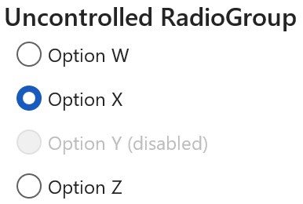
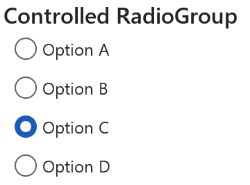
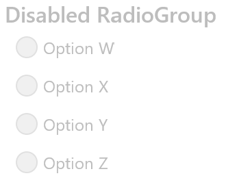
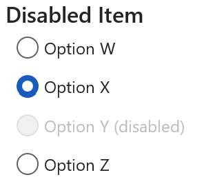
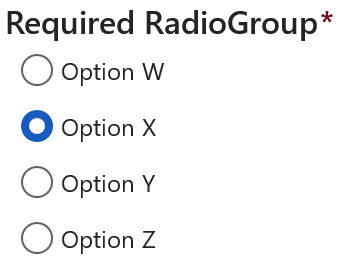
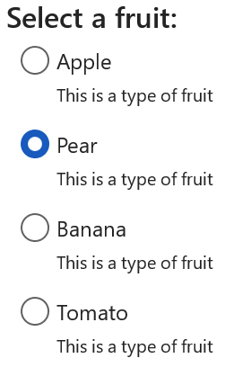
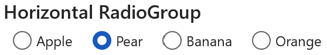
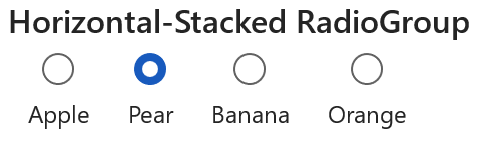

# RadioGroup

## Background

A `RadioGroup` is a component that lets users select a single option from two or more choices. Each option is represented by one Radio; a user can select only one Radio in a RadioGroup.

## Requirements

If using FURN's theming, the `RadioGroup` and sub-component `Radio` requires use of the `ThemeProvider` from `@fluentui-react-native/theme` to work properly with themes. Please see [this page](../../../docs/pages/Guides/UpdateThemeProvider.md) for information on updating your `ThemeProvider` if using the version from `@uifabricshared/theming-react-native`.

## Sample Code

Basic Example:

```jsx
const radiogroup = (
  <RadioGroup label="RadioGroup">
    <Radio label="Option W" value="W" />
    <Radio label="Option X" value="X" />
    <Radio label="Option Y" value="Y" />
    <Radio label="Option Z" value="Z" />
  </RadioGroup>
);
```

More examples on the [Test pages for RadioGroup](../../../apps/tester-core/src/TestComponents/RadioGroupV1). Instructions on running the tester app can be found [here](../../../apps/fluent-tester/README.md).

## Visual Examples

### Uncontrolled RadioGroup

Win32:



```tsx
const onChange = React.useCallback((key: string) => {
  console.log(key);
}, []);

const radiogroup = (
  <RadioGroup label="Uncontrolled RadioGroup" defaultValue="X" onChange={onChange}>
    <Radio label="Option W" value="W" />
    <Radio label="Option X" value="X" />
    <Radio label="Option Y" value="Y" />
    <Radio label="Option Z" value="Z" />
  </RadioGroup>
);
```

### Controlled RadioGroup

Win32:



```tsx
const [selectedKey, setSelectedKey] = React.useState('C');

const onChange = React.useCallback((key: string) => {
  setSelectedKey(key);
}, []);

const radiogroup = (
  <RadioGroup label="Controlled RadioGroup" value={selectedKey} onChange={onChange}>
    <Radio label="Option A" value="A" />
    <Radio label="Option B" value="B" />
    <Radio label="Option C" value="C" />
    <Radio label="Option D" value="D" />
  </RadioGroup>
);
```

### Disabled RadioGroup

Win32:



```tsx
const onChange = React.useCallback((key: string) => {
  console.log(key);
}, []);

const radiogroup = (
  <RadioGroup disabled label="Disabled RadioGroup" defaultValue="X" onChange={onChange}>
    <Radio label="Option W" value="W" />
    <Radio label="Option X" value="X" />
    <Radio label="Option Y" value="Y" />
    <Radio label="Option Z" value="Z" />
  </RadioGroup>
);
```

### Disabled Radio

Win32:



```tsx
const onChange = React.useCallback((key: string) => {
  console.log(key);
}, []);

const radiogroup = (
  <RadioGroup label="Disabled Item" defaultValue="X" onChange={onChange}>
    <Radio label="Option W" value="W" />
    <Radio label="Option X" value="X" />
    <Radio label="Option Y (disabled)" value="Y" disabled={true} />
    <Radio label="Option Z" value="Z" />
  </RadioGroup>
);
```

### Required RadioGroup

Win32:



```tsx
const onChange = React.useCallback((key: string) => {
  console.log(key);
}, []);

const radiogroup = (
  <RadioGroup required label="Required RadioGroup" defaultValue="X" onChange={onChange}>
    <Radio label="Option W" value="W" />
    <Radio label="Option X" value="X" />
    <Radio label="Option Y" value="Y" />
    <Radio label="Option Z" value="Z" />
  </RadioGroup>
);
```

### Label Subtext

Win32:



```tsx
const onChange = React.useCallback((key: string) => {
  console.log(key);
}, []);

const radiogroup = (
  <RadioGroup label="Select a fruit:" defaultValue="Pear" onChange={onChange}>
    <Radio label="Apple" subtext="This is a type of fruit" value="Apple" />
    <Radio label="Pear" subtext="This is a type of fruit" value="Pear" />
    <Radio label="Banana" subtext="This is a type of fruit" value="Banana" />
    <Radio label="Tomato" subtext="This is a type of fruit" value="Tomato" />
  </RadioGroup>
);
```

### Horizontal RadioGroup

The horizontal layout is not supported on Win32 and Android.



```tsx
const onChange = React.useCallback((key: string) => {
  console.log(key);
}, []);

const radiogroup = (
  <RadioGroup layout={'horizontal'} label="Horizontal RadioGroup" defaultValue="Pear" onChange={onChange}>
    <Radio label="Apple" value="Apple" />
    <Radio label="Pear" value="Pear" />
    <Radio label="Banana" value="Banana" />
    <Radio label="Orange" value="Orange" />
  </RadioGroup>
);
```

### Horizontal-Stacked RadioGroup

The horizontal-stacked layout is not supported on Win32 and Android.



```tsx
const onChange = React.useCallback((key: string) => {
  console.log(key);
}, []);

const radiogroup = (
  <RadioGroup layout={'horizontal-stacked'} label="Horizontal-Stacked RadioGroup" defaultValue="Pear" onChange={onChange}>
    <Radio label="Apple" value="Apple" />
    <Radio label="Pear" value="Pear" />
    <Radio label="Banana" value="Banana" />
    <Radio label="Orange" value="Orange" />
  </RadioGroup>
);
```

## Variants

### Disabled

The `RadioGroup` component or a singular `Radio` button can appear disabled when the "disabled" prop is passed in as true.

### Required

The `RadioGroup` component can visually appear required when the "required" prop is passed in as true. The RadioGroup will have a red "\*" next to the label to signify a selection must be made. It is up to the user to add additional functionality to ensure a selection is made.

### Subtext

The `Radio` component can have a subtext label that will appear below the primary label.

### Layout

The `RadioGroup` component can have different layouts.

- layout="vertical": Radios appear vertically in the group. This is the default if layout is not set.
- shape="horizontal": Radios appear horizontal in the group.
- shape="horizontal-stacked": Radios appear horizontal in the group and the label is below the indicator.

## API

### Slots

The `RadioGroup` component has six slots, or parts. The slots behave as follows:

- `root` - The outer container representing the `RadioGroup` itself.
- `label` - If specified, a wrapper view to support a group label and required visual indicator.
- `labelText` - If specified, renders a text for the group label before the `children`.
- `required` - If specified, render a red "\*" text adjacent to the group label.
- `options` - A wrapper view that wraps everything passed via the `children` prop.
- `container` - A FocusZone wrapper view that wraps the `options` slot that wraps the children.

The `Radio` component has six slots, or parts. The slots behave as follows:

- `root` - The outer container representing the `Radio` itself.
- `button` - A pressable view that represents the outer circle of the indicator button and wraps the inner circle of the indicator button.
- `innerCircle` - A wrapper view that represents the inner circle of the indicator button.
- `labelContent` - A wrapper view that contains the description of the Radio, wrapping both the label and label subtext.
- `label` - Renders the primary label of the Radio.
- `subtext` - If specified, renders the label subtext.

The slots can be modified using the `compose` function on the `RadioGroup` or `Radio`. For more information on using the `compose` API, please see [this page](../../framework/composition/README.md).

### Props

Below is the set of props `RadioGroup` supports:

```ts
export interface RadioGroupProps extends Pick<FocusZoneProps, 'isCircularNavigation' | 'defaultTabbableElement'>, IViewProps {
  /**
   * Descriptive label for the RadioGroup. This will be displayed as the title of the radio group to the user.
   */
  label?: string;

  /**
   * The key of the RadioButton that will initially be selected.
   *
   * This is mutually-exclusive if radiogroup is disabled or radio button is disabled.
   */
  defaultValue?: string;

  /**
   * The key of the selected option. If you provide this, you must maintain selection state by observing
   * onChange events and passing a new value in when changed. This overrides defaultSelectedKey
   * and makes the RadioGroup a controlled component.
   */
  value?: string;

  /**
   * Require a selection in this group. Adds the 'required' prop to all child Radio items.
   */
  required?: boolean;

  /**
   * Sets the RadioGroup to disabled if true
   */
  disabled?: boolean;

  /**
   * The position of the label relative to the indicator.
   *
   * 'horizontal' and 'horizontal-stacked' are not supported from Fluent Android and Win32, renders as-is.
   *
   * @default vertical
   */
  layout?: 'vertical' | 'horizontal' | 'horizontal-stacked';

  /**
   * Callback for receiving a notification when the choice has been changed
   */
  onChange?: (key: string) => void;
}
```

Below is the set of props `Radio` supports:

```ts
export interface RadioProps extends PressablePropsExtended {
  /**
   * The text string for the option
   */
  label: string;

  /**
   * Label subtext for the option
   */
  subtext?: string;

  /**
   * A unique key-identifier for each option
   */
  value: string;

  /**
   * Whether or not the radio button is selectable
   */
  disabled?: boolean;

  /**
   * The position of the label relative to the radio indicator.
   *
   * This defaults to 'after' unless the Radio is inside a RadioGroup with layout horizontal-stacked,
   * in which case it defaults to 'below'
   *
   * 'below' is not supported from Fluent Android and Win32, renders as-is.
   * @default after
   */
  labelPosition?: 'after' | 'below';

  /**
   * A RefObject to access the IFocusable interface. Use this to access the public methods and properties of the component.
   */
  componentRef?: React.RefObject<IFocusable>;
}
```

### Styling Tokens

Tokens can be used to customize the styling of the control by using the `customize` function on the `RadioGroup` or `Radio`. For more information on using the `customize` API, please see [this page](../../framework/composition/README.md).

The `RadioGroup` has the following tokens:

```ts
export interface RadioGroupTokens extends IForegroundColorTokens, FontTokens {
  /**
   * Color of required indicator
   */
  requiredColor?: ColorValue;

  /**
   * Amount of padding between the end of the label and the start of the required text
   */
  requiredPadding?: ViewStyle['padding'];

  /**
   * The flex direction of the Radios
   */
  flexDirection?: ViewStyle['flexDirection'];

  /**
   * States that can be applied to a RadioGroup
   */
  disabled?: RadioGroupTokens;
  isHorizontal?: RadioGroupTokens;
}
```

The `Radio` has the following tokens:

```ts
export interface RadioTokens extends FontTokens, IColorTokens, IForegroundColorTokens, IBackgroundColorTokens, IBorderTokens {
  /**
   * Horizontal padding of the root view
   */
  rootHorizontalPadding?: number;

  /**
   * Vertical padding of the root view
   */
  rootVerticalPadding?: number;

  /**
   * Indicator border color
   */
  radioBorder?: ColorValue;

  /**
   * Indicator border style
   */
  radioBorderStyle?: ViewStyle['borderStyle'];

  /**
   * Inner circle color when selected
   */
  radioFill?: ColorValue;

  /**
   * Visibility of the radio inner circle from 0 to 1
   */
  radioVisibility?: number;

  /**
   * Diameter size of the outer indicator
   */
  radioOuterCircleSize?: number;

  /**
   * Diameter size of the inner circle indicator
   */
  radioInnerCircleSize?: number;

  /**
   * Border width of Radio
   */
  radioBorderWidth?: number;

  /**
   * The flex direction of the root
   */
  flexDirection?: ViewStyle['flexDirection'];

  /**
   * Root item alignment
   */
  alignItems?: ViewStyle['alignItems'];

  /**
   * The top margin
   */
  marginTop?: ViewStyle['marginTop'];

  /**
   * The right margin
   */
  marginRight?: ViewStyle['marginRight'];

  /**
   * The bottom margin
   */
  marginBottom?: ViewStyle['marginBottom'];

  /**
   * The left margin
   */
  marginLeft?: ViewStyle['marginLeft'];

  /**
   * Label item alignment
   */
  labelAlignItems?: ViewStyle['alignItems'];

  /**
   * Label's top margin.
   */
  labelMarginTop?: ViewStyle['marginTop'];

  /**
   * Label's right margin.
   */
  labelMarginRight?: ViewStyle['marginRight'];

  /**
   * Label's left margin.
   */
  labelMarginLeft?: ViewStyle['marginLeft'];

  /**
   * Label's padding.
   */
  labelPadding?: ViewStyle['marginLeft'];

  /*
   * Variant of label subtext.
   *
   * Should only by used if subtext prop is provided.
   */
  subtextVariant?: keyof Variant;

  /**
   * Padding between label and label subtext.
   *
   * Should only by used if subtext prop is provided.
   */
  subtextMarginTop?: ViewStyle['marginTop'];

  /**
   * Padding between label subtext and focus ring.
   *
   * Should only by used if subtext prop is provided.
   */
  subtextMarginBottom?: ViewStyle['marginBottom'];

  /**
   * Ripple color for Android.
   *
   * A ripple animation is shown on click for Android. This sets the color of the ripple.
   * @platform android
   */
  rippleColor?: ColorValue;

  /**
   * Ripple radius for circular radio on Android.
   *
   * A ripple animation is shown on click for Android. This sets the radius of the circular ripple shown on the radio button.
   * @platform android
   */
  rippleRadius?: number;

  /**
   * States that can be applied to a Radio
   */
  labelPositionBelow?: RadioTokens;
  selected?: RadioTokens;
  disabled?: RadioTokens;
  hovered?: RadioTokens;
  focused?: RadioTokens;
  pressed?: RadioTokens;
}
```

## Behaviors

The user will have the opportunity to select from a group of radio buttons. The user may only select one. Selecting a different option will deselect the previously selected option. Initially, the default option (usually the first) is selected.

### States

The following section describes the different states which `RadioGroup` and `Radio` can be in as a result of interaction.

#### Enabled and Disabled States

An enabled `RadioGroup` or `Radio` communicates interaction by having styling that invites the user to click/tap on it to trigger an action.

A disabled `RadioGroup` or `Radio` is non-interactive, disallowing the user to click/tap on it to trigger an action.

#### Hovered State

A hovered `Radio` changes styling to communicate that the user has placed a cursor above it.

#### Focused State

A focused `Radio` changes styling to communicate that the user has placed keyboard focus on it. This styling is similar to the one in the hovered state plus extra styling on the outline to indicate keyboard focus has been placed on the component.

#### Pressed State

A pressed `Radio` changes styling to communicate that the user is currently pressing it.

### Interaction

#### Keyboard Interaction

`RadioGroup` uses existing `FocusZone` that complies with standard Win32 keyboard interaction guidelines. The following is a set of keys that interact with the `RadioGroup` component children:

| Key             | Description                                                                                                                                                                |
| --------------- | -------------------------------------------------------------------------------------------------------------------------------------------------------------------------- |
| `Tab/Tab+Shift` | Moves focus in and out of a RadioGroup. If Radio is checked, focus is set on selected Radio. If there are no checked Radios, focus is set on the first Radio in the group. |
| `Space`         | Checks the focused Radio if not already checked.                                                                                                                           |
| `Up/Left`       | Navigates up the list in a circular fashion. For RTL, `Left` navigates down.                                                                                               |
| `Down/Right`    | Navigates down the list in a circular fashion. For RTL, `Right` navigates up.                                                                                              |

It is possible to override key behaviors by specifying `onKeyUp` or `onKeyDown`, depending on what `preferKeyDownForKeyEvents` from the `@fluentui-react-native/interactive-hooks` package indicates. Providing the callback this way will prevent the default behaviors noted above -- you will need to handle `Up/Left` and `Down/Right` in the provided callback if the default behavior is desired.

#### Mouse Interaction

- Cursor moves onto `Radio`: Should immediately change the styling of the `Radio` so that it appears to be hovered.
- Cursor moves out of `Radio`: Should immediately remove the hovered styling of the `Radio`.
- Mouse down: Shows a pressed state on `Radio`, but does not immediately select `Radio`.
- Mouse up: Should execute the `Radio` onChange and move focus to its target.

#### Touch interaction

The same behavior as above translated for touch events. This means that there is no equivalent for `onHoverIn` and `onHoverOut`, which makes it so that the hovered state cannot be accessed.

## Accessibility

### Expected behavior

- Should default to adding `role="radiogroup"` and `role="radio"` to the root slot.
- Should mix in the accessibility props expected for a `RadioGroup` and `Radio` component.
- Should be keyboard tabbable and focusable.
- Narration when focus is set.
  - Mouse/Tabbing: "Option A, Radio Button, Selected, Required, 1 of 4"
  - Keyboard Arrows: “Radio Button, Non-Selected, Required, 1 of 4, Option A”

See [`useRadioGroup` hook](./src/RadioGroup/useRadioGroup.ts) and [`useRadio` hook](./src/Radio/useRadio.ts) for details on accessibility props
