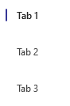

# TabList

## Background

`TabList` allow for navigation between two or more content views and relies on text headers to articulate the different sections of content.

## Requirements

If using FURN's theming, the `TabList` and sub-component `Tab` requires use of the `ThemeProvider` from `@fluentui-react-native/theme` to work properly with themes. Please see [this page](../../../docs/pages/Guides/UpdateThemeProvider.md) for information on updating your `ThemeProvider` if using the version from `@uifabricshared/theming-react-native`.

## Sample Code

Basic Example:

```jsx
const tablist = (
  <TabList defaultSelectedKey="tab1">
    <Tab tabKey="tab1">Tab 1</Tab>
    <Tab tabKey="tab2">Tab 2</Tab>
    <Tab tabKey="tab3">Tab 3</Tab>
  </TabList>
);
```

More examples on the [Test pages for TabList](../../../apps/fluent-tester/src/TestComponents/TabList). Instructions on running the tester app can be found [here](../../../apps/fluent-tester/README.md).

## Visual Examples

### Uncontrolled TabList

Win32:


```tsx
const onTabSelect = React.useCallback((key: string) => {
  console.log(key);
}, []);

const tablist = (
  <TabList defaultSelectedKey="tab1" onTabSelect={onTabSelect}>
    <Tab tabKey="tab1">Tab 1</Tab>
    <Tab tabKey="tab2">Tab 2</Tab>
    <Tab tabKey="tab3">Tab 3</Tab>
  </TabList>
);
```

### Controlled TabList

Win32:


```tsx
const [selectedKey, setSelectedKey] = React.useState('tab1');

const onTabSelect = React.useCallback((key: string) => {
  setSelectedKey(key);
}, []);

const tablist = (
  <>
    <Text>Selected key: {selectedKey}</Text>
    <TabList defaultSelectedKey="tab1" onTabSelect={onTabSelect} selectedKey={selectedKey}>
      <Tab tabKey="tab1">Tab 1</Tab>
      <Tab tabKey="tab2">Tab 2</Tab>
      <Tab tabKey="tab3">Tab 3</Tab>
    </TabList>
  </>
);
```

### Disabled TabList

Win32:


```tsx
const tablist = (
  <TabList disabled defaultSelectedKey="tab1">
    <Tab tabKey="tab1">Tab 1</Tab>
    <Tab tabKey="tab2">Tab 2</Tab>
    <Tab tabKey="tab3">Tab 3</Tab>
  </TabList>
);
```

### Disabled Tab

Win32:


```tsx
const tablist = (
  <TabList disabled defaultSelectedKey="tab2">
    <Tab disabled tabKey="tab1">
      Tab 1
    </Tab>
    <Tab tabKey="tab2">Tab 2</Tab>
    <Tab disabled tabKey="tab3">
      Tab 3
    </Tab>
    <Tab tabKey="tab4">Tab 4</Tab>
  </TabList>
);
```

### Sized TabLists

Win32:


```tsx
return (
  <>
    <Text>Small</Text>
    <TabList defaultSelectedKey="sm1" size="small">
      <Tab tabKey="sm1">Small Tab 1</Tab>
      <Tab tabKey="sm2">Small Tab 2</Tab>
      <Tab tabKey="sm3">Small Tab 3</Tab>
    </TabList>
    <Text>Medium (default)</Text>
    <TabList defaultSelectedKey="m1" size="medium">
      <Tab tabKey="m1">Medium Tab 1</Tab>
      <Tab tabKey="m2">Medium Tab 2</Tab>
      <Tab tabKey="m3">Medium Tab 3</Tab>
    </TabList>
    <Text>Large</Text>
    <TabList defaultSelectedKey="lg1" size="large">
      <Tab tabKey="lg1">Large Tab 1</Tab>
      <Tab tabKey="lg2">Large Tab 2</Tab>
      <Tab tabKey="lg3">Large Tab 3</Tab>
    </TabList>
  </>
);
```

### Subtle TabList


```tsx
const tablist = (
  <TabList appearance="subtle" defaultSelectedKey="tab1">
    <Tab tabKey="tab1">Tab 1</Tab>
    <Tab tabKey="tab2">Tab 2</Tab>
    <Tab tabKey="tab3">Tab 3</Tab>
  </TabList>
);
```

### Vertical TabList



```tsx
const tablist = (
  <TabList vertical defaultSelectedKey="tab1">
    <Tab tabKey="tab1">Tab 1</Tab>
    <Tab tabKey="tab2">Tab 2</Tab>
    <Tab tabKey="tab3">Tab 3</Tab>
  </TabList>
);
```

## Variants

### Appearance

The `TabList` component can have either a `transparent` (default) appearance or `subtle` appearance, which dictates the color tokens used for tab backgrounds whenever a tab is hovered.

### Disabled

The `TabList` or singular `Tab` components can appear disabled when the "disabled" prop is passed as true.

### Size

The `TabList` component has a `size` prop which controls the size (font size + padding) of all children tabs.

### Vertical

The `TabList` component has a `vertical` prop, that if set true, changes the layout such that the child tabs are laid out vertically.

## API

### Slots

The `TabList` component has two slots, or parts. The slots behave as follows:

- `container` - The outer container controlling `TabList` focus.
- `stack` - The view that represents the `TabList` itself. Takes the view props passed by the user and stores tabs as children.

The `Tab` component has seven slots, or parts. The slots behave as follows:

- `root` - Pressable outer view representing the `Tab` itself.
- `stack` - A wrapper view that contains the tab's icon and text.
- `icon` - Renders an icon if the user passes an `icon` prop.
- `indicatorContainer` - A wrapper view that contains the Tab's static indicator.
- `indicator` - The view underneath the stack root that shows when a user hovers over the Tab.
- `contentContainer` - A wrapper view that contains the Tab's text.
- `content` - The Tab's text itself.

The slots can be modified using the `compose` function on the `TabList`, but not the `Tab`. For more information on using the `compose` API, please see [this page](../../framework/composition/README.md).

### Props

Below is the set of props `TabList` supports:

```ts
export interface TabListProps extends Pick<FocusZoneProps, 'isCircularNavigation' | 'defaultTabbableElement'>, IViewProps {
  /**
   * Visual appearance of the TabList, affecting header hover / selection background.
   */
  appearance?: TabListAppearance;

  /**
   * A RefObject to access TabList.
   */
  componentRef?: React.RefObject<View>;

  /**
   * The key of the Tab that will initially be selected
   */
  defaultSelectedKey?: string;

  /**
   * Flag to disable all tabs
   */
  disabled?: boolean;

  /**
   * Callback for receiving a notification when the choice has been changed
   */
  onTabSelect?: (key: string) => void;

  /**
   * The value of the selected option. If you provide this, you must maintain selection state by observing
   * onTabSelect events and passing a new value in when changed. This overrides defaultSelectedKey
   * and makes the TabList a controlled component. This prop is mutually exclusive to defaultSelectedKey.
   */
  selectedKey?: string;

  /**
   * Flag to change the size of the tabs.
   */
  size?: TabListSize;

  testID?: string;

  /**
   * Flag to render the list of tabs horizontally or vertically
   */
  vertical?: boolean;
}
```

Below is the set of props `Tab` supports:

```ts
export interface TabProps extends Omit<PressablePropsExtended, 'onPress'> {
  /**
   * A unique key-identifier for each option
   */
  tabKey: string;

  /**
   * Whether or not the tab is selectable
   */
  disabled?: boolean;

  /**
   * Source URL or name of the icon to show on the Button.
   */
  icon?: IconProps;

  /**
   * A RefObject to access the IButton interface. Use this to access the public methods and properties of the component.
   */
  componentRef?: React.RefObject<IFocusable>;

  testID?: string;
}
```

### Styling Tokens

Tokens can be used to customize the styling of the control by using the `customize` function on the `TabList` or `Tab`. For more information on using the `customize` API, please see [this page](../../framework/composition/README.md).

The `TabList` has the following tokens:

```ts
export interface TabListTokens extends LayoutTokens {
  /**
   * Controls direction of TabList items, controlled by 'vertical' prop
   */
  direction?: 'row' | 'column';
  /**
   * States
   */
  vertical?: TabListTokens;
}
```

The `Tab` has the following tokens:

```ts
export interface TabTokens extends FontTokens, IBorderTokens, IForegroundColorTokens, IBackgroundColorTokens, LayoutTokens {
  /**
   * Horizontal start margin of the tab text. If an icon and text are both rendered, this is the margin beween the icon and text.
   */
  contentMarginStart?: number;

  /**
   * Horizontal end margin of the tab text.
   */
  contentMarginEnd?: number;

  /**
   * Controls order and direction of tab content and indicator.
   */
  flexDirection?: ViewStyle['flexDirection'];

  /**
   * The indicator color.
   */
  indicatorColor?: ColorValue;

  /**
   * The horizontal / vertical margin of the indicator, depending on its orientation.
   */
  indicatorMargin?: number;

  /**
   * The direction the indicator is laying.
   */
  indicatorOrientation?: 'horizontal' | 'vertical';

  /**
   * Border radius of the indicator.
   */
  indicatorRadius?: number;

  /**
   * Thickness of the indicator line.
   */
  indicatorThickness?: number;

  /**
   * The icon color.
   */
  iconColor?: string;

  /**
   * The size of the icon.
   */
  iconSize?: number;

  /**
   * Horizontal margin of the icon + content.
   */
  stackMarginHorizontal?: number;

  /**
   * Vertical margin of the icon + content.
   */
  stackMarginVertical?: number;

  /**
   * States that can be applied to a button
   */
  small?: TabTokens;
  medium?: TabTokens;
  large?: TabTokens;
  vertical?: TabTokens;
  transparent?: TabTokens;
  subtle?: TabTokens;
  hovered?: TabTokens;
  focused?: TabTokens;
  pressed?: TabTokens;
  disabled?: TabTokens;
  selected?: TabTokens;
  hasIcon?: TabTokens;
}
```

## Behaviors

The user will have the opportunity to select from a group of tabs. The user may only select one. Selecting a different option will deselect the previously selected option. Initially, the set default option is selected.

### States

The following section describes the different states which `TabList` and `Tab` can be in as a result of interaction.

#### Enabled and Disabled States

An enabled `TabList` or `Tab` communicates interaction by having styling that invites the user to click/press on it to trigger selection.

A disabled `TabList` or `Tab` is non-interactive, disallowing the user to click/press on it to trigger selection.

#### Hovered State

A hovered `Tab` changes styling to communicate that the user has placed a cursor above it.

#### Focused State

A focused `Tab` adds a focus border to communicate that the user has placed keyboard focus on it.

#### Pressed State

A pressed `Tab` changes styling to communicate that the user is currently pressing it.

#### Selected State

A selected `Tab` changes styling to communicate that the user has currently selected it.

### Interaction

#### Keyboard Interaction

`TabList` uses existing `FocusZone` that complies with standard Win32 keyboard interaction guidelines. The following is a set of keys that interact with the `TabList` component children:

| Key             | Description                                                                                                                                                                                                          |
| --------------- | -------------------------------------------------------------------------------------------------------------------------------------------------------------------------------------------------------------------- |
| `Tab/Tab+Shift` | Moves focus in and out of a TabList. If a Tab is selected, focus is set on selected Tab. If there are no selected, focus is set on either the first Tab in the group if tabbing in, or the last if shift-tabbing in. |
| `Space/Enter`   | Selects the focused Tab if not already selected and re-triggers the `onTabSelect` callback.                                                                                                                          |
| `Up/Left`       | Navigates up the TabList in a circular fashion. For RTL, `Left` navigates down.                                                                                                                                      |
| `Down/Right`    | Navigates down the TabList in a circular fashion. For RTL, `Right` navigates up.                                                                                                                                     |

It is possible to override key behaviors by specifying `onKeyUp` or `onKeyDown`, depending on what `preferKeyDownForKeyEvents` from the `@fluentui-react-native/interactive-hooks` package indicates. Providing the callback this way will prevent the default behaviors noted above -- you will need to handle `Up/Left` and `Down/Right` in the provided callback if the default behavior is desired.

#### Mouse Interaction

- Cursor moves onto `Tab`: Should immediately change the styling of the `Tab` so that it appears to be hovered.
- Cursor moves out of `Tab`: Should immediately remove the hovered styling of the `Tab`.
- Mouse down: Shows a pressed state on `Tab`, but does not immediately select `Tab`.
- Mouse up: Should execute the `Tab`'s `onTabSelect` callback and move focus to its target.

#### Touch interaction

The same behavior as above translated for touch events. This means that there is no equivalent for `onHoverIn` and `onHoverOut`, which makes it so that the hovered state cannot be accessed.

## Accessibility

### Expected behavior

- Should default to adding `role="tablist"` and `role="tab"` to the root slots of the TabList and Tab.
- Should mix in the accessibility props expected for a `TabList` and `Tab` component.
- Should be keyboard tabbable and focusable.
- Narration when focus is set:
  - Mouse/Tabbing: "Tab 1", Tab Item, 1 of 3, Selected
  - Keyboard Arrows: "Tab 2", Tab Item, 2 of 4

See [`useTabList` hook](./src/TabList/useTabList.ts) and [`useTab` hook](./src/Tab/useTab.ts) for details on accessibility props
