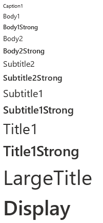

# Text

In the short term, the new `Text` control is named `TextV1` while it clashes with the existing older control. Once we deprecate the old control, it will be renamed to `Text`. It may be useful to rename the control to `Text` using the import syntax to simplify the rename:

```ts
import { TextV1 as Text } from '@fluentui-react-native/text';
```

FURN components that have imported from experimental-text now use the above syntax to use `TextV1`.

## Background

The `Text` component is for displaying text, and supports nesting, styling, and touch handling.

## Requirements

If using FURN's theming, the `Text` requires use of the `ThemeProvider` from `@fluentui-react-native/theme` to work properly with themes. Please see [this page](../../../docs/pages/Guides/UpdateThemeProvider.md) for information on updating your `ThemeProvider` if using the version from `@uifabricshared/theming-react-native`.

## Sample Code

Basic example:

```jsx
<Text>Hello World</Text>
```
More examples on the [Test pages for Text](../../../apps/fluent-tester/src/TestComponents/TextExperimental). Instructions on running the tester app can be found [here](../../../apps/fluent-tester/README.md).

## Visual Examples

Win32:


```jsx
<Text underline>This line has been underlined and striked through</Text>
```


```jsx
<>
  <Text>Every block of text gets its own line.</Text>
  <Text>This is a new block</Text>
</>
```


```jsx
<Text>
  <Text>Text components inside a parent text component is inline text</Text>
  <Text>This entire block is a RichLabel.</Text>
</Text>
```


```jsx
const RedCaptionBold = Text.customize({ variant: 'captionStandard', fontWeight: '700', color: '#ff0000' });
<RedCaptionBold>RedCaptionBold</RedCaptionBold>
```


V1 `Text` component supports variant types that have preset font family, size, and weight values.

```jsx
<Caption1>Caption1</Caption1>
<Body1>Body1</Body1>
<Body1Strong>Body1Strong</Body1Strong>
<Body2>Body2</Body2>
<Body2Strong>Body2Strong</Body2Strong>
<Subtitle2>Subtitle2</Subtitle2>
<Subtitle2Strong>Subtitle2Strong</Subtitle2Strong>
<Subtitle1>Subtitle1</Subtitle1>
<Subtitle1Strong>Subtitle1Strong</Subtitle1Strong>
<Title1>Title1</Title1>
<Title1Strong>Title1Strong</Title1Strong>
<LargeTitle>LargeTitle</LargeTitle>
<Display>Display</Display>
```


```jsx
<Text variant={'bodyStandard'}>
  Press{' '}
  <Text
  variant={'bodyStandard'}
  color="blue"
  keyDownEvents={handledNativeKeyboardEvents}
  onPress={_onPress2}
  onKeyDown={_onKeyDown2}
  >
  here
  </Text>{' '}
  to view an alert.
  </Text>
```

## API

The `Text` control is rendered as a `react-native` Text(`RNText`). However, `RNText`and `Text` do not align in their set of props entirely.

### Props

Below is the set of props the Text supports:

```ts
export type TextProps<TBase = ITextProps> = TBase &
  FontVariantTokens & {
    /**
     * foreground text color
     */
    color?: ColorValue;

    /**
     * Aligns text based on the parent container.
     *
     * @defaultValue start
     */
    align?: TextAlign;

    /**
     * Applies a block display for the content.
     *
     * @defaultValue false
     */
    block?: boolean;

    /**
     * Applies the font family to the content.
     *
     * @defaultValue base
     */
    font?: TextFont;

    /**
     * Applies the italic font style to the content.
     *
     * @defaultValue false
     */
    italic?: boolean;

    /**
     * Applies the strikethrough text decoration to the content.
     *
     * @defaultValue false
     */
    strikethrough?: boolean;

    /**
     * Applies font size and line height based on the theme tokens.
     *
     * @defaultValue 300
     */
    size?: TextSize;

    /**
     * Truncate overflowing text for block displays.
     *
     * @defaultValue false
     */
    truncate?: boolean;

    /**
     * Applies the underline text decoration to the content.
     *
     * @defaultValue false
     */
    underline?: boolean;

    /**
     * Applies font weight to the content.
     *
     * @defaultValue regular
     */
    weight?: TextWeight;

    /**
     * Wraps the text content on white spaces.
     *
     * @defaultValue true
     */
    wrap?: boolean;
  };

8/1/22 Notes:

- `block` => On win32, instead of setting it as a boolean prop, block display is applied by default, and is overridden as inline when `<Text>` is wrapped by a parent `<Text>`.

- `font` => According to design token redlines, `font` prop is given a giant string with a delimiter of font families for each enum type (`base`/`numeric`/`monospace`), We currently don't have a way to deal with this fontFamily format. We only support a single font family for each font type.
```

### Styling Tokens

Tokens can be used to customize the styling of the control by using the `customize` function on the `Text`. For more information on using the `customize` API, please see [this page](../../framework/composition/README.md). The `Text` has the following tokens:

```ts
export type TextTokens = FontTokens & IForegroundColorTokens & TextStyle;
```

## Behaviors

### Pressable Text

`Text` can be rendered as pressable.

### Interaction

#### Keyboard interaction

The following is a set of keys that interact with the `Text` component:

| Key     | Description                                                     |
| ------- | --------------------------------------------------------------- |
| `Tab`   | If `onPress` or `focusable` is set, component will gain focus.  |
| `Space` | Executes the function passed into the `onPress` prop.           |

#### Cursor interaction for Pressable Text

- Cursor moves onto pressable text: Should immediately change the styling of the `Text` so that it appears to be hovered.
- Cursor moves out of pressable text: Should immediately remove the hovered styling of the `Text`.
- Mouse click: Should handle `onPress` event of `Text` and move focus to its target.

#### Touch interaction

The same behavior as above translated for touch events. This means that there is no equivalent for `onHoverIn` and `onHoverOut`, which makes it so that the hovered state cannot be accessed.

## Accessibility

### Expected behavior

- Should mix in the accessibility props expected for a `Text` component.
- Should be keyboard tabbable and focusable.
- onAccessibilityTap defaults to onPress unless set otherwise