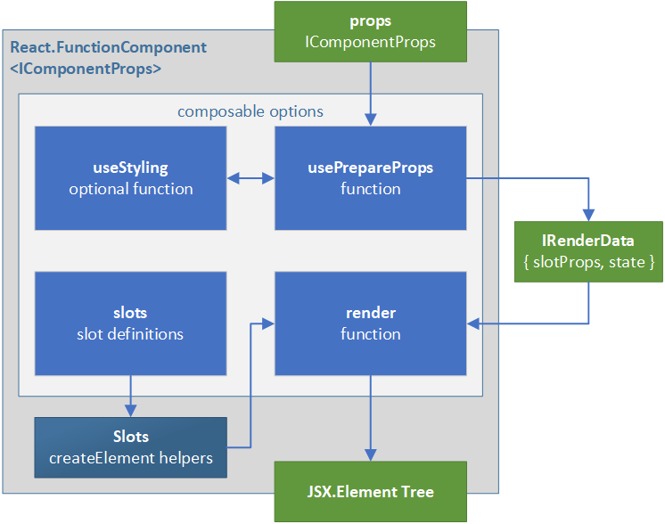

# Composable - un-opinionated and composable base components

This package provides a framework for writing unopinionated functional components that can easily be extended to inject styling, and composed together in an efficient manner.

This provides a foundation for writing both simple and higher order components with the following characteristics:

- **Unopinionated** - Components can be written such that they encapsulate the core functionality of a component, without having opinions on what styling system to use. There are myriad styling systems and all involve tradeoffs between flexibility, simplicity, and performance. Writing components which allow injection of a styling system allows consumers to optimize for their scenarios.
- **Reusable** - Modern practice in react encourages making functionality reusable via hooks. This framework provides a standardized pattern for hooks and how their results are communicated to the actual rendering. This allows replacing or augmenting either the hook or rendering portions without the need of writing everything from scratch.
- **Customizable** - Typical customization patterns involve either passing customizations via props, or customizing via wrapping. Passing customizations via props explode the complexity of the props and cause issues with cacheability and performance. Wrapping components adds additional layers to the react hierarchy and still precludes access to internals of the component.
- **Composable** - This framework provides a repeatable pattern which allows for a wrapped component, or a part of a higher order component, to be executed functionally without adding extra layers to the react hierarchy.
- **Scalable** - Composable components can be used for both simple and higher order components. The framework uses the concept of slots to make targeting and customizing sub-components easier.
- **Flexible** - This pattern is suitable for use with both react and react-native. None of the concepts are platform specific.

## Guides

- [Getting Started: Simple Components](./docs/GuideSimple.md) - a walkthrough of creating a simple composable component. Start here to understand the base concepts.
- [Getting Started: Higher Order Components](./docs/GuideHOC.md) - a walkthrough of creating a complex composable component. Read this next to better understand how the pieces fit together and can be recombined.

## composable

The primary entry point into the module is via the `composable` function. This creates a functional component, for use with react or react-native, which can be efficiently layered and recomposed. With all types expanded out the definition will be as follows:

<!-- prettier-ignore-start -->
```ts
export function composable<
  TProps extends object,
  TSlotProps extends ISlotProps = ISlotProps<TProps>,
  TState = object
>(
  options: {
    useStyling?: (
      props: TProps
    ) => TSlotProps,
    usePrepareProps?: (
      props: TProps,
      useStyling: (props: TProps) => TSlotProps
    ) => IRenderData<TSlotProps, TState>,
    render?: (
      Slots: ISlots<TSlotProps>,
      renderData: IRenderData<TSlotProps, TState>,
      ...children: React.ReactNode[]
    ) => React.JSX.Element | null,
    slots: {
      [K in keyof TSlotProps]: {
        slotType?: React.ElementType<> | string,
        filter?: (propName: string) => boolean
      }
    }
  }
): React.FunctionComponent<TProps> & { __composable: IComposableOptions };
```
<!-- prettier-ignore-end -->

### Type Arguments

The `composable` function takes up to three generic template arguments.

- `TProps extends object` - This determines the type of the functional component. At its heart the component will be `React.FunctionalComponent<TProps>`.
- `TSlotProps extends ISlotProps = ISlotProps<TProps>` - This is the collection of props corresponding to the parts of the component. If the type is omitted then this will be defined as an object in the form of `{ root: TProps }`. See the [foundation-settings](../foundation-settings/README.md) documentation for more on slot props.
- `TState = object` - State is an optional type, used to pass data from `usePrepareProps` to `render`.

### Parameters

The object is configured via the `options` parameter. This has four main parts

#### options.slots

The `slots` option is how a user configures the base component types for the parts of this component.

```ts
slots: {
  [K in keyof TSlotProps]: {
    slotType?: React.ElementType<> | string,
    filter?: (propName: string) => boolean
  }
}
```

The most important part is setting the `React.ElementType` of the component into `slotType`. This determines the type of react element that will be created in render. The optional `filter` can be set to automatically trim the prop set down during render.

The required slots will be determined by the values in TSlotProps.

#### options.useStyling?

The `useStyling` function allows a user of composable to provide style injection. This is a function that takes props as input and should return ISlotProps that include references to the styling and defaults to apply.

```ts
useStyling?: (props: TProps) => TSlotProps
```

If not specified, an empty implementation will be set provided which will return an empty object.

#### options.usePrepareProps?

The `usePrepareProps` function provides a standardized pattern for preparing props for render.

```ts
usePrepareProps?: (
  props: TProps,
  useStyling: (props: TProps) => TSlotProps
) => IRenderData<TSlotProps, TState>,
```

The role of this function is to do the following:

1. Call any hooks functions that need to be called
1. Obtain any styling slot props from the provided useStyling implementation
1. Perform any other property transformations needed by the component.
1. Return the prepared props, split into the slotProps as needed.
1. Optionally return a custom state

The return result is an `IRenderData` which is defined as:

```ts
export interface IRenderData<TSlotProps extends ISlotProps, TState = any> {
  slotProps?: TSlotProps;
  state?: TState;
}
```

The render data is simply a custom package to be passed to the render function. Anything returned in here will be passed on as-is. Note that `state` can be anything, while it may contain state data, it can be used to pass any data to render that doesn't map to props.

If `usePrepareProps` is not provided a simple implementation that calls `useStyling`, merges the result with the props, then passes the merged result into the root slot props. Note this is only valid in the case where there is a single slot.

#### options.render?

The `render` function is the routine that returns the JSX element tree to react. The signature is as follows:

```ts
render?: (
  Slots: ISlots<TSlotProps>,
  renderData: IRenderData<TSlotProps, TState>,
  ...children: React.ReactNode[]
) => React.JSX.Element | null,
```

The three parameters are:

- `Slots` - an object containing the react elements to render. These elements have a built in reference to the slotProps returned by `usePrepareProps` and the filters passed in via `slots`.
- `renderData` - is the object returned by `usePrepareProps`, this generally contains `slotProps` and `state`.
- `...children` - this is the children property from initial input props for the component. It can be handled as is standard for a react component.

The `Slots` parameter allows plugging different react types into a complex component. These can be output by either using `renderSlot` or by using the `withSlots` jsx helper. Usage would be something like:

```tsx
/** @jsxRuntime classic */
/* @jsx withSlots */
import { withSlots } from '@uifabricshared/foundation-composable';

render: (Slots: ISlots<IMySlotProps>, renderData, ...children) => {
  // do some work
  return (
    <Slots.root>
      <Slots.slot1 additionalProp="foo">{...children}</Slots.slot1>
      <Slots.slot2 />
    </Slots.root>
  );
};
```

In the case above `Slots.root` will automatically fill in the props from `renderData.slotProps.root`. `Slots.slot1` will do the same with the equivalent data for its slot name. Additional props can be added inline in the JSX if so desired. All of these will be merged and filtered as appropriate.

Render is optional in the case where there is only one sub-component, in this case the root slot will be rendered in the default manner.

### Return result

`composable` will create a function component and will also append its options to the function as `__composable`. As an example if there is a `FancyThing` component, its options will be accessible via `FancyThing.__composable` while it can still be used in a JSX tree via `<FancyThing>` or `React.createElement(FancyThing, props, children)`.

## How it all works

The overall flow of a component can be seen in the following diagram. At its core, a functional react component takes in a set of props, and outputs a React.JSX.Element tree.

Using composable, the normal flow is broken into two primary parts: `usePrepareProps` and `render`. The optional `useStyling` function allows for style injection, while the `slots` define the actual React.JSX.Elements that will be output.



### How Slots work

The `Slots` parameter passed to `render` is an object containing functions which mimic the shape of `React.createElement`. When used with the @jsx helper `withSlots`, These functions:

1. Are created once. This is essential because creating a new closure on every render pass will cause the tree to remount. They are stored in a state hook but then never updated over the lifetime of the component.
1. Include references to the `slotProps` returned as part of `usePrepareProps`. This allows for filters to act upon the props and avoids having to manually write `<Slot.root {...slotProps.root}>` every time. It also allows additional props to be mixed in directly to the JSX tree with the merge happening implicitly before render.
1. Calls `composable.render` directly without going through `React.createElement`. This means that it will not create an unnecessary entry in the element tree. The `composable.usePrepareProps` will have been called as part of the parent component's prop preparation pass.
1. Can be used conditionally. Because hooks will be done as part of the `usePrepareProps` pass, the actual render itself will be safe to be used conditionally, even when being called as a function.

### Handling children

Because of the slot behavior a sub-component may or may not have children set during `usePrepareProps`. This is because children can be filled in via props, or by construction of a JSX tree within a higher order component. Because the construction of the tree happens during `render`, children are not reliably available until `render`.
