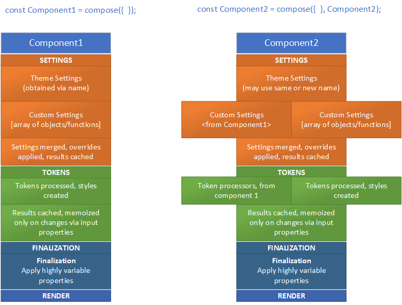

# Compose Component Builder

The foundation-compose package defines a pattern for building performant components which can be easily customized and composed. By making customization easy and efficient, complex customization scenarios can be handled by creating new variants of controls instead of adding complexity to the props interface.

## Design Principles

Controls should be:

- **Simple to Use** - The expected styling information for the theme should be loaded automatically, easy points of customization should be exposed in the props interface, rather than encouraging users to modify the style directly.
- **Cacheable** - Common resolutions for the control styling should be cached such that multiple instances of the same control type should share much of the logic.
- **Customizeable via Composition** - Complex customization should be achievable by composing new overrides with an existing control, without adding additional overhead and without breaking cacheability.

This infrastructure builds upon a number of key concepts.

### Component Settings

Settings are collections of props and styles for the parts of a component. They allow for inheritance and the ability to specify overrides for certain states. See the documentation of the [themed-settings](../themed-settings/README.md) package for a more detailed description.

### Tokens

A token property is a semantic representation of a style property, generally exposed on a higher order component's props interface. This allows a consumer of a control to customize the bits of the style directly, without needing to understand the details of the implementation.

Consider the example of a button, which at its most simple may have a layout element such as a View, a Text element, and an Icon element. Authoring style properties directly has a number of issues:

- If the implementation changes, either via a rename or a structural change, there is no guarantee customizations will continue to work.
- If the button is customized to have a primary label and a caption, if a text style was applied directly to the label, the caption would be unaffected.
- More complex implementations will likely be built on top of a base implementation. Things such as split buttons, menu buttons, toggle buttons are all variations where it is desireable to keep the complexity out of the root implementation.

As a general principle, separating the intent from the implementation is good design practice.

### Common Caching

Implementation of a caching layer requires optimizing to increase the number of successful cache retrievals. This means that cache memoization needs to be optimized around properties and customizations that are common across usages.

Ideally produced styles come directly from the caches. This ensures that the controls don't end up with extraneous re-renders for sub-components. Because style is an object, it is compared with an identity check by the framework. This means that dynamic recomputation will always cause re-renders. This object identity check causes many seemingly simple usages of style to be problematic. As an example:

    // always re-renders
    <MyComponent style={{backgroundColor: 'blue'}}>

    // always re-renders if _style is defined inside the function itself, will not always re-render
    // if _style is defined outside the component.
    const _style={backgroundColor: 'blue'};
    <MyComponent style={_style}>

This is one of the things the react-native style sheet functionality strives to address.

## Component Layering

Components are built in four main phases. They are:

1. _Settings_ - obtain and merge all the settings objects together, apply the overrides, and cache the result.
1. _Tokens_ - turn the various tokens set via the settings phase or via the user props into styles, merge everything together and cache the result.
1. _Finalization_ - do custom processing on highly variable props. Things such as the text value for a label will be different for every instance of the control, these should just be applied directly.
1. _Render_ - render using the props prepared in the above steps

The following diagram shows what this might look like for a base or composed control. Note that when composing a control not everything needs to be specified, if things are unspecified the new component will just use the functionality from the parent control.

It's also worth mentioning that these steps are optional. If a component has no tokens, then token processors need not be defined. Similarly if there are no settings to obtain the settings may return an empty result.

### ToDo Items

Some ideas for explanation are [here](./Todo.md)
