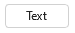
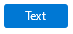

# Button

## Background

The `Button` component enables users to trigger an action or event, such as submitting a form, opening a dialog, canceling an action, or performing a delete operation.

## Requirements

If using FURN's theming, the `Button` requires use of the `ThemeProvider` from `@fluentui-react-native/theme` to work properly with themes. Please see [this page](https://github.com/microsoft/fluentui-react-native/blob/master/docs/pages/Guides/UpdateThemeProvider.md) for information on updating your `ThemeProvider` if using the version from `@uifabricshared/theming-react-native`.

## Sample Code

Basic examples:

```jsx
<Button>Text</Button>
<Button icon={{ svgSource: { uri: 'https://www.example.com/test.svg', viewBox: '0 0 100 100' } }} />
<Button icon={{ svgSource: { uri: 'https://www.example.com/test.svg', viewBox: '0 0 100 100' } }}>Text</Button>
<Button appearance="primary">Text</Button>
<Button disabled>Text</Button>
<Button size="small">Text</Button>
<Button size="large">Text</Button>
```

More examples on the [Test pages for the Button](https://github.com/microsoft/fluentui-react-native/tree/master/apps/fluent-tester/src/FluentTester/TestComponents/ButtonExperimental). Instructions on running the tester app can be found [here](https://github.com/microsoft/fluentui-react-native/blob/master/apps/fluent-tester/README.md).

## Visual Examples

Win32:



```tsx
<Button>Text</Button>
```



```tsx
<Button appearance="primary">Text</Button>
```

## Variants

### Appearance

The `Button` component has several apparance variants depending on where it's being used:

- The default `Button` is rendered with its default styling indicating a trigger for an action.
- appearance="primary": The `Button` is styled to emphasize that it represents the primary action.
- appearance="subtle": The `Button` is styled to blend into its background to become less emphasized.

### Icon

The `Button` component can include an `icon` that appears before or after its `children`. If an `icon` is provided without any other `children` passed into `Button`, then the `Button` becomes an icon-only `Button`.

### Shape

- shape="rounded": The button as rounded corners. This is the default if shape is not set.
- shape="circular": The button has completely round corners. A button of equal width and height will be a circle.
- shape="square": The button has right-angle corners.

### Sizes

The `Button` component supports different sizing with at least three different sizes: `small`, `medium`, and `large`. `Small` is the default on `win32`, `medium` is the default on other platforms.

### Block

The `Button` component can completely fill the width of its container.

### Loading

The `Button` component can be loading if it's waiting for another action to occur before allowing itself to be interacted with.

## API

### Slots

The `Button` component has three slots, or parts. The slots behave as follows:

- `root` - The outer container representing the `Button` itself that wraps everything passed via the `children` prop.
- `icon` - If specified, renders an `icon` either before or after the `children` as specified by the `iconPosition` prop.
- `loader` - If specified, renders a `loader` before `children` while the `loading` flag is set to `true` in place of an icon. This slot is mutually exclusive to the icon slot.

The slots can be modified using the `compose` function on the `Button`. For more information on using the `compose` API, please see [this page](../../framework/composition/README.md).

### Props

Below is the set of props the button supports:

```ts
export interface ButtonProps extends Omit<IWithPressableOptions<ViewProps>, 'onPress'> {
  /**
   * A button can have its content and borders styled for greater emphasis or to be subtle.
   * - 'primary': Emphasizes the button as a primary action.
   * - 'subtle': Minimzes emphasis to blend into the background until hovered or focused.
   */
  appearance?: 'primary' | 'outline' | 'subtle';

  /**
   * Icon slot that, if specified, renders an icon either before or after the `children` as specified by the
   * `iconPosition` prop.
   */
  icon?: IconSourcesType;

  /**
   * Loader slot that, if specified, renders a `loader` before the `icon` and `children` while the `loading` flag
   * is set to `true`.
   */
  loader?: ActivityIndicator;

  /**
   * A button can fill the width of its container.
   * @default false
   */
  block?: boolean;

  /**
   * A button can format its icon to appear before or after its content.
   * @default 'before'
   */
  iconPosition?: 'before' | 'after';

  /**
   * Button contains only icon, there's no text content
   * Must be set for button to style correctly when button has not content.
   */
  iconOnly?: boolean;

  /**
   * A button can show a loading indicator if it is waiting for another action to happen before allowing itself to
   * be interacted with.
   * @default false
   */
  loading?: boolean;

  /**
   * A ref to access the IButton interface. Use this to access the public methods and properties of the component.
   *
   * NOTE: Callbacks will not invoke focus on click behavior, caller will need to add that behavior if desired.
   */
  ref?: React.ForwardedRef<IFocusable>;

  /**
   * A button can be rounded, circular, or square.
   * @default 'rounded'
   */
  shape?: 'rounded' | 'circular' | 'square';

  /**
   * A button supports different sizes.
   * @default 'medium'
   */
  size?: 'small' | 'medium' | 'large';

  /**
   * Text that should show in a tooltip when the user hovers over a button.
   */
  tooltip?: string;

  /**
   * A callback to call on button click event
   */
  onClick?: () => void;
}
```

### Styling Tokens

Tokens can be used to customize the styling of the control by using the `customize` function on the `Button`. For more information on using the `customize` API, please see [this page](../../framework/composition/README.md). The `Button` has the following tokens:

```ts
export interface ButtonTokens extends LayoutTokens, FontTokens, IBorderTokens, IShadowTokens, IColorTokens {
  /**
   * The icon color.
   */
  iconColor?: ColorValue;

  /**
   * The icon color when hovering over the Button.
   */
  iconColorHovered?: ColorValue;

  /**
   * The icon color when the Button is being pressed.
   */
  iconColorPressed?: ColorValue;

  /**
   * The size of the icon.
   */
  iconSize?: number;

  /**
   * The weight of the lines used when drawing the icon.
   */
  iconWeight?: number;

  /**
   * The width of the button.
   */
  width?: ViewStyle['width'];

  /**
   * The amount of spacing between an icon and the content when iconPosition is set to 'before', in pixels
   */
  spacingIconContentBefore?: number;

  /**
   * The amount of spacing between an icon and the content when iconPosition is set to 'after', in pixels
   */
  spacingIconContentAfter?: number;

  /**
   * States that can be applied to a button.
   * These can be used to modify styles of the button when under the specified state.
   */
  hovered?: ButtonTokens;
  focused?: ButtonTokens;
  pressed?: ButtonTokens;
  disabled?: ButtonTokens;
  hasContent?: ButtonTokens;
  hasIconAfter?: ButtonTokens;
  hasIconBefore?: ButtonTokens;
  primary?: ButtonTokens;
  subtle?: ButtonTokens;
  block?: ButtonTokens;
  small?: ButtonTokens;
  medium?: ButtonTokens;
  large?: ButtonTokens;
  rounded?: ButtonTokens;
  circular?: ButtonTokens;
  square?: ButtonTokens;
}
```

## Behaviors

### States

The following section describes the different states which `Button` can be in as a result of interaction.

#### Enabled and Disabled states

An enabled `Button` communicates interaction by having styling that invites the user to click/tap on it to trigger an action.

A disabled `Button` is non-interactive, disallowing the user to click/tap on it to trigger an action.

#### Hovered state

A hovered `Button` changes styling to communicate that the user has placed a cursor above it.

#### Focused state

A focused `Button` changes styling to communicate that the user has placed keyboard focus on it. This styling is usually the same to the one in the hovered state plus extra styling on the outline to indicate keyboard focus has been placed on the component.

#### Pressed state

A pressed `Button` changes styling to communicate that the user is currently pressing it.

#### Loading state

A loading `Button` renders a `loader` before all the other content to indicate that it is waiting for another action before allowing itself to be interacted with.

### Interaction

#### Keyboard interaction

The following is a set of keys that interact with the `Button` component:

| Key     | Description                                           |
| ------- | ----------------------------------------------------- |
| `Enter` | Executes the function passed into the `onClick` prop. |
| `Space` | Executes the function passed into the `onClick` prop. |

#### Cursor interaction

- Cursor moves onto botton: Should immediately change the styling of the `Button` so that it appears to be hovered.
- Cursor moves out of botton: Should immediately remove the hovered styling of the `Button`.
- Mouse click: Should execute the `Button` and move focus to its target.

#### Touch interaction

The same behavior as above translated for touch events. This means that there is no equivalent for `onHoverIn` and `onHoverOut`, which makes it so that the hovered state cannot be accessed.

## Accessibility

### Expected behavior

- Should default to adding `role="button"` to the root slot.
- Should mix in the accessibility props expected for a `button` component.
- Should be keyboard tabbable and focusable.

See [`useButton` hook](https://github.com/microsoft/fluentui-react-native/blob/master/packages/experimental/Button/src/useButton.ts) for details on accessibility props
