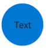

# FAB

## Background

The `FAB` is a `Button` that is designed for mobile scenarios. This button only renders on mobile platforms.

## Sample Code

Basic examples:

```jsx
<FAB>Text</FAB>
<FAB icon={{ svgSource: { uri: 'https://www.example.com/test.svg', viewBox: '0 0 100 100' } }} />
<FAB icon={{ svgSource: { uri: 'https://www.example.com/test.svg', viewBox: '0 0 100 100' } }}>Text</FAB>
<FAB appearance="primary">Text</FAB>
<FAB disabled>Text</FAB>
```

More examples on the [Test pages for the Button](https://github.com/microsoft/fluentui-react-native/tree/master/apps/fluent-tester/src/FluentTester/TestComponents/ButtonExperimental). Instructions on running the tester app can be found [here](https://github.com/microsoft/fluentui-react-native/blob/master/apps/fluent-tester/README.md).

## Visual Examples

Android:



```tsx
<FAB>Text</FAB>
```

## API

### Slots

- `root` - The outer container representing the `Button` itself that wraps everything passed via the `children` prop.
- `icon` - If specified, renders an `icon` either before or after the `children` as specified by the `iconPosition` prop.

### Props

```ts
export interface FABProps extends Omit<IWithPressableOptions<ViewProps>, 'onPress'> {
  /*
   * Text to show on the Button.
   * Only used in FAB
   */
  content?: string;

  /*
   * Source URL or name of the icon to show on the Button.
   */
  icon?: IconSourcesType;

  innerRef?: React.ForwardedRef<IFocusable>;

  /**
   * A callback to call on button click event
   */
  onClick?: () => void;

  /**
   * Text that should show in a tooltip when the user hovers over a button.
   */
  tooltip?: string;
}
```

### Styling Tokens

Tokens can be used to customize the styling of the control.

```jsx
const CustomFAB = FAB.customize({
  iconSize: 10,
  spacingIconContentBefore: 10,
})

<CustomFAB>Button with small icon and large gap between icon and label</CustomFAB>

const CustomHoverFAB = FAB.customize({
  hovered: { backgroundColor: 'pink' },
})

<CustomHoverFAB>Button with pink background on hover</CustomHoverFAB>
```

```ts
export interface CompoundButtonTokens extends LayoutTokens, FontTokens, IBorderTokens, IShadowTokens, IColorTokens {
  /**
   * The icon color.
   */
  iconColor?: ColorValue;

  /**
   * The icon color when hovering over the Button.
   */
  iconColorHovered?: ColorValue;

  /**
   * The icon color when the Button is being pressed.
   */
  iconColorPressed?: ColorValue;

  /**
   * The size of the icon.
   */
  iconSize?: number;

  /**
   * The weight of the lines used when drawing the icon.
   */
  iconWeight?: number;

  /**
   * The width of the button.
   */
  width?: ViewStyle['width'];

  /**
   * The amount of spacing between an icon and the content when iconPosition is set to 'before', in pixels
   */
  spacingIconContentBefore?: number;

  /**
   * States that can be applied to a button
   */
  hovered?: ButtonTokens;
  focused?: ButtonTokens;
  pressed?: ButtonTokens;
  disabled?: ButtonTokens;
  hasContent?: ButtonTokens;
  hasIconBefore?: ButtonTokens;
}
```

## Behaviors

Same as base `Button`.
