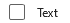

# Checkbox

## Background

The `Checkbox` component enables users to select one or more items from a group, or switch between two mutually exclusive options (checked or unchecked).

## Requirements

If using FURN's theming, the `Checkbox` requires use of the `ThemeProvider` from `@fluentui-react-native/theme` to work properly with themes. Please see [this page](../../../docs/pages/Guides/UpdateThemeProvider.md) for information on updating your `ThemeProvider` if using the version from `@uifabricshared/theming-react-native`.

## Sample Code

Basic examples:

```jsx
<Checkbox label="Example Checkbox" />
<Checkbox label="Large Circular Checkbox" circular size="large" />
<Checkbox label="Controlled Checkbox" onChange={onChangeFunction} checked={checked} />
```

More examples on the [Test pages for the Checkbox](../../../apps/fluent-tester/src/FluentTester/TestComponents/CheckboxExperimental). Instructions on running the tester app can be found [here](../../../apps/fluent-tester/README.md).

## Visual Examples

Win32:



```tsx
<Checkbox label="Text" />
```


```tsx
<Checkbox label="Large Circular Checkbox" circular size="large" />
```

## Variants

### Checked

The `Checkbox` control supports the `unchecked` and `checked` appearances. It does _not_ support a `intermediate` or `mixed` appearance.

### Circular

The `Checkbox` control supports a `circular` shape variant.

### Sizes

The `Checkbox` control supports two different sizes: `medium` (default), and `large`.

## API

### Slots

The `Checkbox` control has three slots, or parts. The slots behave as follows:

- `root` - The outer container representing the `Checkbox` itself that wraps everything passed via the `children` prop.
- `icon` - If specified, renders an `icon` either before or after the `children` as specified by the `iconPosition` prop.
- `content` - If specified, renders the first entry of `children` as text.

The slots can be modified using the `compose` function on the `Checkbox`. For more information on using the `compose` API, please see [this page](../../framework/composition/README.md).

### Props

Below is the set of props the Checkbox supports:

```ts
export interface CheckboxProps extends Omit<IWithPressableOptions<ViewProps>, 'onPress'> {
  /**
   * A Checkbox can have its content and borders styled for greater emphasis or to be subtle.
   * - 'primary': Emphasizes the Checkbox as a primary action.
   * - 'subtle': Minimzes emphasis to blend into the background until hovered or focused.
   */
  appearance?: 'primary' | 'subtle';

  /**
   * A Checkbox can fill the width of its container.
   * @default false
   */
  block?: boolean;

  /**
   * A RefObject to access the ICheckbox interface. Use this to access the public methods and properties of the component.
   */
  componentRef?: React.RefObject<IFocusable>;

  /**
   * Icon slot that, if specified, renders an icon either before or after the `children` as specified by the
   * `iconPosition` prop.
   */
  icon?: IconSourcesType;

  /**
   * Checkbox contains only icon, there's no text content
   * Must be set for Checkbox to style correctly when Checkbox has not content.
   */
  iconOnly?: boolean;

  /**
   * A Checkbox can format its icon to appear before or after its content.
   * @default 'before'
   */
  iconPosition?: 'before' | 'after';

  /**
   * A Checkbox can show a loading indicator if it is waiting for another action to happen before allowing itself to
   * be interacted with.
   * @default false
   */
  loading?: boolean;

  /**
   * A Checkbox can be rounded, circular, or square.
   * @default 'rounded'
   */
  shape?: 'rounded' | 'circular' | 'square';

  /**
   * A Checkbox supports different sizes.
   * @default 'medium'
   */
  size?: 'small' | 'medium' | 'large';

  /**
   * Text that should show in a tooltip when the user hovers over a Checkbox.
   */
  tooltip?: string;

  /**
   * A callback to call on Checkbox click event
   */
  onClick?: () => void;
}
```

### Styling Tokens

Tokens can be used to customize the styling of the control by using the `customize` function on the `Checkbox`. For more information on using the `customize` API, please see [this page](../../framework/composition/README.md). The `Checkbox` has the following tokens:

```ts
export interface CheckboxTokens extends LayoutTokens, FontTokens, IBorderTokens, IShadowTokens, IColorTokens {
  /**
   * The icon color.
   */
  iconColor?: ColorValue;

  /**
   * The size of the icon.
   */
  iconSize?: number;

  /**
   * The weight of the lines used when drawing the icon.
   */
  iconWeight?: number;

  /**
   * The width of the Checkbox.
   */
  width?: ViewStyle['width'];

  /**
   * The amount of spacing between an icon and the content when iconPosition is set to 'before', in pixels
   */
  spacingIconContentBefore?: number;

  /**
   * The amount of spacing between an icon and the content when iconPosition is set to 'after', in pixels
   */
  spacingIconContentAfter?: number;

  /**
   * States that can be applied to a Checkbox.
   * These can be used to modify styles of the Checkbox when under the specified state.
   */
  hovered?: CheckboxTokens;
  focused?: CheckboxTokens;
  pressed?: CheckboxTokens;
  disabled?: CheckboxTokens;
  hasContent?: CheckboxTokens;
  hasIconAfter?: CheckboxTokens;
  hasIconBefore?: CheckboxTokens;
  primary?: CheckboxTokens;
  subtle?: CheckboxTokens;
  block?: CheckboxTokens;
  small?: CheckboxTokens;
  medium?: CheckboxTokens;
  large?: CheckboxTokens;
  rounded?: CheckboxTokens;
  circular?: CheckboxTokens;
  square?: CheckboxTokens;
}
```

## Behaviors

### States

The following section describes the different states which `Checkbox` can be in as a result of interaction.

#### Enabled and Disabled states

An enabled `Checkbox` communicates interaction by having styling that invites the user to click/tap on it to trigger an action.

A disabled `Checkbox` is non-interactive, disallowing the user to click/tap on it to trigger an action.

#### Hovered state

A hovered `Checkbox` changes styling to communicate that the user has placed a cursor above it.

#### Focused state

A focused `Checkbox` changes styling to communicate that the user has placed keyboard focus on it. This styling is usually the same to the one in the hovered state plus extra styling on the outline to indicate keyboard focus has been placed on the component.

#### Pressed state

A pressed `Checkbox` changes styling to communicate that the user is currently pressing it.

#### Checked state

A checked `Checkbox` changes styling to communicate that it is currently in a selected state. The checkbox will show a checkmark in it to show the checked state.

### Interaction

#### Keyboard interaction

The following is a set of keys that interact with the `Checkbox` component:

| Key     | Description                                            |
| ------- | ------------------------------------------------------ |
| `Enter` | Executes the function passed into the `onChange` prop. |
| `Space` | Executes the function passed into the `onChange` prop. |

#### Cursor interaction

- Cursor moves onto botton: Should immediately change the styling of the `Checkbox` so that it appears to be hovered.
- Cursor moves out of botton: Should immediately remove the hovered styling of the `Checkbox`.
- Mouse click: Should toggle the `Checkbox` and move focus to its target.

#### Touch interaction

The same behavior as above translated for touch events. This means that there is no equivalent for `onHoverIn` and `onHoverOut`, which makes it so that the hovered state cannot be accessed.

## Accessibility

### Expected behavior

- Should default to adding `role="checkbox"` to the root slot.
- Should mix in the accessibility props expected for a `Checkbox` component.
- Should be keyboard tabbable and focusable.

See [`useCheckbox` hook](./src/useCheckbox.ts) for details on accessibility props
