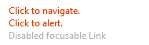

# Link

(Once moved from Experimental to Components)
In the short term, the new `Link` control is named `LinkV1` while it clashes with the existing older control. Once we deprecate the old control, it will be renamed to `Link`. It may be useful to rename the control to `Link` using the import syntax to simplify the rename:

```ts
import { LinkV1 as Link } from '@fluentui-react-native/link';
```

FURN components that have imported from experimental-text will use the above syntax to use `LinkV1`.

## Background

The `Link` component is a clickable control primarily used for navigation, providing an interactive reference to a resource. It is usually displayed as an block element by default, but can be displayed inline as well.

## Requirements

If using FURN's theming, the `Link` requires use of the `ThemeProvider` from `@fluentui-react-native/theme` to work properly with themes. Please see [this page](../../../docs/pages/Guides/UpdateThemeProvider.md) for information on updating your `ThemeProvider` if using the version from `@uifabricshared/theming-react-native`.

## Sample Code

Basic example:

```jsx
<Link inline url="https://www.bing.com/">Click to Navigate.</Link>
```
More examples on the [Test pages for Link](../../../apps/fluent-tester/src/TestComponents/LinkExperimental). Instructions on running the tester app can be found [here](../../../apps/fluent-tester/README.md).

## Visual Examples

Win32:



```jsx
<Link tooltip={'https://www.bing.com/'} url="https://www.bing.com/">
  Click to navigate.
</Link>
<Link onPress={doPress} onAccessibilityTap={doAllyTap}>
  Click to alert.
</Link>
<Link disabled focusable>
  Disabled focusable Link
</Link>
```


```jsx
<>
  <Text>
    Click{' '}
    <Link inline onPress={doPress} onAccessibilityTap={doAllyTap}>
      this link
    </Link>{' '}
    to alert me.
  </Text>
  <Text>
    This{' '}
    <Link inline onPress={doPress} disabled focusable>
      link
    </Link>{' '}
      is disabled but focusable.
  </Text>
  <Text>
    Follow this{' '}
    <Link inline url="https://www.bing.com/">
      link
    </Link>{' '}
    to navigate.
  </Text>
</>
```


```jsx
<Link appearance="subtle" url="https://www.bing.com/">
  Click to navigate.
</Link>
<Text>
  This is inline Link.{' '}
  <Link appearance="subtle" inline onPress={doPress} onAccessibilityTap={doAllyTap}>
    Click to alert.
  </Link>
</Text>
<Link appearance="subtle" onPress={doPress} disabled>
  Disabled Link
</Link>
```


```jsx
const BlueHeaderBold = Link.customize({ variant: 'headerStandard', fontWeight: '700', color: '#0229c4', textAlign: 'right' });
<BlueHeaderBold>BlueHeaderBold</BlueHeaderBold>
```

## API

The default `Link` control is rendered as a FURN Text(`Text`) wrapped in a `react-native` View. However, inline `Link` is rendered purely as a FURN Text(`Text`) without a wrapping View.

### Props

Below is the set of props the Text supports:

```ts
export interface LinkProps extends IWithPressableOptions<TextProps> {
  /**
   * link appearance
   */
  appearance?: LinkAppearance;
  /**
   * A RefObject to access the IButton interface. Use this to access the public methods and properties of the component.
   */
  componentRef?: React.RefObject<IFocusable>;
  /**
   * Whether to use native focus visuals for the component
   * @default true
   */
  enableFocusRing?: boolean;
  /**
   * link inline
   */
  inline?: boolean;
  /**
   * The URL that is opened when the link is clicked.  This value supersedes the 'onPress' callback when both are present.
   * @default undefined
   */
  url?: string;
  /**
   * Text that should show in a tooltip when the user hovers over a button.
   */
  tooltip?: string;
}

11/8/22 Notes:

- `inline` => On win32, inline links are rendered as a Text component without a View to handle all the mouse and focus events. Text component itself should handle them in case of inline links. Native changes need to be made on the platform level to support hovered/pressed/focused states.

```

### Styling Tokens

Tokens can be used to customize the styling of the control by using the `customize` function on the `Link`. For more information on using the `customize` API, please see [this page](../../framework/composition/README.md). The `Link` has the following tokens:

```ts
export interface LinkTokens extends TextTokens {
  hovered?: LinkTokens;
  pressed?: LinkTokens;
  focused?: LinkTokens;
  visited?: LinkTokens;
  disabled?: LinkTokens;
  inline?: LinkTokens;
  subtle?: LinkTokens;
}
```

## Behaviors

### Link with url

`Text` can be rendered as pressable.

### Interaction

#### Keyboard interaction

The following is a set of keys that interact with the `Link` component:

| Key     | Description                                                     |
| ------- | --------------------------------------------------------------- |
| `Tab`   | If `disabled` is not set, component will gain focus.  |
| `Space` | Nagivates to the path passed in as a `url` or executes the function passed into the `onPress` prop.           |

#### Cursor interaction for Link

- Cursor moves onto Link: Should immediately change the styling of the `Link` so that it appears to be hovered. Cursor changes to `pointer`.
- Cursor moves out of Link: Should immediately remove the hovered styling of the `Link`. Cursor changes to `arrow`.
- Cursor moves onto disabled Link: Cursor changes to `not-allowed`.
- Mouse click: Navigate to `url` or should handle `onPress` event of `Link` and move focus to its target.

#### Touch interaction

The same behavior as above translated for touch events. This means that there is no equivalent for `onHoverIn` and `onHoverOut`, which makes it so that the hovered state cannot be accessed.

## Accessibility

### Expected behavior

- accessibleRole: `link`
- Should mix in the accessibility props expected for a `Link` component.
- Should be keyboard tabbable and focusable.
- onAccessibilityTap defaults to onPress unless set otherwise