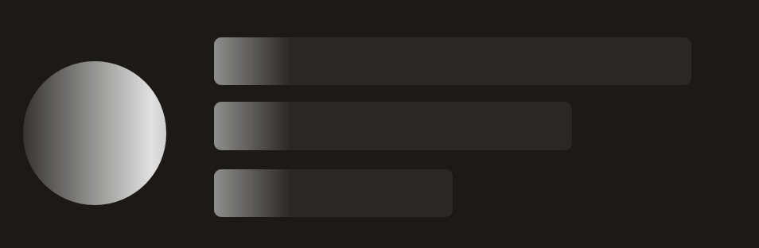
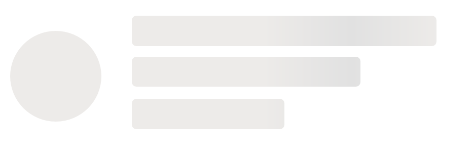
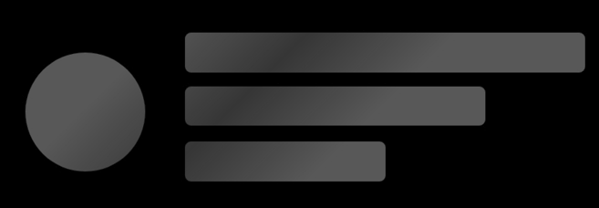
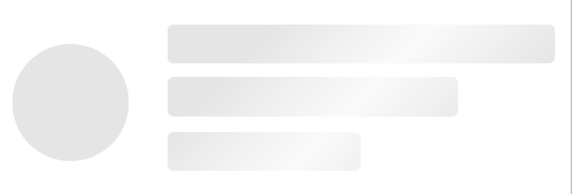

# Shimmer

## Background

The `Shimmer` component is a temporary animation placeholder for when a service call takes time to return data and we don't want to block rendering the rest of the UI.

Many a time, applications must wait for content to load or perform lengthy data processing operations. During these times, it is vital to show the user that the application isn't stalled. Progress indicators like `Shimmer` are used in these cases.

## Requirements

To work with [FURN's theming](../../../docs/pages/Theming/Basics.md), the `Shimmer` requires the use of `ThemeProvider` from `@fluentui-react-native/theme`.

Please see [this page](../../../docs/pages/Guides/UpdateThemeProvider.md) for information on updating your `ThemeProvider` if you are already using the older version from `@uifabricshared/theming-react-native`.

## Sample Code

Basic examples:

```jsx
function shimmerRects(): Array<ShimmerRectElement | ShimmerCircleElement> {
  return [
    {
      type: 'rect',
      borderRadiusX: 3,
      borderRadiusY: 3,
      width: 100,
      height: 20,
      x: 90,
      y: 70,
    },
    {
      type: 'rect',
      borderRadiusX: 3,
      borderRadiusY: 3,
      width: 150,
      height: 20,
      x: 90,
      y: 42,
    },
    {
      type: 'rect',
      borderRadiusX: 3,
      borderRadiusY: 3,
      width: 200,
      height: 20,
      x: 90,
      y: 15,
    },
    {
      type: 'circle',
      radius: 30,
      cx: 40,
      cy: 55,
    },
  ];
}
<Shimmer elements={shimmerRects()} style={{ width: 300, height: 100 }} />;
```

More examples on the [Test pages for the Shimmer](../../../apps/tester-core/src/TestComponents/Shimmer). Instructions on running the tester app can be found [here](../../../apps/fluent-tester/README.md).

## Visual Examples

Win32:

Dark:


Light:


Android:

Dark:


Light:


## API

### Slots

The `Shimmer` component has only one slot, or part. The slot behaves as follows:

- `root` - The outer container representing the `Shimmer` itself that wraps everything passed via the `children` prop.

On Win32 though, the `Shimmer` component has four slots, or parts. The slots behave as follows:

- `root` - The outer container representing the `Shimmer` itself that wraps everything passed via the `children` prop.
- `shimmerWave` - The shimmer wave is rendered here.
- `shimmerWaveContainer` - Container of the shimmer wave. This is responsible for the animation in win32.
- `clippingMask` - Mask placed along with the shimmer wave to render elements passed.

The slots can be modified using the `compose` function on the `Shimmer`. For more information on using the `compose` API, please see [this page](../../framework/composition/README.md).

### Props

Below is the set of props the Shimmer supports:

```ts
export interface ShimmerCircleElement {
  /**
   * Shimmer element type.
   */
  type: 'circle';

  /**
   * Radius of the circle element.
   * @defaultValue 12
   */
  radius?: number;

  /**
   * Note: cx and cy should be optional properties [or removed], with relative positioning being the default [or only] positioning mechanism.
   * Note: The behavior of element intersections is undefined.  https://www.github.com/Microsoft/fluentui-react-native Issue #866
   */

  /**
   * The x-axis center of the circle element in the Shimmer relative to the origin [top-left, (0,0)].
   */
  cx: number;

  /**
   * The y-axis center of the circle element in the Shimmer relative to the origin [top-left, (0,0)].
   */
  cy: number;
}

/**
 * Properties necessary to define a rectangular Shimmer element.
 */
export interface ShimmerRectElement {
  /**
   * Shimmer element type.
   */
  type: 'rect';

  /**
   * Width of the rect.
   * @defaultValue 100%
   */
  width?: number;

  /**
   * Height of the rect.
   * @defaultValue 16
   */
  height?: number;

  /**
   * Border radius for the x-axis of a rounded rect.
   * @defaultValue 0
   */
  borderRadiusX?: number;

  /**
   * Border radius for the y-axis of a rounded rect.
   * @defaultValue 0
   */
  borderRadiusY?: number;

  /**
   * Note: x and y should be optional properties [or removed], with relative positioning being the default [or only] positioning mechanism.
   * Note: The behavior of element intersections is undefined.  https://www.github.com/Microsoft/fluentui-react-native Issue #866
   */

  /**
   * The x-axis position of the rect element's top-left corner in the Shimmer relative to the origin [top-left, (0,0)].
   */
  x: number;

  /**
   * The y-axis position of the rect element's top-left corner in the Shimmer relative to the origin [top-left, (0,0)].
   */
  y: number;
}

export type ShimmerElementTypes = ShimmerCircleElement | ShimmerRectElement;
```

```ts
export interface ShimmerProps extends ViewProps {
  /**
   * Shimmer shapes that define the masking effect of the Shimmer control.
   */
  elements: Array<ShimmerElementTypes>;

  /**
   * Specifies the Shimmer effect angle in degrees (produced by a gradient).
   *
   * @defaultValue 45 on @platform Android
   * @defaultValue 0 on other platforms.
   */
  angle?: number;

  /**
   * Specifies the animation delay time in milliseconds.
   *
   * @defaultValue 500 on @platform win32
   * @defaultValue 0 on other platforms.
   */
  delay?: number;

  /**
   * Specifies the time required to traverse the control in milliseconds.
   *
   * @defaultValue 1000 on @platform Android
   * @defaultValue 2000 on @platform win32
   * @defaultValue 7000 on other platforms.
   */
  duration?: number;

  /**
   * Specifies the opacity of the shimmer color.
   * @defaultValue 1
   */
  shimmerColorOpacity?: number;

  /**
   * Specifies the opacity of the wave color.
   * @defaultValue 1
   */
  shimmerWaveColorOpacity?: number;

  /**
   * Color you see when the shimmer wave is not animating.
   *
   * @defaultValue theme.colors.neutralStencil1 on @platform Android
   * @defaultValue theme.colors.bodyFrameDivider on @platform win32
   * @defaultValue #E1E1E1/#404040 for light/dark theme on other platforms.
   */
  shimmerColor?: ColorValue;

  /**
   * Defines the tip color of the wave which has a linear gradient.
   * from shimmerColor to shimmerWaveColor to shimmerColor.
   *
   * @defaultValue theme.colors.neutralStencil2 on @platform Android
   * @defaultValue #E1E1E1 on @platform win32
   * @defaultValue white/black for light/dark theme on other platforms.
   */
  shimmerWaveColor?: ColorValue;

  /**
   * Width of the Shimmer wave.
   *
   * @defaultValue '100%' of the 'width' property
   * @platform win32
   */
  shimmerWaveWidth?: number | string;
}
```

### Styling Tokens

Tokens can be used to customize the styling of the control by using the `customize` function on the `Shimmer`. For more information on using the `customize` API, please see [this page](../../framework/composition/README.md). The `Shimmer` has the following tokens:

```ts
export interface ShimmerTokens extends IBackgroundColorTokens {
  /**
   * Specifies the Shimmer effect angle in degrees (produced by a gradient)
   * @defaultValue 45 on Android, 0 on other platforms
   */
  angle?: number;

  /**
   * Specifies the animation delay time in milliseconds
   * @defaultValue 500 on win32, 0 on other platforms
   */
  delay?: number;

  /**
   * Specifies the time required to traverse the control in milliseconds
   *
   * @defaultValue 1000 on Android, 2000 on win32, 7000 on other platforms
   */
  duration?: number;

  /**
   * Specifies the opacity of the shimmer color.
   * @defaultValue 1
   */
  shimmerColorOpacity?: number;

  /**
   * Specifies the opacity of the wave color.
   * @defaultValue 1
   */
  shimmerWaveColorOpacity?: number;

  /**
   * Color you see when the shimmer wave is not animating.
   *
   * @defaultValue theme.colors.neutralStencil1 on Android, theme.colors.bodyFrameDivider on win32, #E1E1E1/#404040 on other platforms for light/dark theme
   */
  shimmerColor?: ColorValue;

  /**
   * Defines the tip color of the wave which has a linear gradient.
   * from shimmerColor to shimmerWaveColor to shimmerColor.
   *
   * @defaultValue theme.colors.neutralStencil2 on Android, #E1E1E1 on win32, white/black on other platforms for light/dark theme
   */
  shimmerWaveColor?: ColorValue;

  /**
   * Width of the Shimmer wave.
   * @defaultValue '100%' of the 'width' property
   * @platform win32
   */
  shimmerWaveWidth?: number | string;
}
```

## Behaviors

### States

There is only one default state for `Shimmer`.

### Interaction

There are no interactions available for `Shimmer`.
