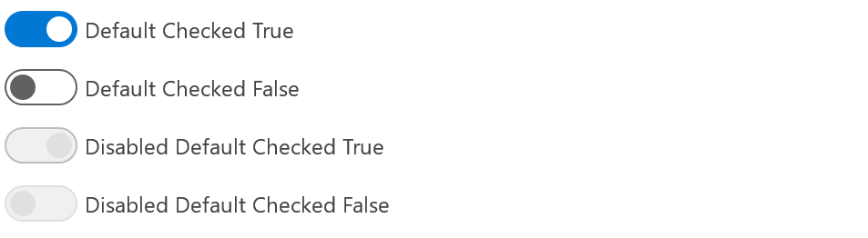

# Switch

## Background

The `Switch` component allows users to toggle between two mutually exclusive states.

## Requirements

If using FURN's theming, the `Switch` requires use of the `ThemeProvider` from `@fluentui-react-native/theme` to work properly with themes. Please see [this page](../../../docs/pages/Guides/UpdateThemeProvider.md) for information on updating your `ThemeProvider` if using the version from `@uifabricshared/theming-react-native`.

## Sample Code

Basic example:

```tsx
<Switch defaultChecked={false} label={'Switch Test'}>
```

More examples on the [Test pages for the Switch](../../../apps/fluent-tester/src/TestComponents/Switch). Instructions on running the tester app can be found [here](../../../apps/fluent-tester/README.md).

## Visual Examples

Win32:



```jsx
<Switch defaultChecked={true} label={'Default Checked True'} />
<Switch defaultChecked={false} label={'Default Checked False'} />
<Switch defaultChecked={true} label={'Disabled Default Checked True'} disabled />
<Switch defaultChecked={false} label={'Disabled Default Checked False'} disabled />
```

## API

### Slots

The `Switch` component has six slots. The slots behave as follows:

- `root` - The outer container representing the `Switch` itself that wraps everything passed via the `children` prop.
- `label` - If specified, renders the name of the Switch as text.
- `track` - The container for the thumb.
- `thumb` - A shape that's location informs the user of the Switch's toggle state.
- `toggleContainer` - Container for the thumb and track.
- `onOffText` - If specified, renders the the toggle state of the Switch as text.

The slots can be modified using the `compose` function on the `Switch`. For more information on using the `compose` API, please see [this page](../../framework/composition/README.md).

### Props

Below is the set of props the Switch supports:

```ts
export interface SwitchProps extends Omit<IWithPressableOptions<ViewProps>, 'onPress'> {
  /**
   * Reference to the Switch
   */
  componentRef?: React.RefObject<IFocusable>;

  /**
   * Callback function for changes to the switch's state and interaction event
   */
  onChange?: (e: InteractionEvent, checked?: boolean) => void;

  /**
   * The default state of the Switch
   */
  defaultChecked?: boolean;

  /**
   * The Switch's state
   */
  checked?: boolean;

  /**
   * A label to describe the Switch
   */
  label?: string;

  /**
   * The Switch's text that shows when it is in a false state
   */
  offText?: string;

  /**
   * The Switch's text that shows when it is in a true state
   */
  onText?: string;

  /**
   * Sets the position of the Switch's label
   */
  labelPosition?: 'before' | 'above' | 'after';
}
```

### Styling Tokens

Tokens can be used to customize the styling of the control by using the `customize` function on the `Switch`. For more information on using the `customize` API, please see [this page](../../framework/composition/README.md). The `Button` has the following tokens:

```ts
export interface SwitchTokens extends LayoutTokens, FontTokens, IBorderTokens, IColorTokens {
  /**
   * Track color
   */
  trackColor?: ColorValue;

  /**
   * Track height
   */
  trackHeight?: ViewStyle['height'];

  /**
   * Track width
   */
  trackWidth?: ViewStyle['width'];

  /**
   * Track top margin
   */
  trackMarginTop?: ViewStyle['marginTop'];

  /**
   * Track bottom margin
   */
  trackMarginBottom?: ViewStyle['marginBottom'];

  /**
   * Track left margin
   */
  trackMarginLeft?: ViewStyle['marginLeft'];

  /**
   * Track right margin
   */
  trackMarginRight?: ViewStyle['marginRight'];

  /**
   * Thumb color
   */
  thumbColor?: ColorValue;

  /**
   * Thumb height and width
   */
  thumbSize?: number;

  /**
   * Thumb radius
   */
  thumbRadius?: number;

  /**
   * Thumb margin
   */
  thumbMargin?: ViewStyle['margin'];

  /**
   * Color of border when Switch is focused on
   */
  focusStrokeColor?: ColorValue;

  /**
   * Width of border when Switch is focused on
   */
  focusBorderWidth?: number;

  /**
   * Border Radius of border when Switch is focused on
   */
  focusBorderRadius?: number;

  /**
   * Sets the position of the thumb
   */
  justifyContent?: ViewStyle['justifyContent'];

  /**
   * The width of the switch.
   */
  width?: ViewStyle['width'];

  /**
   * The minWidth of the switch
   */
  minWidth?: ViewStyle['minWidth'];

  /**
   * The minHeight of the switch
   */
  minHeight?: ViewStyle['minHeight'];

  /**
   * The flex direction of the root
   */
  flexDirection?: ViewStyle['flexDirection'];

  /**
   * The toggle container flex direction
   */
  toggleContainerFlexDirection?: ViewStyle['flexDirection'];

  /**
   * States that can be applied to a button
   */
  hovered?: SwitchTokens;
  focused?: SwitchTokens;
  pressed?: SwitchTokens;
  disabled?: SwitchTokens;
  checked?: SwitchTokens;
  toggleOn?: SwitchTokens;
  toggleOff?: SwitchTokens;
  before?: SwitchTokens;
  after?: SwitchTokens;
  above?: SwitchTokens;
}
```

## Behaviors

### States

The following section describes the different states which the `Switch` can be in as a result of interaction.

#### Enabled and Disabled states

An enabled `Switch` communicates interaction by having styling that invites the user to click/tap on it to trigger a toggle.

A disabled `Switch` is non-interactive, disallowing the user to click/tap on it to trigger a toggle.

#### Hovered state

A hovered `Switch` changes styling to communicate that the user has placed a cursor above it.

#### Focused state

A focused `Switch` changes styling to communicate that the user has placed keyboard focus on it. One aspect of that styling is the addition of a border.

#### Pressed state

A pressed `Switch` changes styling to communicate that the user is currently pressing it.

### Interaction

#### Keyboard interaction

The following is a set of keys that interact with the `Switch` component:

| Key     | Description                                            |
| ------- | ------------------------------------------------------ |
| `Enter` | Executes the function passed into the `onChange` prop. |
| `Space` | Executes the function passed into the `onChange` prop. |

It is possible to override key behaviors by specifying `onKeyUp` or `onKeyDown`, depending on what `preferKeyDownForKeyEvents` from the `@fluentui-react-native/interactive-hooks` package indicates. Providing the callback this way will prevent the default behaviors noted above -- you will need to handle `Enter` and `Space` in the provided callback if the default behavior is desired.

#### Cursor interaction

- Cursor moves onto the Switch: Should immediately change the styling of the `Switch` so that it appears to be hovered.
- Cursor moves out of Switch: Should immediately remove the hovered styling of the `Switch`.
- Mouse click: Should execute the `Switch` and move focus to its target.

#### Touch interaction

The same behavior as above translated for touch events. This means that there is no equivalent for `onHoverIn` and `onHoverOut`, which makes it so that the hovered state cannot be accessed.

## Accessibility

### Expected behavior

- Should default to adding `role="switch"` to the root slot.
- Should mix in the accessibility props expected for a `Switch` component.
- Should be keyboard tabbable and focusable.

See [`useSwitch` hook](./src/useSwitch.ts) for details on accessibility props
