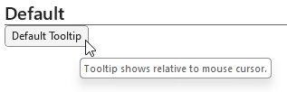

# Tooltip

## Background

A `Tooltip` is a component that displays additional information about another component. The information is displayed above or near the target. At this time, the tooltip is displayed at or near the mouse cursor (target), which is default Win32 behavior.

## Sample Code

Basic Example:

```jsx
const tooltip = (
  <Tooltip content={defaultContent}>
    <ButtonV1 accessibilityDescription={defaultContent}>Default Tooltip</ButtonV1>
  </Tooltip>
);
```

More examples on the [Test pages for Tooltip](../../../apps/tester-core/src/TestComponents/Tooltip). Instructions on running the tester app can be found [here](../../../apps/fluent-tester/README.md).

## Visual Examples

### Default Tooltip

Win32:



```tsx
const defaultContent = 'Tooltip shows relative to mouse cursor.';

const tooltip = (
  <Tooltip content={defaultContent}>
    <ButtonV1 accessibilityDescription={defaultContent}>Default Tooltip</ButtonV1>
  </Tooltip>
);
```

## Variants

### Positioning

Not yet implemented.

The `Tooltip` component will appear in the specified position relative to the anchor (target). In Win32, the positions are denoted by the DirectionalHint: `topLeftEdge`, `topCenter`, `topRightEdge`, `rightTopEdge`, `rightCenter`, `rightBottomEdge`, `bottomLeftEdge`, `bottomCenter`, `bottomRightEdge`, `leftTopEdge`, `leftCenter`, and `leftBottomEdge`.

### Target

Not yet implemented.

The `Tooltip` component can reference a target component that will be used as the position anchor.

## API

### Slots

The `Tooltip` component has one slot, or parts. The slots behave as follows:

- `root` - The outer container representing the `Tooltip` itself. The NativeTooltipViewManager is passed into this.

### Props

Below is the set of props `Tooltip` supports:

```ts
export type TooltipProps = React.PropsWithChildren<{
  /**
   * The text of the tooltip.
   */
  content: string;

  /**
   * Notification when the visibility of the tooltip is changed.
   */
  onVisibleChange?: (event, data) => void;

  /**
   * Positioning of the tooltip relative to the target element.
   *
   * @default topCenter
   */
  positioning?: DirectionalHint;

  /**
   * Allow consumers to pass in Style props
   */
  style?: ViewStyle;

  /**
   * Target anchor that tooltip uses for relative positioning. Certain components may proffer a string as an anchor target, such as
   * anchoring to a point inside the component.
   *
   * If not provided, will anchor to the wrapper element.
   */
  target?: React.RefObject<React.Component> | string;

  /**
   * Controls the tooltip visibility and can be used in conjunction with onVisibleChange to modify show/hide behavior. If not provided, will be updated based on hover/focus events on target element.
   *
   * @default false
   */
  visible?: boolean;
}>;
```

### Styling

Styling is handled by the native platform for Win32.

## Behaviors

The user will have the opportunity to see the tooltip on hover or focus of the target component. Tooltips simply display additional information about another component for the user to read.

### Interactions

#### Keyboard Interaction

Focus is set according to the guidelines of the target component (ex. Button). When the component is focused, the `Tooltip` is raisable by Ctrl+Shift+F10.

#### Mouse Interaction

`Tooltip` is visible when target component is hovered. `Tooltip` is dismissed when the mouse cursor moves again.

#### Touch interaction

`Tooltip` is rendered on touch/press.

## Accessibility

### Expected behavior

Narrator will read the contents of the `Tooltip` when visible. The user should use `accessibilityDescription` on the target component to set the full description. Win32 platform infrastructure supports narrator default to reading the full description of the target element.
