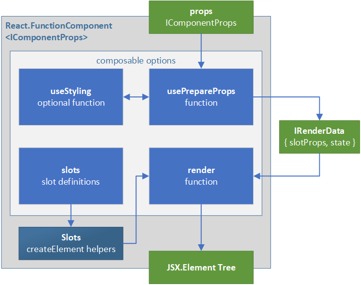

# Composable - un-opinionated and composable base components

This package provides a framework for writing unopinionated functional components that can easily be extended to inject styling, and composed together in an efficient manner.

This provides a foundation for writing both simple and higher order components with the following characteristics:

- **Unopinionated** - Components can be written such that they encapsulate the core functionality of a component, without having opinions on what styling system to use. There are myriad styling systems and all involve tradeoffs between flexibility, simplicity, and performance. Writing components which allow injection of a styling system allows consumers to optimize for their scenarios.
- **Reusable** - Modern practice in react encourages making functionality reusable via hooks. This framework provides a standardized pattern for hooks and how their results are communicated to the actual rendering. This allows replacing or augmenting either the hook or rendering portions without the need of writing everything from scratch.
- **Customizeable** - Typical customization patterns involve either passing customizations via props, or customizing via wrapping. Passing customizations via props explode the complexity of the props and cause issues with cacheability and performance. Wrapping components adds additional layers to the react hierarchy and still precludes access to internals of the component.
- **Composable** - This framework provides a repeatable pattern which allows for a wrapped component, or a part of a higher order component, to be executed functionally without adding extra layers to the react hierarchy.
- **Scalable** - Composable components can be used for both simple and higher order components. The framework uses the concept of slots to make targeting and customizing sub-components easier.
- **Flexible** - This pattern is suitable for use with both react and react-native. None of the concepts are platform specific.

## Guides

- [Getting Started: Simple Components](./docs/GuideSimple.md) - a walkthrough of creating a simple composable component. Start here to understand the base concepts.
- [Getting Started: Higher Order Components](./docs/GuideHOC.md) - a walkthrough of creating a complex composable component. Read this next to better understand how the pieces fit together and can be recombined.

## Reference

The primary entry point into the module is via the `composable` function. This creates a functional component, for use with react or react-native, which can be efficiently layered and recomposed.

### composable

```ts
export function composable<TProps extends object, TSlotProps extends ISlotProps = ISlotProps<TProps>, TState = object>(
  options: IComposableDefinition<TProps, TSlotProps, TState>
): IWithComposable<React.FunctionComponent<TProps>, IComposable<TProps, TSlotProps, TState>> {
```

#### Generic template arguments

The `composable` function takes up to generic template arguments.

- `TProps extends object` - This determines the type of the functional component. At its heart the component will be `React.FunctionalComponent<TProps>`.
- `TSlotProps extends ISlotProps = ISlotProps<TProps>` - This is the collection of props corresponding to the parts of the component. If the type is omitted then this will be defined as an object in the form of `{ root: TProps }`. See the [foundation-settings](../foundation-settings/README.md) documentation for more on slot props.
- `TState = object` - State is an optional type, used to pass data from `usePrepareProps` to `render`.

#### options: IComposableDefinition

The created component is defined by the set of options passed in. This is of type `IComposableDefinition<TProps, TSlotProps, TState>` and is described below.

#### Return result

`composable` will create a function component and will also append its options to the function as `__composable`. As an example if there is a `FancyThing` component, its options will be accessible via `FancyThing.__composable` while it can still be used in a JSX tree via `<FancyThing>` or `React.createElement(FancyThing, props, children)`.

### IComposableDefinition

The options which configure a composable component have four parts: `useStyling`, `usePrepareProps`, `render`, and `slots`.

#### usePrepareProps

#### render

#### slots

#### useStyling (optional)

This optional function defines the pattern for injecting opinionated styling.

```ts
useStyling: (props: TProps) => TSlotProps;
```

If not defined, an empty implementation will be set into the options.


